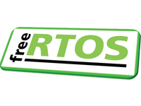

 
 

# Mastering the FreeRTOS™[^1][^2] Real Time Kernel

## A Hands-On Tutorial Guide ##

### Richard Barry -and- The FreeRTOS Team ###

**Release Version - 1.0**

 
 

 
 
 
 
 
 
 
 
 
 
 
 
 
 
 
 
 
 
 
 
 
 
 

  
[^1]: FreeRTOS™, FreeRTOS.org™ and the FreeRTOS logo are trademarks of Amazon Web Services.
[^2]: OPEN**RTOS**® and SAFE**RTOS**® are trademarks of WITTENSTEIN High Integrity Systems Ltd. All other brands or product names are the property of their respective holders.

