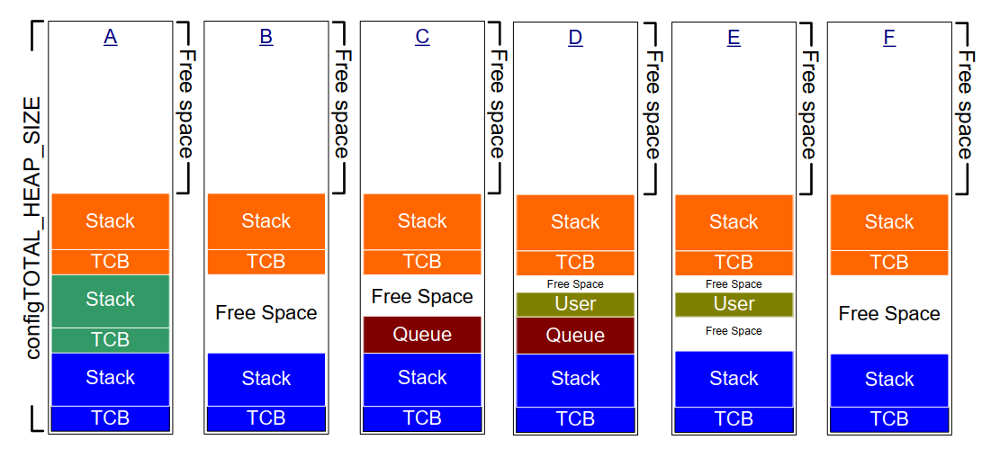

# 3 Heap Memory Management

## 3.1 Introduction

### 3.1.1 Prerequisites

Being a competent C programmer is a prerequisite for using FreeRTOS, so
this chapter assumes the reader is familiar with concepts such as:

- The different compiling and linking phases of building a C project.
- What the stack and heap are.
- The standard C library `malloc()` and `free()` functions.

### 3.1.2 Scope

This chapter covers:

- When FreeRTOS allocates RAM.
- The five example memory allocation schemes supplied with FreeRTOS.
- Which memory allocation scheme to select.

### 3.1.3 Switching Between Static and Dynamic Memory Allocation

The following chapters introduce kernel objects such as tasks, queues,
semaphores, and event groups. The RAM required to hold these objects can
be allocated statically at compile-time or dynamically at run time.
Dynamic allocation reduces design and planning effort, simplifies the
API, and minimizes the RAM footprint. Static allocation is more
deterministic, removes the need to handle memory allocation failures,
and removes the risk of heap fragmentation (where the heap has enough
free memory but not in one usable contiguous block).

The FreeRTOS API functions that create kernel objects using statically
allocated memory are only available when `configSUPPORT_STATIC_ALLOCATION`
is set to 1 in FreeRTOSConfig.h. The FreeRTOS API functions that create
kernel objects using dynamically allocated memory are only available
when `configSUPPORT_DYNAMIC_ALLOCATION` is either set to 1 or left
undefined in FreeRTOSConfig.h. It is valid to have both constants set to
1 simultaneously.

More information concerning `configSUPPORT_STATIC_ALLOCATION` is in
section 3.4 Using Static Memory Allocation.

### 3.1.4 Using Dynamic Memory Allocation

Dynamic memory allocation is a C programming concept, not a concept
specific to either FreeRTOS or multitasking. It is relevant to FreeRTOS
because kernel objects can optionally be created using dynamically
allocated memory, and the general-purpose C library `malloc()` and `free()`
functions may not be suitable for one or more of the following reasons:

- They are not always available on small embedded systems.
- Their implementation can be relatively large, taking up valuable
  code space.
- They are rarely thread-safe.
- They are not deterministic; the amount of time taken to execute the
  functions will differ from call to call.
- They can suffer from fragmentation (where the heap has enough free
  memory but not in one usable contiguous block).
- They can complicate the linker configuration.
- They can be the source of difficult to debug errors if the heap
  space is allowed to grow into memory used by other variables.

### 3.1.5 Options for Dynamic Memory Allocation

Early versions of FreeRTOS used a memory pools allocation scheme, where
pools of different size memory blocks are pre-allocated at compile-time,
then returned by the memory allocation functions. Although block
allocation is common in real-time systems, it was removed from FreeRTOS
because its inefficient use of RAM in really small embedded systems led to
many support requests.

FreeRTOS now treats memory allocation as part of the portable layer
(instead of part of the core codebase). This is because different
embedded systems have different dynamic memory allocation and timing
requirements, so a single dynamic memory allocation algorithm will only
ever be appropriate for a subset of applications. Also, removing dynamic
memory allocation from the core codebase enables application writers to
provide their own specific implementations when appropriate.

When FreeRTOS requires RAM it calls `pvPortMalloc()` instead of `malloc()`.
Likewise, when FreeRTOS frees previously allocated RAM it calls
`vPortFree()` instead of `free()`. `pvPortMalloc()` has the same prototype as
the standard C library `malloc()` function, and `vPortFree()` has the same
prototype as the standard C library `free()` function.

`pvPortMalloc()` and `vPortFree()` are public functions, so they can also be
called from application code.

FreeRTOS comes with five example implementations of `pvPortMalloc()` and
`vPortFree()`, which are all documented in this chapter. FreeRTOS
applications can use one of the example implementations or provide their
own.

The five examples are defined in the heap\_1.c, heap\_2.c, heap\_3.c,
heap\_4.c and heap\_5.c source files respectively, all of which are
located in the FreeRTOS/Source/portable/MemMang directory.


## 3.2 Example Memory Allocation Schemes

### 3.2.1 Heap\_1

It is common for small, dedicated embedded systems to only create tasks
and other kernel objects before starting the FreeRTOS scheduler. When
this is the case, memory only gets (dynamically) allocated by the kernel
before the application starts to perform any real-time functionality,
and the memory remains allocated for the application's lifetime. This
means the chosen allocation scheme does not have to consider the more
complex memory allocation issues, such as determinism and fragmentation,
and can instead prioritise attributes such as code size and simplicity.

Heap\_1.c implements a very basic version of `pvPortMalloc()`, and does not
implement `vPortFree()`. Applications that never delete a task or other
kernel objects have the potential to use heap\_1. Some commercially
critical and safety-critical systems that would otherwise prohibit the
use of dynamic memory allocation also have the potential to use heap\_1.
Critical systems often prohibit dynamic memory allocation because of the
uncertainties associated with non-determinism, memory fragmentation, and
failed allocations. Heap\_1 is always deterministic and cannot fragment
memory.

Heap\_1's implementation of `pvPortMalloc()` simply subdivides a simple
`uint8_t` array called the FreeRTOS heap into smaller blocks each time
it's called. The FreeRTOSConfig.h constant `configTOTAL_HEAP_SIZE` sets
the size of the array in bytes. Implementing the heap as a statically
allocated array makes FreeRTOS appear to consume a lot of RAM because
the heap becomes part of the FreeRTOS data.

Each dynamically allocated task results in two calls to `pvPortMalloc()`.
The first allocates a task control block (TCB), and the second the
task's stack. Figure 3.1 demonstrates how heap\_1 subdivides the simple
array as tasks get created.

Referring to Figure 3.1:

- **A** shows the array before creating any tasks—the entire array is free.

- **B** shows the array after creating one task.

- **C** shows the array after creating three tasks.


<a name="fig3.1" title="Figure 3.1 RAM being allocated from the heap\_1 array each time a task is created"></a>

* * *

***Figure 3.1*** *RAM being allocated from the heap\_1 array each time a task is created*
* * *


### 3.2.2 Heap\_2

Heap\_2 is superseded by heap\_4, which includes enhanced functionality.
Heap\_2 is kept in the FreeRTOS distribution for backward compatibility
and is not recommended for new designs.

Heap\_2.c also works by subdividing an array dimensioned by the
`configTOTAL_HEAP_SIZE` constant. It uses a best-fit algorithm to allocate
memory, and, unlike heap\_1, it does implement `vPortFree()`. Again,
implementing the heap as a statically allocated array makes FreeRTOS
appear to consume a lot of RAM because the heap becomes part of the
FreeRTOS data.

The best-fit algorithm ensures that `pvPortMalloc()` uses the free block
of memory that is closest in size to the number of bytes requested. For
example, consider the scenario where:

- The heap contains three blocks of free memory that are 5 bytes, 25
  bytes, and 100 bytes, respectively.
- `pvPortMalloc()` requests 20 bytes of RAM.

The smallest free block of RAM into which the requested number of bytes
fits is the 25-byte block, so `pvPortMalloc()` splits the 25-byte block
into one block of 20 bytes and one block of 5 bytes before returning
a pointer to the 20-byte block[^2]. The new 5-byte block remains available
for future calls to `pvPortMalloc()`.

[^2]: This is an oversimplification, because heap\_2 stores information
on the block sizes within the heap area, so the sum of the two split
blocks will actually be less than 25.

Unlike heap\_4, heap\_2 does not combine adjacent free blocks into a
single larger block, so it is more susceptible to fragmentation than
heap\_4. However, fragmentation is not an issue if the allocated and
subsequently freed blocks are always the same size.

<a name="fig3.2" title="Figure 3.2 RAM being allocated and freed from the heap\_2 array as tasks are created and deleted"></a>

* * *

***Figure 3.2*** *RAM being allocated and freed from the heap\_2 array as tasks are created and deleted*
* * *

Figure 3.2 demonstrates how the best-fit algorithm works when a task is
created, deleted, and created again. Referring to Figure 3.2:

- **A** shows the array after allocating three tasks. A large free
  block remains at the top of the array.

- **B** shows the array after deleting one of the tasks. The large
  free block at the top of the array remains. There are now also two
  smaller free blocks that previously held the TCB and stack of the
  deleted task.

- **C** shows the situation after creating another task. Creating
  the task resulted in two calls to `pvPortMalloc()` from within the
  `xTaskCreate()` API function, one to allocate a new TCB and the other
  to allocate the task stack. Section 3.4 of this book describes
  `xTaskCreate()`.

  Every TCB is the same size, so the best-fit algorithm reuses the block
  of RAM that held the TCB of the deleted task to hold the TCB of the
  created task.

  If the size of the stack allocated to the newly created task is the
  same size as that allocated to the previously deleted task, then the
  best-fit algorithm reuses the block of RAM that held the stack of the
  deleted task to hold the stack of the created task.

  The larger unallocated block at the top of the array remains
  untouched.

Heap\_2 is not deterministic but is faster than most standard library
implementations of `malloc()` and `free()`.


### 3.2.3 Heap\_3

Heap\_3.c uses the standard library `malloc()` and `free()` functions, so the
linker configuration defines the heap size, and the
`configTOTAL_HEAP_SIZE` constant is not used.

Heap\_3 makes `malloc()` and `free()` thread-safe by temporarily suspending
the FreeRTOS scheduler for the duration of their execution. Chapter 8,
Resource Management, covers thread safety and scheduler suspension.


### 3.2.4 Heap\_4

Like heap\_1 and heap\_2, heap\_4 works by subdividing an array into
smaller blocks. As before, the array is statically allocated and
dimensioned by `configTOTAL_HEAP_SIZE`, which makes FreeRTOS appear to use
a lot of RAM as the heap becomes part of the FreeRTOS data.

Heap\_4 uses a first-fit algorithm to allocate memory. Unlike heap\_2,
heap\_4 combines (coalesces) adjacent free blocks of memory into a
single larger block, which minimizes the risk of memory fragmentation.

The first fit algorithm ensures `pvPortMalloc()` uses the first free block
of memory that is large enough to hold the number of bytes requested.
For example, consider the scenario where:

- The heap contains three blocks of free memory that, in the order in
  which they appear in the array, are 5 bytes, 200 bytes, and 100
  bytes, respectively.
- `pvPortMalloc()` requests 20 bytes of RAM.

The first free block of RAM that the requested number of bytes fits is
the 200-byte block, so `pvPortMalloc()` splits the 200-byte block into one
block of 20 bytes and one of 180 bytes[^3], before returning a pointer
to the 20-byte block. The new 180-byte block remains available to future
calls to `pvPortMalloc()`.

[^3]: This is an oversimplification, because heap\_4 stores information
on the block sizes within the heap area, so the sum of the two split
blocks will actually be less than 200 bytes.

Heap\_4 combines (coalesces) adjacent free blocks into a single larger
block, minimizing the risk of fragmentation, and making it suitable for
applications that repeatedly allocate and free different-sized blocks of
RAM.


<a name="fig3.3" title="Figure 3.3 RAM being allocated and freed from the heap\_4 array"></a>

* * *

***Figure 3.3*** *RAM being allocated and freed from the heap\_4 array*
* * *

Figure 3.3 demonstrates how the heap\_4 first-fit algorithm with memory
coalescence works. Referring to Figure 3.3:

- **A** shows the array after creating three tasks. A large free
  block remains at the top of the array.

- **B** shows the array after deleting one of the tasks. The large
  free block at the top of the array remains. There is now another
  free block where the TCB and stack of the deleted task used to be.
  Unlike in the heap\_2 example, heap\_4 merges the two memory blocks
  that previously held the TCB and stack of the deleted task,
  respectively, into a larger single free block.

- **C** shows the situation after creating a FreeRTOS queue.
  Section 5.3 of this book describes the `xQueueCreate()` API function
  used to allocate queues dynamically. `xQueueCreate()` calls
  `pvPortMalloc()` to allocate the RAM used by the queue. As heap\_4 uses
  a first-fit algorithm, `pvPortMalloc()` allocates RAM from the first
  free RAM block that is large enough to hold the queue, which in
  Figure 3.3, was the RAM freed by deleting the task. The queue does not
  consume all the RAM in the free block, so the block is split into
  two, and the unused portion remains available to future calls to
  `pvPortMalloc()`.

- **D** shows the situation after calling `pvPortMalloc()` directly
  from application code, rather than indirectly by calling a FreeRTOS
  API function. The user allocated block was small enough to fit in
  the first free block, which was the block between the memory
  allocated to the queue, and the memory allocated to the TCB
  following it.

  The memory freed by deleting the task has now split into three
  separate blocks; the first block holds the queue, the second block
  holds the user allocated memory, and the third block remains free.

- **E** shows the situation after deleting the queue, which
  automatically frees the memory allocated to the deleted queue. There
  is now free memory on either side of the user allocated block.

- **F** shows the situation after freeing the user allocated
  memory. The memory previously used by the user allocated block has
  been combined with the free memory on either side to create a larger
  single free block.

Heap\_4 is not deterministic but is faster than most standard library
implementations of `malloc()` and `free()`.


### 3.2.5 Heap\_5

Heap\_5 uses the same allocation algorithm as heap\_4. Unlike heap\_4,
which is limited to allocating memory from a single array, heap\_5 can
combine memory from multiple separated memory spaces into a single heap.
Heap\_5 is useful when the RAM provided by the system on which FreeRTOS
is running does not appear as a single contiguous (without space) block
in the system's memory map.


### 3.2.6 Initialising heap\_5: The vPortDefineHeapRegions() API Function

`vPortDefineHeapRegions()` initialises heap\_5 by specifying the start
address and size of each separate memory area that makes up the heap
managed by heap\_5. Heap\_5 is the only provided heap allocation scheme
that requires explicit initialisation and can't be used until after the
call to `vPortDefineHeapRegions()`. That means kernel objects, such as
tasks, queues, and semaphores, cannot be created dynamically until after
the call to `vPortDefineHeapRegions()`.


<a name="list3.1" title="Listing 3.1 The vPortDefineHeapRegions() API function prototype"></a>


```c
void vPortDefineHeapRegions( const HeapRegion_t * const pxHeapRegions );
```
***Listing 3.1*** *The vPortDefineHeapRegions() API function prototype*


`vPortDefineHeapRegions()` takes an array of `HeapRegion_t` structures as
its only parameter. Each structure defines the start address and size of
a memory block that will become part of the heap—the whole array of
structures defines the entire heap space.


<a name="list3.2" title="Listing 3.2 The HeapRegion\_t structure"></a>


```c
typedef struct HeapRegion
{
    /* The start address of a block of memory that will be part of the heap.*/
    uint8_t *pucStartAddress;

    /* The size of the block of memory in bytes. */
    size_t xSizeInBytes;

} HeapRegion_t;
```
***Listing 3.2*** *The HeapRegion\_t structure*


**Parameters:**

- `pxHeapRegions`

  A pointer to the start of an array of `HeapRegion_t` structures.
  Each structure defines the start address and size of a memory block that
  will become part of the heap.

  The `HeapRegion_t` structures in the array must be ordered by start
  address; the `HeapRegion_t` structure that describes the memory area with
  the lowest start address must be the first structure in the array, and
  the `HeapRegion_t` structure that describes the memory area with the
  highest start address must be the last structure in the array.

  Mark the end of the array with a `HeapRegion_t` structure that has its
  `pucStartAddress` member set to `NULL`.

By way of example, consider the hypothetical memory map shown in Figure
3.4 **A** which contains three separate blocks of RAM: RAM1, RAM2
and RAM3. It is assumed executable code is placed in read-only memory,
which is not shown.


<a name="fig3.4" title="Figure 3.4 Memory Map"></a>

* * *

***Figure 3.4*** *Memory Map*
* * *

Listing 3.3 shows an array of `HeapRegion_t` structures that together
describe the three blocks of RAM in their entirety.


<a name="list3.3" title="Listing 3.3 An array of HeapRegion\_t structures that together describe the 3 regions of RAM in their entirety"></a>


```c
/* Define the start address and size of the three RAM regions. */
#define RAM1_START_ADDRESS ( ( uint8_t * ) 0x00010000 )
#define RAM1_SIZE ( 64 * 1024 )

#define RAM2_START_ADDRESS ( ( uint8_t * ) 0x00020000 )
#define RAM2_SIZE ( 32 * 1024 )

#define RAM3_START_ADDRESS ( ( uint8_t * ) 0x00030000 )
#define RAM3_SIZE ( 32 * 1024 )

/* Create an array of HeapRegion_t definitions, with an index for each
   of the three RAM regions, and terminate the array with a HeapRegion_t
   structure containing a NULL address. The HeapRegion_t structures must
   appear in start address order, with the structure that contains the
   lowest start address appearing first. */
const HeapRegion_t xHeapRegions[] =
{
    { RAM1_START_ADDRESS, RAM1_SIZE },
    { RAM2_START_ADDRESS, RAM2_SIZE },
    { RAM3_START_ADDRESS, RAM3_SIZE },
    { NULL,               0         } /* Marks the end of the array. */
};

int main( void )
{
    /* Initialize heap_5. */
    vPortDefineHeapRegions( xHeapRegions );

    /* Add application code here. */
}
```
***Listing 3.3*** *An array of HeapRegion\_t structures that together describe the 3 regions of RAM in their entirety*


Although Listing 3.3 correctly describes the RAM, it does not demonstrate a
usable example because it allocates all the RAM to the heap, leaving no
RAM free for use by other variables.

The linking phase of the build process allocates a RAM address to each
variable. The RAM available for use by the linker is normally described
by a linker configuration file, such as a linker script. In Figure 3.4
**B** it is assumed the linker script included information on
RAM1, but did not include information on RAM2 or RAM3. As a result, the
linker placed variables in RAM1, leaving only the portion of RAM1 above
address 0x0001nnnn available for use by heap\_5. The actual value of
0x0001nnnn depends on the combined size of all the variables included in
the application. The linker has left all of RAM2 and all of RAM3 unused,
leaving the whole of RAM2 and the whole of RAM3 available for use by
heap\_5.

The code shown in Listing 3.3 would cause the RAM allocated to heap\_5
below address 0x0001nnnn to overlap the RAM used to hold variables.
If you set the start address of the first `HeapRegion_t` structure within the
`xHeapRegions[]` array to 0x0001nnnn, rather than a start address of
0x00010000, the heap will not overlap with RAM used by the linker.
However, that is not a recommended solution because:

- The start address might not be easy to determine.
- The amount of RAM used by the linker might change in future builds,
  which would make an update to the start address used in the
  `HeapRegion_t` structure necessary.
- The build tools will not know, and therefore cannot warn the
  application writer, if the RAM used by the linker and the RAM used
  by heap\_5 overlap.

Listing 3.4 demonstrates a more convenient and maintainable example. It
declares an array called `ucHeap`. `ucHeap` is a normal variable, so it
becomes part of the data allocated to RAM1 by the linker. The first
`HeapRegion_t` structure in the `xHeapRegions` array describes the start
address and size of `ucHeap`, so `ucHeap` becomes part of the memory managed
by heap\_5. The size of `ucHeap` can be increased until the RAM used by the
linker consumes all of RAM1, as shown in Figure 3.4 **C**.


<a name="list3.4" title="Listing 3.4 An array of HeapRegion\_t structures that describe all of RAM2, all of RAM3, but only part of RAM1"></a>

```c
/* Define the start address and size of the two RAM regions not used by
   the linker. */
#define RAM2_START_ADDRESS ( ( uint8_t * ) 0x00020000 )
#define RAM2_SIZE ( 32 * 1024 )

#define RAM3_START_ADDRESS ( ( uint8_t * ) 0x00030000 )
#define RAM3_SIZE ( 32 * 1024 )

/* Declare an array that will be part of the heap used by heap_5. The
   array will be placed in RAM1 by the linker. */
#define RAM1_HEAP_SIZE ( 30 * 1024 )
static uint8_t ucHeap[ RAM1_HEAP_SIZE ];

/* Create an array of HeapRegion_t definitions. Whereas in Listing 3.3 the
   first entry described all of RAM1, so heap_5 will have used all of
   RAM1, this time the first entry only describes the ucHeap array, so
   heap_5 will only use the part of RAM1 that contains the ucHeap array.
   The HeapRegion_t structures must still appear in start address order,
   with the structure that contains the lowest start address appearing first. */

const HeapRegion_t xHeapRegions[] =
{
    { ucHeap,             RAM1_HEAP_SIZE },
    { RAM2_START_ADDRESS, RAM2_SIZE },
    { RAM3_START_ADDRESS, RAM3_SIZE },
    { NULL,               0 }           /* Marks the end of the array. */
};
```
***Listing 3.4*** *An array of HeapRegion\_t structures that describe all of RAM2, all of RAM3, but only part of RAM1*


The advantages of the technique demonstrated in Listing 3.4 include:

- It is not necessary to use a hard-coded start address.
- The address used in the `HeapRegion_t` structure will be set
  automatically by the linker, so it will always be correct, even if the
  amount of RAM used by the linker changes in future builds.
- It is impossible for RAM allocated to heap\_5 to overlap data placed
  into RAM1 by the linker.
- The application will not link if `ucHeap` is too big.


## 3.3 Heap Related Utility Functions and Macros

### 3.3.1 Defining the Heap Start Address

Heap\_1, heap\_2 and heap\_4 allocate memory from a statically allocated
array dimensioned by `configTOTAL_HEAP_SIZE`. This section refers to these
allocation schemes collectively as heap\_n.

Sometimes the heap needs to be placed at a specific memory address. For
example, the stack allocated to a dynamically created task comes from
the heap, so it might be necessary to locate the heap in fast internal
memory rather than slow external memory. (See the sub-section Placing
Task Stacks in Fast Memory below for another method of allocating task
stacks in fast memory). The `configAPPLICATION_ALLOCATED_HEAP`
compile-time configuration constant enables the application to declare
the array in place of the declaration that would otherwise be in the
heap\_n.c source file. Declaring the array in the application code
enables the application writer to specify its start address.

If `configAPPLICATION_ALLOCATED_HEAP` is set to 1 in FreeRTOSConfig.h,
the application that uses FreeRTOS must allocate a `uint8_t` array
called `ucHeap` and dimensioned by the `configTOTAL_HEAP_SIZE` constant.

The syntax required to place a variable at a specific memory address is
dependent on the compiler in use, so refer to your compiler's
documentation. Examples for two compilers follow:

- Listing 3.5 shows the syntax required by the GCC compiler to declare
  the array and place the array in a memory section called `.my_heap`.
- Listing 3.6 shows the syntax required by the IAR compiler to declare
  the array and place the array at the absolute memory address
  0x20000000.


<a name="list3.5" title="Listing 3.5 Using GCC syntax to declare the array that will be used by heap\_4, and place the array in a memory section named .my\_heap"></a>


```c
uint8_t ucHeap[ configTOTAL_HEAP_SIZE ] __attribute__ ( ( section( ".my_heap" ) ) );
```
***Listing 3.5*** *Using GCC syntax to declare the array that will be used by heap\_4, and place the array in a memory section named .my\_heap*


<a name="list3.6" title="Listing 3.6 Using IAR syntax to declare the array that will be used by heap\_4, and place the array at the absolute address 0x20000000"></a>


```c
uint8_t ucHeap[ configTOTAL_HEAP_SIZE ] @ 0x20000000;
```
***Listing 3.6*** *Using IAR syntax to declare the array that will be used by heap\_4, and place the array at the absolute address 0x20000000*


### 3.3.2 The xPortGetFreeHeapSize() API Function

The `xPortGetFreeHeapSize()` API function returns the number of free bytes
in the heap at the time the function is called. It does not provide
information on heap fragmentation.

`xPortGetFreeHeapSize()` is not implemented for heap\_3.


<a name="list3.7" title="Listing 3.7 The xPortGetFreeHeapSize() API function prototype"></a>


```c
size_t xPortGetFreeHeapSize( void );
```
***Listing 3.7*** *The xPortGetFreeHeapSize() API function prototype*


**Return value:**

- `xPortGetFreeHeapSize()` returns the number of bytes that remain unallocated in the heap at
   the time it is called.


### 3.3.3 The xPortGetMinimumEverFreeHeapSize() API Function

The `xPortGetMinimumEverFreeHeapSize()` API function returns the minimum
number of unallocated bytes that have ever existed in the heap since the
FreeRTOS application started executing.

The value returned by `xPortGetMinimumEverFreeHeapSize()` indicates how
close the application has ever come to running out of heap space. For
example, if `xPortGetMinimumEverFreeHeapSize()` returns 200, then, at some
time since the application started executing, it came within 200 bytes
of running out of heap space.

`xPortGetMinimumEverFreeHeapSize()` can also be used to optimise the heap
size. For example, if `xPortGetMinimumEverFreeHeapSize()` returns 2000
after executing the code that you know has the highest heap usage,
`configTOTAL_HEAP_SIZE` can be reduced by up to 2000 bytes.

`xPortGetMinimumEverFreeHeapSize()` is only implemented in heap\_4 and heap\_5.


<a name="list3.8" title="Listing 3.8 The xPortGetMinimumEverFreeHeapSize() API function prototype"></a>


```c
size_t xPortGetMinimumEverFreeHeapSize( void );
```
***Listing 3.8*** *The xPortGetMinimumEverFreeHeapSize() API function prototype*


**Return value:**

- `xPortGetMinimumEverFreeHeapSize()` returns the minimum number of unallocated
  bytes that existed in the heap since the FreeRTOS application started executing.


### 3.3.4 The vPortGetHeapStats() API Function

Heap\_4 and heap\_5 implement `vPortGetHeapStats()`, which completes the
`HeapStats_t` structure pass by reference as the function's only parameter.

Listing 3.9 shows the `vPortGetHeapStats()` function prototype. Listing 3.10
shows the `HeapStats_t` structure members.


<a name="list3.9" title="Listing 3.9 The vPortGetHeapStatus() API function prototype"></a>


```c
void vPortGetHeapStats( HeapStats_t *xHeapStats );
```
***Listing 3.9*** *The vPortGetHeapStatus() API function prototype*


<a name="list3.10" title="Listing 3.10 The HeapStatus\_t() structure"></a>


```c
/* Prototype of the vPortGetHeapStats() function. */
void vPortGetHeapStats( HeapStats_t *xHeapStats );

/* Definition of the HeapStats_t structure. All sizes specified in bytes. */
typedef struct xHeapStats
{
    /* The total heap size currently available - this is the sum of all the
       free blocks, not the largest available block. */
    size_t xAvailableHeapSpaceInBytes;

    /* The size of the largest free block within the heap at the time
       vPortGetHeapStats() is called. */
    size_t xSizeOfLargestFreeBlockInBytes;

    /* The size of the smallest free block within the heap at the time
       vPortGetHeapStats() is called. */
    size_t xSizeOfSmallestFreeBlockInBytes;

    /* The number of free memory blocks within the heap at the time
       vPortGetHeapStats() is called. */
    size_t xNumberOfFreeBlocks;

    /* The minimum amount of total free memory (sum of all free blocks)
       there has been in the heap since the system booted. */
    size_t xMinimumEverFreeBytesRemaining;

    /* The number of calls to pvPortMalloc() that have returned a valid
       memory block. */
    size_t xNumberOfSuccessfulAllocations;

    /* The number of calls to vPortFree() that has successfully freed a
       block of memory. */
    size_t xNumberOfSuccessfulFrees;
} HeapStats_t;
```
***Listing 3.10*** *The HeapStatus\_t() structure*


### 3.3.5 Collecting Per-task Heap Usage Statistics

The application writer can use the following trace macros to collect per-task
heap usage statistics:
- `traceMALLOC`
- `traceFREE`

Listing 3.11 shows one example implementation of these trace macros to collect
per-task heap usage statistics.

<a name="list3.11" title="Listing 3.11 Collecting Per-task Heap Usage Statistics"></a>


```c
#define mainNUM_ALLOCATION_ENTRIES          512
#define mainNUM_PER_TASK_ALLOCATION_ENTRIES 32

/*-----------------------------------------------------------*/

/*
 * +-----------------+--------------+----------------+-------------------+
 * | Allocating Task | Entry in use | Allocated Size | Allocated Pointer |
 * +-----------------+--------------+----------------+-------------------+
 * |                 |              |                |                   |
 * +-----------------+--------------+----------------+-------------------+
 * |                 |              |                |                   |
 * +-----------------+--------------+----------------+-------------------+
 */
typedef struct AllocationEntry
{
    BaseType_t xInUse;
    TaskHandle_t xAllocatingTaskHandle;
    size_t uxAllocatedSize;
    void * pvAllocatedPointer;
} AllocationEntry_t;

AllocationEntry_t xAllocationEntries[ mainNUM_ALLOCATION_ENTRIES ];

/*
 * +------+-----------------------+----------------------+
 * | Task | Memory Currently Held | Max Memory Ever Held |
 * +------+-----------------------+----------------------+
 * |      |                       |                      |
 * +------+-----------------------+----------------------+
 * |      |                       |                      |
 * +------+-----------------------+----------------------+
 */
typedef struct PerTaskAllocationEntry
{
    TaskHandle_t xTask;
    size_t uxMemoryCurrentlyHeld;
    size_t uxMaxMemoryEverHeld;
} PerTaskAllocationEntry_t;

PerTaskAllocationEntry_t xPerTaskAllocationEntries[ mainNUM_PER_TASK_ALLOCATION_ENTRIES ];

/*-----------------------------------------------------------*/

void TracepvPortMalloc( size_t uxAllocatedSize, void * pv )
{
    size_t i;
    TaskHandle_t xAllocatingTaskHandle;
    AllocationEntry_t * pxAllocationEntry = NULL;
    PerTaskAllocationEntry_t * pxPerTaskAllocationEntry = NULL;

    if( xTaskGetSchedulerState() != taskSCHEDULER_NOT_STARTED )
    {
        xAllocatingTaskHandle = xTaskGetCurrentTaskHandle();

        for( i = 0; i < mainNUM_ALLOCATION_ENTRIES; i++ )
        {
            if( xAllocationEntries[ i ].xInUse == pdFALSE )
            {
                pxAllocationEntry = &( xAllocationEntries[ i ] );
                break;
            }
        }

        /* Do we already have an entry in the per task table? */
        for( i = 0; i < mainNUM_PER_TASK_ALLOCATION_ENTRIES; i++ )
        {
            if( xPerTaskAllocationEntries[ i ].xTask == xAllocatingTaskHandle )
            {
                pxPerTaskAllocationEntry = &( xPerTaskAllocationEntries[ i ] );
                break;
            }
        }

        /* We do not have an entry in the per task table. Find an empty slot. */
        if( pxPerTaskAllocationEntry == NULL )
        {
            for( i = 0; i < mainNUM_PER_TASK_ALLOCATION_ENTRIES; i++ )
            {
                if( xPerTaskAllocationEntries[ i ].xTask == NULL )
                {
                    pxPerTaskAllocationEntry = &( xPerTaskAllocationEntries[ i ] );
                    break;
                }
            }
        }

        /* Ensure that we have space in both the tables. */
        configASSERT( pxAllocationEntry != NULL );
        configASSERT( pxPerTaskAllocationEntry != NULL );

        pxAllocationEntry->xAllocatingTaskHandle = xAllocatingTaskHandle;
        pxAllocationEntry->xInUse = pdTRUE;
        pxAllocationEntry->uxAllocatedSize = uxAllocatedSize;
        pxAllocationEntry->pvAllocatedPointer = pv;

        pxPerTaskAllocationEntry->xTask = xAllocatingTaskHandle;
        pxPerTaskAllocationEntry->uxMemoryCurrentlyHeld += uxAllocatedSize;
        if( pxPerTaskAllocationEntry->uxMaxMemoryEverHeld < pxPerTaskAllocationEntry->uxMemoryCurrentlyHeld )
        {
            pxPerTaskAllocationEntry->uxMaxMemoryEverHeld = pxPerTaskAllocationEntry->uxMemoryCurrentlyHeld;
        }
    }
}
/*-----------------------------------------------------------*/

void TracevPortFree( void * pv )
{
    size_t i;
    AllocationEntry_t * pxAllocationEntry = NULL;
    PerTaskAllocationEntry_t * pxPerTaskAllocationEntry = NULL;

    for( i = 0; i < mainNUM_ALLOCATION_ENTRIES; i++ )
    {
        if( ( xAllocationEntries[ i ].xInUse == pdTRUE ) &&
            ( xAllocationEntries[ i ].pvAllocatedPointer == pv ) )
        {
            pxAllocationEntry = &( xAllocationEntries [ i ] );
            break;
        }
    }

    /* Attempt to free a block that was never allocated. */
    configASSERT( pxAllocationEntry != NULL );

    for( i = 0; i < mainNUM_PER_TASK_ALLOCATION_ENTRIES; i++ )
    {
        if( xPerTaskAllocationEntries[ i ].xTask == pxAllocationEntry->xAllocatingTaskHandle )
        {
            pxPerTaskAllocationEntry = &( xPerTaskAllocationEntries[ i ] );
            break;
        }
    }

    /* An entry must exist in the per task table. */
    configASSERT( pxPerTaskAllocationEntry != NULL );

    pxPerTaskAllocationEntry->uxMemoryCurrentlyHeld -= pxAllocationEntry->uxAllocatedSize;

    pxAllocationEntry->xInUse = pdFALSE;
    pxAllocationEntry->xAllocatingTaskHandle = NULL;
    pxAllocationEntry->uxAllocatedSize = 0;
    pxAllocationEntry->pvAllocatedPointer = NULL;
}
/*-----------------------------------------------------------*/

/* The following goes in FreeRTOSConfig.h: */
extern void TracepvPortMalloc( size_t uxAllocatedSize, void * pv );
extern void TracevPortFree( void * pv );

#define traceMALLOC( pvReturn, xAllocatedBlockSize ) \
TracepvPortMalloc( xAllocatedBlockSize, pvReturn )

#define traceFREE( pv, xAllocatedBlockSize ) \
TracevPortFree( pv )
```
***Listing 3.11*** *Collecting Per-task Heap Usage Statistics*

### 3.3.6 Malloc Failed Hook Functions

Like the standard library `malloc()` function, `pvPortMalloc()` returns NULL
if it cannot allocate the requested amount of RAM. The malloc failed hook
(or callback) is an application-provided function that gets called if
`pvPortMalloc()` returns NULL. You must set `configUSE_MALLOC_FAILED_HOOK` to
1 in FreeRTOSConfig.h in order for the callback to occur. If the malloc failed
hook gets called inside a FreeRTOS API function that uses dynamic memory
allocation to create a kernel object, the object is not created.

If `configUSE_MALLOC_FAILED_HOOK` is set to 1 in FreeRTOSConfig.h, then
the application must provide a malloc failed hook function with the name
and prototype shown in Listing 3.12. The application can implement the
function in any way appropriate for the application. Many of the
provided FreeRTOS demo applications treat an allocation failure as a
fatal error, but that is not the best practice for production systems,
which should gracefully recover from allocation failures.


<a name="list3.12" title="Listing 3.12 The malloc failed hook function name and prototype"></a>


```c
void vApplicationMallocFailedHook( void );
```
***Listing 3.12*** *The malloc failed hook function name and prototype*


### 3.3.7 Placing Task Stacks in Fast Memory

Because stacks are written to and read from at a high rate, they should
be placed in fast memory, but that might not be where you want the heap to
reside. FreeRTOS uses the `pvPortMallocStack()` and `vPortFreeStack()`
macros to optionally enable stacks that are allocated within the FreeRTOS API
code to have their own memory allocator. If you want the stack to come
from the heap managed by `pvPortMalloc()` then leave `pvPortMallocStack()`
and `vPortFreeStack()` undefined as they default to calling
`pvPortMalloc()` and `vPortFree()`, respectively. Otherwise, define the
macros to call application-provided functions as shown in Listing 3.13.


<a name="list3.13" title="Listing 3.13 Mapping the pvPortMallocStack() and vPortFreeStack() macros to an application defined memory allocator"></a>


```c
/* Functions provided by the application writer than allocate and free
   memory from a fast area of RAM. */

void *pvMallocFastMemory( size_t xWantedSize );

void vPortFreeFastMemory( void *pvBlockToFree );

/* Add the following to FreeRTOSConfig.h to map the pvPortMallocStack()
   and vPortFreeStack() macros to the functions that use fast memory. */

#define pvPortMallocStack( x ) pvMallocFastMemory( x )

#define vPortFreeStack( x ) vPortFreeFastMemory( x )
```
***Listing 3.13*** *Mapping the pvPortMallocStack() and vPortFreeStack() macros to an application defined memory allocator*


## 3.4 Using Static Memory Allocation

Section 3.1.4 lists some of the disadvantages that come with dynamic memory allocation. To avoid those issues, static
memory allocation allows the developer to explicitly create every memory block needed by the application. This has the
following advantages:

- All required memory is known at compile time.
- All memory is deterministic.

There are other advantages, but with these advantages come a few complications. The main complication is the addition of a
few additional user functions to manage some kernel memory, and the second complication is the need to ensure all static
memory is declared in a suitable scope.


### 3.4.1 Enabling Static Memory Allocation

Static memory allocation is enabled by setting `configSUPPORT_STATIC_ALLOCATION` to 1 in FreeRTOSConfig.h.  When this
configuration is enabled, the kernel enables all the `static` versions of the kernel functions. These are:

- `xTaskCreateStatic`
- `xEventGroupCreateStatic`
- `xEventGroupGetStaticBuffer`
- `xQueueGenericCreateStatic`
- `xQueueGenericGetStaticBuffers`
- `xQueueCreateMutexStatic`
  - *if `configUSE_MUTEXES` is 1*
- `xQueueCreateCountingSemaphoreStatic`
  - *if `configUSE_COUNTING_SEMAPHORES` is 1*
- `xStreamBufferGenericCreateStatic`
- `xStreamBufferGetStaticBuffers`
- `xTimerCreateStatic`
  - *if `configUSE_TIMERS` is 1*
- `xTimerGetStaticBuffer`
  - *if `configUSE_TIMERS` is 1*

These functions will be explained in the appropriate chapters in this book.

### 3.4.2 Static Internal Kernel Memory

When the static memory allocator is enabled, the idle task and the timer task (if enabled) will use static memory supplied
by user functions. These user functions are:

- `vApplicationGetTimerTaskMemory`
  - *if `configUSE_TIMERS` is 1*
- `vApplicationGetIdleTaskMemory`


#### 3.4.2.1 vApplicationGetTimerTaskMemory

If `configSUPPORT_STATIC_ALLOCATION` and `configUSE_TIMERS` are both enabled, the kernel will call `vApplicationGetTimerTaskMemory()`
to allow the application to create and return a memory buffer for the timer task TCB and the timer task stack. The function will
also return the size of the timer task stack. A suggested implementation of the timer task memory function is shown in listing 3.14.


<a name="list3.14" title="Listing 3.14 Typical implementation of vApplicationGetTimerTaskMemory"></a>


```c
void vApplicationGetTimerTaskMemory( StaticTask_t **ppxTimerTaskTCBBuffer,
                                     StackType_t **ppxTimerTaskStackBuffer,
                                     uint32_t *pulTimerTaskStackSize )
{
  /* If the buffers to be provided to the Timer task are declared inside this
  function then they must be declared static - otherwise they will be allocated on
  the stack and hence would not exists after this function exits. */
  static StaticTask_t xTimerTaskTCB;
  static StackType_t uxTimerTaskStack[ configMINIMAL_STACK_SIZE ];

  /* Pass out a pointer to the StaticTask_t structure in which the Timer task's
  state will be stored. */
  *ppxTimerTaskTCBBuffer = &xTimerTaskTCB;

  /* Pass out the array that will be used as the Timer task's stack. */
  *ppxTimerTaskStackBuffer = uxTimerTaskStack;

  /* Pass out the stack size of the array pointed to by *ppxTimerTaskStackBuffer.
  Note the stack size is a count of StackType_t */
  *pulTimerTaskStackSize = sizeof(uxTimerTaskStack) / sizeof(*uxTimerTaskStack);
}
```
***Listing 3.14*** *Typical implementation of vApplicationGetTimerTaskMemory*


Since there is only a single timer task in any system including SMP, a valid solution to the timer task memory problem
is to allocate static buffers in the `vApplicationGetTimeTaskMemory()` function and return the buffer pointers to the kernel.


#### 3.4.2.2 vApplicationGetIdleTaskMemory

The idle task is run when a core runs out of scheduled work. The idle task performs some housekeeping and can also trigger
the user's `vTaskIdleHook()` if it is enabled.  In a symmetric multiprocessing system (SMP) there are also non-housekeeping
idle tasks for each of the remaining cores, but these are statically allocated internally to `configMINIMAL_STACK_SIZE` bytes.

The `vApplicationGetIdleTaskMemory` function is called to allow the application to create the needed buffers for the "main"
idle task. Listing 3.15 shows a typical implementation of the `vApplicationIdleTaskMemory()` function using static local
variables to create the needed buffers.


<a name="list3.15" title="Listing 3.15 Typical implementation of vApplicationGetIdleTaskMemory"></a>

```c
void vApplicationGetIdleTaskMemory( StaticTask_t **ppxIdleTaskTCBBuffer,
                                    StackType_t **ppxIdleTaskStackBuffer,
                                    uint32_t *pulIdleTaskStackSize )
{
  static StaticTask_t xIdleTaskTCB;
  static StackType_t uxIdleTaskStack[ configMINIMAL_STACK_SIZE ];

  *ppxIdleTaskTCBBuffer = &xIdleTaskTCB;
  *ppxIdleTaskStackBuffer = uxIdleTaskStack;
  *pulIdleTaskStackSize = configMINIMAL_STACK_SIZE;
}
```
***Listing 3.15*** *Typical implementation of vApplicationGetIdleTaskMemory*

