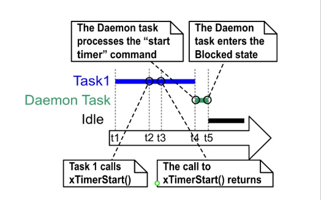
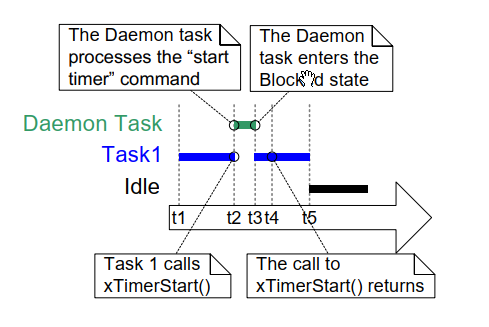

# 6 Software Timer Management

## 6.1 Chapter Introduction and Scope

Software timers are used to schedule the execution of a function at a
set time in the future, or periodically with a fixed frequency. The
function executed by the software timer is called the software timer's
callback function.

Software timers are implemented by, and are under the control of, the
FreeRTOS kernel. They do not require hardware support, and are not
related to hardware timers or hardware counters.

Note that, in line with the FreeRTOS philosophy of using innovative
design to ensure maximum efficiency, software timers do not use any
processing time unless a software timer callback function is actually
executing.

Software timer functionality is optional. To include software timer
functionality:

1. Build the FreeRTOS source file FreeRTOS/Source/timers.c as part of
   your project.

2. Define the constants detailed below in the application's FreeRTOSConfig.h header file :

- `configUSE_TIMERS`

  Set `configUSE_TIMERS` to 1 in FreeRTOSConfig.h.

- `configTIMER_TASK_PRIORITY`

  Sets the priority of the timer service task between 0 and ( `configMAX_PRIORITIES` - 1 ).

- `configTIMER_QUEUE_LENGTH`

  Sets the maximum number of unprocessed commands that the timer command queue can hold at any one time.

- `configTIMER_TASK_STACK_DEPTH`

  Sets the size of the stack (in words, not bytes) allocated to the timer service task.

### 6.1.1 Scope

This chapter covers:

- The characteristics of a software timer compared to the
  characteristics of a task.
- The RTOS daemon task.
- The timer command queue.
- The difference between a one shot software timer and a periodic
  software timer.
- How to create, start, reset and change the period of a software timer.


## 6.2 Software Timer Callback Functions

Software timer callback functions are implemented as C functions. The
only thing special about them is their prototype, which must return
void, and take a handle to a software timer as its only parameter. The
callback function prototype is demonstrated by Listing 6.1.


<a name="list" title="Listing 6.1 The software timer callback function prototype"></a>

```c
void ATimerCallback( TimerHandle_t xTimer );
```
***Listing 6.1*** *The software timer callback function prototype*

Software timer callback functions execute from start to finish, and exit
in the normal way. They should be kept short, and must not enter the
Blocked state.

> *Note: As will be seen, software timer callback functions execute in the
> context of a task that is created automatically when the FreeRTOS
> scheduler is started. Therefore, it is essential that software timer
> callback functions never call FreeRTOS API functions that will result in
> the calling task entering the Blocked state. It is ok to call functions
> such as `xQueueReceive()`, but only if the function's `xTicksToWait`
> parameter (which specifies the function's block time) is set to 0. It is
> not ok to call functions such as `vTaskDelay()`, as calling `vTaskDelay()`
> will always place the calling task into the Blocked state.*


## 6.3 Attributes and States of a Software Timer

### 6.3.1 Period of a Software Timer

A software timer's 'period' is the time between the software timer being
started, and the software timer's callback function executing.

### 6.3.2 One-shot and Auto-reload Timers

There are two types of software timer:

1. One-shot timers

   Once started, a one-shot timer will execute its callback function
   once only. A one-shot timer can be restarted manually, but will not
   restart itself.

1. Auto-reload timers

   Once started, an auto-reload timer will re-start itself each time it
   expires, resulting in periodic execution of its callback function.

Figure 6.1 shows the difference in behavior between a one-shot timer and
an auto-reload timer. The dashed vertical lines mark the times at which
a tick interrupt occurs.


<a name="fig6.1" title="Figure 6.1 The difference in behavior between one-shot and auto-reload software timers"></a>

* * *

***Figure 6.1*** *The difference in behavior between one-shot and auto-reload software timers*
* * *

Referring to Figure 6.1:

- Timer 1

  Timer 1 is a one-shot timer that has a period of 6 ticks. It is
  started at time t1, so its callback function executes 6 ticks later,
  at time t7. As timer 1 is a one-shot timer, its callback function does
  not execute again.

- Timer 2

  Timer 2 is an auto-reload timer that has a period of 5 ticks. It is
  started at time t1, so its callback function executes every 5 ticks
  after time t1. In Figure 6.1 this is at times t6, t11 and t16.


### 6.3.3 Software Timer States

A software timer can be in one of the following two states:

- Dormant

  A Dormant software timer exists, and can be referenced by its handle,
  but is not running, so its callback functions will not execute.

- Running

  A Running software timer will execute its callback function after a
  time equal to its period has elapsed since the software timer entered
  the Running state, or since the software timer was last reset.

Figure 6.2 and Figure 6.3 show the possible transitions between the
Dormant and Running states for an auto-reload timer and a one-shot timer
respectively. The key difference between the two diagrams is the state
entered after the timer has expired; the auto-reload timer executes its
callback function then re-enters the Running state, the one-shot timer
executes its callback function then enters the Dormant state.


<a name="fig6.2" title="Figure 6.2 Auto-reload software timer states and transitions"></a>
<a name="fig6.3" title="Figure 6.3 One-shot software timer states and transitions"></a>

* * *

***Figure 6.2*** *Auto-reload software timer states and transitions*


***Figure 6.3*** *One-shot software timer states and transitions*
* * *

The `xTimerDelete()` API function deletes a timer. A timer can be deleted
at any time. The function prototype is demonstrated by Listing 6.2.


<a name="list6.2" title="Listing 6.2 The xTimerDelete() API function prototype"></a>

```c
BaseType_t xTimerDelete( TimerHandle_t xTimer, TickType_t xTicksToWait );
```
***Listing 6.2*** *The xTimerDelete() API function prototype*


**xTimerDelete() parameters and return value**

- `xTimer`

  The handle of the timer being deleted.

- `xTicksToWait`

  Specifies the time, in ticks, that the calling task should be held
  in the Blocked state to wait for the delete command to be successfully
  sent to the timer command queue, should the queue already be full when
  xTimerDelete() was called.  xTicksToWait is ignored if xTimerDelete()
  is called before the scheduler is started.

- Return value

  There are two possible return values:

  - `pdPASS`

    `pdPASS` will be returned if the command was successfully sent to the
     timer command queue.

  - `pdFAIL`

    `pdFAIL` will be returned if the delete command could not be sent to
    the timer command queue even after xBlockTime ticks had passed.


## 6.4 The Context of a Software Timer

### 6.4.1 The RTOS Daemon (Timer Service) Task

All software timer callback functions execute in the context of the same
RTOS daemon (or 'timer service') task[^10].

[^10]: The task used to be called the 'timer service task', because
originally it was only used to execute software timer callback
functions. Now the same task is used for other purposes too, so it
is known by the more generic name of the 'RTOS daemon task'.

The daemon task is a standard FreeRTOS task that is created
automatically when the scheduler is started. Its priority and stack size
are set by the `configTIMER_TASK_PRIORITY` and
`configTIMER_TASK_STACK_DEPTH` compile time configuration constants
respectively. Both constants are defined within FreeRTOSConfig.h.

Software timer callback functions must not call FreeRTOS API functions
that will result in the calling task entering the Blocked state, as to
do so will result in the daemon task entering the Blocked state.


### 6.4.2 The Timer Command Queue

Software timer API functions send commands from the calling task to the
daemon task on a queue called the 'timer command queue'. This is shown
in Figure 6.4. Examples of commands include 'start a timer', 'stop a
timer' and 'reset a timer'.

The timer command queue is a standard FreeRTOS queue that is created
automatically when the scheduler is started. The length of the timer
command queue is set by the `configTIMER_QUEUE_LENGTH` compile time
configuration constant in FreeRTOSConfig.h.


<a name="fig6.4" title="Figure 6.4 The timer command queue being used by a software timer API function to communicate with the RTOS daemon task"></a>

* * *

***Figure 6.4*** *The timer command queue being used by a software timer API function to communicate with the RTOS daemon task*
* * *


### 6.4.3 Daemon Task Scheduling

The daemon task is scheduled like any other FreeRTOS task; it will only
process commands, or execute timer callback functions, when it is the
highest priority task that is able to run. Figure 6.5 and Figure 6.6
demonstrate how the `configTIMER_TASK_PRIORITY` setting affects the
execution pattern.

Figure 6.5 shows the execution pattern when the priority of the daemon
task is below the priority of a task that calls the `xTimerStart()` API
function.


<a name="fig6.5" title="Figure 6.5 The execution pattern when the priority of a task calling xTimerStart() is above the priority of the daemon task"></a>

* * *

***Figure 6.5*** *The execution pattern when the priority of a task calling xTimerStart() is above the priority of the daemon task*
* * *

Referring to Figure 6.5, in which the priority of Task 1 is higher than
the priority of the daemon task, and the priority of the daemon task is
higher than the priority of the Idle task:

1.  At time t1

    Task 1 is in the Running state, and the daemon task is in the
    Blocked state.

    The daemon task will leave the Blocked state if a command is sent to
    the timer command queue, in which case it will process the command,
    or if a software timer expires, in which case it will execute the
    software timer's callback function.

1. At time t2

   Task 1 calls `xTimerStart()`.

   `xTimerStart()` sends a command to the timer command queue, causing
   the daemon task to leave the Blocked state. The priority of Task 1
   is higher than the priority of the daemon task, so the daemon task
   does not pre-empt Task 1.

   Task 1 is still in the Running state, and the daemon task has left
   the Blocked state and entered the Ready state.

1. At time t3

   Task 1 completes executing the `xTimerStart()` API function. Task 1
   executed `xTimerStart()` from the start of the function to the end of
   the function, without leaving the Running state.

1. At time t4

   Task 1 calls an API function that results in it entering the Blocked
   state. The daemon task is now the highest priority task in the Ready
   state, so the scheduler selects the daemon task as the task to enter
   the Running state. The daemon task then starts to process the
   command sent to the timer command queue by Task 1.

   > *Note: The time at which the software timer being started will
   > expire is calculated from the time the 'start a timer' command was
   > sent to the timer command queue—it is not calculated from the time
   > the daemon task received the 'start a timer' command from the timer
   > command queue.*

1. At time t5

   The daemon task has completed processing the command sent to it by
   Task 1, and attempts to receive more data from the timer command
   queue. The timer command queue is empty, so the daemon task
   re-enters the Blocked state. The daemon task will leave the Blocked
   state again if a command is sent to the timer command queue, or if a
   software timer expires.

   The Idle task is now the highest priority task in the Ready state,
   so the scheduler selects the Idle task as the task to enter the
   Running state.

Figure 6.6 shows a similar scenario to that shown by Figure 6.5, but this
time the priority of the daemon task is above the priority of the task
that calls `xTimerStart()`.


<a name="fig6.6" title="Figure 6.6 The execution pattern when the priority of a task calling xTimerStart() is below the priority of the daemon task"></a>

* * *

***Figure 6.6*** *The execution pattern when the priority of a task calling xTimerStart() is below the priority of the daemon task*
* * *

Referring to Figure 6.6, in which the priority of the daemon task is
higher than the priority of Task 1, and the priority of the Task 1 is
higher than the priority of the Idle task:

1. At time t1

   As before, Task 1 is in the Running state, and the daemon task is in
   the Blocked state.

1. At time t2

   Task 1 calls `xTimerStart()`.

   `xTimerStart()` sends a command to the timer command queue, causing
   the daemon task to leave the Blocked state. The priority of the
   daemon task is higher than the priority of Task 1, so the scheduler
   selects the daemon task as the task to enter the Running state.

   Task 1 was pre-empted by the daemon task before it had completed
   executing the `xTimerStart()` function, and is now in the Ready state.

   The daemon task starts to process the command sent to the timer
   command queue by Task 1.

1. At time t3

   The daemon task has completed processing the command sent to it by
   Task 1, and attempts to receive more data from the timer command
   queue. The timer command queue is empty, so the daemon task
   re-enters the Blocked state.

   Task 1 is now the highest priority task in the Ready state, so the
   scheduler selects Task 1 as the task to enter the Running state.

1. At time t4

   Task 1 was pre-empted by the daemon task before it had completed
   executing the `xTimerStart()` function, and only exits (returns from)
   `xTimerStart()` after it has re-entered the Running state.

1. At time t5

   Task 1 calls an API function that results in it entering the Blocked
   state. The Idle task is now the highest priority task in the Ready
   state, so the scheduler selects the Idle task as the task to enter
   the Running state.

In the scenario shown by Figure 6.5, time passed between Task 1 sending a
command to the timer command queue, and the daemon task receiving and
processing the command. In the scenario shown by Figure 6.6, the daemon
task had received and processed the command sent to it by Task 1 before
Task 1 returned from the function that sent the command.

Commands sent to the timer command queue contain a time stamp. The time
stamp is used to account for any time that passes between a command
being sent by an application task, and the same command being processed
by the daemon task. For example, if a 'start a timer' command is sent to
start a timer that has a period of 10 ticks, the time stamp is used to
ensure the timer being started expires 10 ticks after the command was
sent, not 10 ticks after the command was processed by the daemon task.


##  6.5 Creating and Starting a Software Timer

### 6.5.1 The xTimerCreate() API Function

FreeRTOS also includes the `xTimerCreateStatic()` function, which
allocates the memory required to create a timer statically at compile
time: A software timer must be explicitly created before it can be used.

Software timers are referenced by variables of type `TimerHandle_t`.
`xTimerCreate()` is used to create a software timer and returns a
`TimerHandle_t` to reference the software timer it creates. Software
timers are created in the Dormant state.

Software timers can be created before the scheduler is running, or from
a task after the scheduler has been started.

[Section 2.5: Data Types and Coding Style Guide](ch02.md#25-data-types-and-coding-style-guide) describes the data types and naming conventions used.


<a name="list6.3" title="Listing 6.3 The xTimerCreate() API function prototype"></a>

```c
TimerHandle_t xTimerCreate( const char * const pcTimerName,
                            const TickType_t xTimerPeriodInTicks,
                            const BaseType_t xAutoReload,
                            void * const pvTimerID,
                            TimerCallbackFunction_t pxCallbackFunction );
```
***Listing 6.3*** *The xTimerCreate() API function prototype*

**xTimerCreate() parameters and return value**

- `pcTimerName`

  A descriptive name for the timer. This is not used by FreeRTOS in
  any way. It is included purely as a debugging aid. Identifying a timer
  by a human readable name is much simpler than attempting to identify it
  by its handle.

- `xTimerPeriodInTicks`

  The timer's period specified in ticks. The `pdMS_TO_TICKS()` macro can
  be used to convert a time specified in milliseconds into a time
  specified in ticks. Cannot be 0.

- `xAutoReload`

  Set `xAutoReload` to `pdTRUE` to create an auto-reload timer. Set
  `xAutoReload` to `pdFALSE` to create a one-shot timer.

- `pvTimerID`

  Each software timer has an ID value. The ID is a void pointer,
  and can be used by the application writer for any purpose. The ID is
  particularly useful when the same callback function is used by more than
  one software timer, as it can be used to provide timer specific storage.
  Use of a timer's ID is demonstrated in an example in this
  chapter.

  `pvTimerID` sets an initial value for the ID of the task being created.

- `pxCallbackFunction`

  Software timer callback functions are simply C functions that
  conform to the prototype shown in Listing 6.1. The `pxCallbackFunction`
  parameter is a pointer to the function (in effect, just the function
  name) to use as the callback function for the software timer being
  created.

- Return value

  If NULL is returned, then the software timer cannot be created
  because there is insufficient heap memory available for FreeRTOS to
  allocate the necessary data structure.

  If a non-NULL value is returned it indicates that the software timer has
  been created successfully. The returned value is the handle of the
  created timer.

  Chapter 3 provides more information on heap memory management.


### 6.5.2 The xTimerStart() API Function

`xTimerStart()` is used to start a software timer that is in the Dormant
state, or reset (re-start) a software timer that is in the Running
state. `xTimerStop()` is used to stop a software timer that is in the
Running state. Stopping a software timer is the same as transitioning
the timer into the Dormant state.

`xTimerStart()` can be called before the scheduler is started, but when
this is done, the software timer will not actually start until the time
at which the scheduler starts.

> *Note: Never call `xTimerStart()` from an interrupt service routine. The
> interrupt-safe version `xTimerStartFromISR()` should be used in its
> place.*


<a name="list6.4" title="Listing 6.4 The xTimerStart() API function prototype"></a>

```c
BaseType_t xTimerStart( TimerHandle_t xTimer, TickType_t xTicksToWait );
```
***Listing 6.4*** *The xTimerStart() API function prototype*


**xTimerStart() parameters and return value**

- `xTimer`

  The handle of the software timer being started or reset. The handle
  will have been returned from the call to `xTimerCreate()` used to create
  the software timer.

- `xTicksToWait`

  `xTimerStart()` uses the timer command queue to send the 'start a
  timer' command to the daemon task. `xTicksToWait` specifies the maximum
  amount of time the calling task should remain in the Blocked state to
  wait for space to become available on the timer command queue, should
  the queue already be full.

  `xTimerStart()` will return immediately if `xTicksToWait` is zero and the
  timer command queue is already full.

  The block time is specified in tick periods, so the absolute time it
  represents is dependent on the tick frequency. The macro `pdMS_TO_TICKS()`
  can be used to convert a time specified in milliseconds into a time
  specified in ticks.

  If `INCLUDE_vTaskSuspend` is set to 1 in `FreeRTOSConfig.h` then setting
  `xTicksToWait` to `portMAX_DELAY` will result in the calling task remaining
  in the Blocked state indefinitely (without a timeout) to wait for space
  to become available in the timer command queue.

  If `xTimerStart()` is called before the scheduler has been started then
  the value of `xTicksToWait` is ignored, and `xTimerStart()` behaves as if
  `xTicksToWait` had been set to zero.

- Return value

  There are two possible return values:

  - `pdPASS`

    `pdPASS` will be returned only if the 'start a timer' command was
    successfully sent to the timer command queue.

    If the priority of the daemon task is above the priority of the task
    that called `xTimerStart()`, then the scheduler will ensure the start
    command is processed before `xTimerStart()` returns. This is because the
    daemon task will pre-empt the task that called `xTimerStart()` as soon as
    there is data in the timer command queue.

    If a block time was specified (`xTicksToWait` was not zero), then it is
    possible the calling task was placed into the Blocked state to wait for
    space to become available in the timer command queue before the function
    returned, but data was successfully written to the timer command queue
    before the block time expired.

  - `pdFAIL`

    `pdFAIL` will be returned if the 'start a timer' command could not be
    written to the timer command queue because the queue was already
    full.

    If a block time was specified (`xTicksToWait` was not zero) then the
    calling task will have been placed into the Blocked state to wait for
    the daemon task to make room in the timer command queue, but the
    specified block time expired before that happened.


<a name="example6.1" title="Example 6.1 Creating one-shot and auto-reload timers"></a>
---
***Example 6.1*** *Creating one-shot and auto-reload timers*

---

This example creates and starts a one-shot timer and an auto-reload
timer—as shown in Listing 6.5.


<a name="list6.5" title="Listing 6.5 Creating and starting the timers used in Example 6.1"></a>

```c
/* The periods assigned to the one-shot and auto-reload timers are 3.333
   second and half a second respectively. */
#define mainONE_SHOT_TIMER_PERIOD pdMS_TO_TICKS( 3333 )
#define mainAUTO_RELOAD_TIMER_PERIOD pdMS_TO_TICKS( 500 )

int main( void )
{
    TimerHandle_t xAutoReloadTimer, xOneShotTimer;
    BaseType_t xTimer1Started, xTimer2Started;

    /* Create the one shot timer, storing the handle to the created timer in
       xOneShotTimer. */
    xOneShotTimer = xTimerCreate(
        /* Text name for the software timer - not used by FreeRTOS. */
                                  "OneShot",
        /* The software timer's period in ticks. */
                                   mainONE_SHOT_TIMER_PERIOD,
        /* Setting uxAutoRealod to pdFALSE creates a one-shot software timer. */
                                   pdFALSE,
        /* This example does not use the timer id. */
                                   0,
        /* Callback function to be used by the software timer being created. */
                                   prvOneShotTimerCallback );

    /* Create the auto-reload timer, storing the handle to the created timer
       in xAutoReloadTimer. */
    xAutoReloadTimer = xTimerCreate(
        /* Text name for the software timer - not used by FreeRTOS. */
                                     "AutoReload",
        /* The software timer's period in ticks. */
                                     mainAUTO_RELOAD_TIMER_PERIOD,
        /* Setting uxAutoRealod to pdTRUE creates an auto-reload timer. */
                                     pdTRUE,
        /* This example does not use the timer id. */
                                     0,
        /* Callback function to be used by the software timer being created. */
                                     prvAutoReloadTimerCallback );

    /* Check the software timers were created. */
    if( ( xOneShotTimer != NULL ) && ( xAutoReloadTimer != NULL ) )
    {
        /* Start the software timers, using a block time of 0 (no block time).
           The scheduler has not been started yet so any block time specified
           here would be ignored anyway. */
        xTimer1Started = xTimerStart( xOneShotTimer, 0 );
        xTimer2Started = xTimerStart( xAutoReloadTimer, 0 );

        /* The implementation of xTimerStart() uses the timer command queue,
           and xTimerStart() will fail if the timer command queue gets full.
           The timer service task does not get created until the scheduler is
           started, so all commands sent to the command queue will stay in the
           queue until after the scheduler has been started. Check both calls
           to xTimerStart() passed. */
        if( ( xTimer1Started == pdPASS ) && ( xTimer2Started == pdPASS ) )
        {
            /* Start the scheduler. */
            vTaskStartScheduler();
        }
    }

    /* As always, this line should not be reached. */
    for( ;; );
}
```
***Listing 6.5*** *Creating and starting the timers used in Example 6.1*


The timers' callback functions just print a message each time they are
called. The implementation of the one-shot timer callback function is
shown in Listing 6.6. The implementation of the auto-reload timer
callback function is shown in Listing 6.7.


<a name="list6.5" title="Listing 6.6 The callback function used by the one-shot timer in Example 6.1"></a>

```c
static void prvOneShotTimerCallback( TimerHandle_t xTimer )
{
    TickType_t xTimeNow;

    /* Obtain the current tick count. */
    xTimeNow = xTaskGetTickCount();

    /* Output a string to show the time at which the callback was executed. */
    vPrintStringAndNumber( "One-shot timer callback executing", xTimeNow );

    /* File scope variable. */
    ulCallCount++;
}
```
***Listing 6.6*** *The callback function used by the one-shot timer in Example 6.1*


<a name="list6.7" title="Listing 6.7 The callback function used by the auto-reload timer in Example 6.1"></a>

```c
static void prvAutoReloadTimerCallback( TimerHandle_t xTimer )
{
    TickType_t xTimeNow;

    /* Obtain the current tick count. */
    xTimeNow = xTaskGetTickCount();

    /* Output a string to show the time at which the callback was executed. */
    vPrintStringAndNumber( "Auto-reload timer callback executing", xTimeNow);

    ulCallCount++;
}
```
***Listing 6.7*** *The callback function used by the auto-reload timer in Example 6.1*

Executing this example produces the output shown in Figure 6.7. Figure 6.7
shows the auto-reload timer's callback function executing with a fixed
period of 500 ticks (`mainAUTO_RELOAD_TIMER_PERIOD` is set to 500 in
Listing 6.5), and the one-shot timer's callback function executing only
once, when the tick count is 3333 (`mainONE_SHOT_TIMER_PERIOD` is set to
3333 in Listing 6.5).


<a name="fig6.7" title="Figure 6.7 The output produced when Example 6.1 is executed"></a>

* * *

***Figure 6.7*** *The output produced when Example 6.1 is executed*
* * *


## 6.6 The Timer ID

Each software timer has an ID, which is a tag value that can be used by
the application writer for any purpose. The ID is stored in a void
pointer (`void *`), so it can store an integer value directly, point to any
other object, or be used as a function pointer.

An initial value is assigned to the ID when the software timer is
created, after which the ID can be updated using the `vTimerSetTimerID()`
API function, and queried using the `pvTimerGetTimerID()` API function.

Unlike other software timer API functions, `vTimerSetTimerID()` and
`pvTimerGetTimerID()` access the software timer directly—they do not send
a command to the timer command queue.


### 6.6.1 The vTimerSetTimerID() API Function


<a name="list6.8" title="Listing 6.8 The vTimerSetTimerID() API function prototype"></a>

```c
void vTimerSetTimerID( const TimerHandle_t xTimer, void *pvNewID );
```
***Listing 6.8*** *The vTimerSetTimerID() API function prototype*


**vTimerSetTimerID() parameters**

- `xTimer`

  The handle of the software timer being updated with a new ID value.
  The handle will have been returned from the call to `xTimerCreate()` used
  to create the software timer.

- `pvNewID`

  The value to which the software timer's ID will be set.


### 6.6.2 The pvTimerGetTimerID() API Function


<a name="list6.9" title="Listing 6.9 The pvTimerGetTimerID() API function prototype"></a>

```c
void *pvTimerGetTimerID( const TimerHandle_t xTimer );
```
***Listing 6.9*** *The pvTimerGetTimerID() API function prototype*


**pvTimerGetTimerID() parameters and return value**

- `xTimer`

  The handle of the software timer being queried. The handle will have
  been returned from the call to `xTimerCreate()` used to create the
  software timer.

- Return value

  The ID of the software timer being queried.


<a name="example6.2" title="Example 6.2 Using the callback function parameter and the software timer ID"></a>
---
***Example 6.2*** *Using the callback function parameter and the software timer ID*

---

The same callback function can be assigned to more than one software
timer. When that is done, the callback function parameter is used to
determine which software timer expired.

Example 6.1 used two separate callback functions; one callback function
was used by the one-shot timer, and the other callback function was used
by the auto-reload timer. Example 6.2 creates similar functionality to
that created by Example 6.1, but assigns a single callback function to
both software timers.

The `main()` function used by Example 6.2 is almost identical to the `main()`
function used in Example 6.1. The only difference is where the software
timers are created. This difference is shown in Listing 6.10, where
`prvTimerCallback()` is used as the callback function for both timers.


<a name="list6.10" title="Listing 6.10 Creating the timers used in Example 6.2"></a>

```c
/* Create the one shot timer software timer, storing the handle in
   xOneShotTimer. */
xOneShotTimer = xTimerCreate( "OneShot",
                              mainONE_SHOT_TIMER_PERIOD,
                              pdFALSE,
                              /* The timer's ID is initialized to NULL. */
                              NULL,
                              /* prvTimerCallback() is used by both timers. */
                              prvTimerCallback );

/* Create the auto-reload software timer, storing the handle in
   xAutoReloadTimer */
xAutoReloadTimer = xTimerCreate( "AutoReload",
                                 mainAUTO_RELOAD_TIMER_PERIOD,
                                 pdTRUE,
                                 /* The timer's ID is initialized to NULL. */
                                 NULL,
                                 /* prvTimerCallback() is used by both timers. */
                                 prvTimerCallback );
```
***Listing 6.10*** *Creating the timers used in Example 6.2*

`prvTimerCallback()` will execute when either timer expires. The
implementation of `prvTimerCallback()` uses the function's parameter to
determine if it was called because the one-shot timer expired, or
because the auto-reload timer expired.

`prvTimerCallback()` also demonstrates how to use the software timer ID as
timer specific storage; each software timer keeps a count of the number
of times it has expired in its own ID, and the auto-reload timer uses
the count to stop itself the fifth time it executes.

The implementation of `prvTimerCallback()` is shown in Listing 6.9.


<a name="list6.11" title="Listing 6.11 The timer callback function used in Example 6.2"></a>

```c
static void prvTimerCallback( TimerHandle_t xTimer )
{
    TickType_t xTimeNow;
    uint32_t ulExecutionCount;

    /* A count of the number of times this software timer has expired is
       stored in the timer's ID. Obtain the ID, increment it, then save it as
       the new ID value. The ID is a void pointer, so is cast to a uint32_t. */
    ulExecutionCount = ( uint32_t ) pvTimerGetTimerID( xTimer );
    ulExecutionCount++;
    vTimerSetTimerID( xTimer, ( void * ) ulExecutionCount );

    /* Obtain the current tick count. */
    xTimeNow = xTaskGetTickCount();

    /* The handle of the one-shot timer was stored in xOneShotTimer when the
       timer was created. Compare the handle passed into this function with
       xOneShotTimer to determine if it was the one-shot or auto-reload timer
       that expired, then output a string to show the time at which the
       callback was executed. */
    if( xTimer == xOneShotTimer )
    {
        vPrintStringAndNumber( "One-shot timer callback executing", xTimeNow );
    }
    else
    {
        /* xTimer did not equal xOneShotTimer, so it must have been the
           auto-reload timer that expired. */
        vPrintStringAndNumber( "Auto-reload timer callback executing", xTimeNow);

        if( ulExecutionCount == 5 )
        {
            /* Stop the auto-reload timer after it has executed 5 times. This
               callback function executes in the context of the RTOS daemon
               task so must not call any functions that might place the daemon
               task into the Blocked state. Therefore a block time of 0 is
               used. */
            xTimerStop( xTimer, 0 );
        }
    }
}
```
***Listing 6.11*** *The timer callback function used in Example 6.2*


The output produced by Example 6.2 is shown in Figure 6.8. It can be seen
that the auto-reload timer only executes five times.


<a name="fig6.8" title="Figure 6.8 The output produced when Example 6.2 is executed"></a>

* * *

***Figure 6.8*** *The output produced when Example 6.2 is executed*
* * *


## 6.7 Changing the Period of a Timer

Every official FreeRTOS port is provided with one or more example
projects. Most example projects are self-checking, and an LED is used to
give visual feedback of the project's status; if the self-checks have
always passed then the LED is toggled slowly, if a self-check has ever
failed then the LED is toggled quickly.

Some example projects perform the self-checks in a task, and use the
`vTaskDelay()` function to control the rate at which the LED toggles.
Other example projects perform the self-checks in a software timer
callback function, and use the timer's period to control the rate at
which the LED toggles.


### 6.7.1 The xTimerChangePeriod() API Function

The period of a software timer is changed using the `xTimerChangePeriod()` function.

If `xTimerChangePeriod()` is used to change the period of a timer that is
already running, then the timer will use the new period value to
recalculate its expiry time. The recalculated expiry time is relative to
when `xTimerChangePeriod()` was called, not relative to when the timer was
originally started.

If `xTimerChangePeriod()` is used to change the period of a timer that is
in the Dormant state (a timer that is not running), then the timer will
calculate an expiry time, and transition to the Running state (the timer
will start running).

> *Note: Never call `xTimerChangePeriod()` from an interrupt service
> routine. The interrupt-safe version `xTimerChangePeriodFromISR()` should
> be used in its place.*


<a name="list6.12" title="Listing 6.12 The xTimerChangePeriod() API function prototype"></a>

```c
BaseType_t xTimerChangePeriod( TimerHandle_t xTimer,
                               TickType_t xNewPeriod,
                               TickType_t xTicksToWait );
```
***Listing 6.12*** *The xTimerChangePeriod() API function prototype*


**xTimerChangePeriod() parameters and return value**

- `xTimer`

  The handle of the software timer being updated with a new period
  value. The handle will have been returned from the call to
  `xTimerCreate()` used to create the software timer.

- `xTimerPeriodInTicks`

  The new period for the software timer, specified in ticks. The
  `pdMS_TO_TICKS()` macro can be used to convert a time specified in
  milliseconds into a time specified in ticks.

- `xTicksToWait`

  `xTimerChangePeriod()` uses the timer command queue to send the
  'change period' command to the daemon task. `xTicksToWait` specifies the
  maximum amount of time the calling task should remain in the Blocked
  state to wait for space to become available on the timer command queue,
  if the queue is already full.

  `xTimerChangePeriod()` will return immediately if `xTicksToWait` is zero
  and the timer command queue is already full.

  The macro `pdMS_TO_TICKS()` can be used to convert a time specified in
  milliseconds into a time specified in ticks.

  If `INCLUDE_vTaskSuspend` is set to 1 in FreeRTOSConfig.h, then setting
  `xTicksToWait` to `portMAX_DELAY` will result in the calling task remaining
  in the Blocked state indefinitely (without a timeout) to wait for space
  to become available in the timer command queue.

  If `xTimerChangePeriod()` is called before the scheduler has been
  started, then the value of `xTicksToWait` is ignored, and
  `xTimerChangePeriod()` behaves as if `xTicksToWait` had been set to zero.

- Returned value

  There are two possible return values:

  - `pdPASS`

    `pdPASS` will be returned only if data was successfully sent to the
    timer command queue.

    If a block time was specified (`xTicksToWait` was not zero), then it is
    possible the calling task was placed into the Blocked state to wait for
    space to become available in the timer command queue before the function
    returned, but data was successfully written to the timer command queue
    before the block time expired.

  - `pdFAIL`

    `pdFAIL` will be returned if the 'change period' command could not be
    written to the timer command queue because the queue was already
    full.

    If a block time was specified (`xTicksToWait` was not zero) then the
    calling task will have been placed into the Blocked state to wait for
    the daemon task to make room in the queue, but the specified block time
    expired before that happened.

Listing 6.13 shows how the FreeRTOS examples that include self-checking
functionality in a software timer callback function use
`xTimerChangePeriod()` to increase the rate at which an LED toggles if a
self-check fails. The software timer that performs the self-checks is
referred to as the 'check timer'.


<a name="list6.13" title="Listing 6.13 Using xTimerChangePeriod()"></a>

```c
/* The check timer is created with a period of 3000 milliseconds, resulting
   in the LED toggling every 3 seconds. If the self-checking functionality
   detects an unexpected state, then the check timer's period is changed to
   just 200 milliseconds, resulting in a much faster toggle rate. */
const TickType_t xHealthyTimerPeriod = pdMS_TO_TICKS( 3000 );
const TickType_t xErrorTimerPeriod = pdMS_TO_TICKS( 200 );

/* The callback function used by the check timer. */
static void prvCheckTimerCallbackFunction( TimerHandle_t xTimer )
{
    static BaseType_t xErrorDetected = pdFALSE;

    if( xErrorDetected == pdFALSE )
    {
        /* No errors have yet been detected. Run the self-checking function
           again. The function asks each task created by the example to report
           its own status, and also checks that all the tasks are actually
           still running (and so able to report their status correctly). */
        if( CheckTasksAreRunningWithoutError() == pdFAIL )
        {
            /* One or more tasks reported an unexpected status. An error might
               have occurred. Reduce the check timer's period to increase the
               rate at which this callback function executes, and in so doing
               also increase the rate at which the LED is toggled. This
               callback function is executing in the context of the RTOS daemon
               task, so a block time of 0 is used to ensure the Daemon task
               never enters the Blocked state. */
            xTimerChangePeriod(
                  xTimer,            /* The timer being updated */
                  xErrorTimerPeriod, /* The new period for the timer */
                  0 );               /* Do not block when sending this command */

            /* Latch that an error has already been detected. */
            xErrorDetected = pdTRUE;
        }
    }

    /* Toggle the LED. The rate at which the LED toggles will depend on how
       often this function is called, which is determined by the period of the
       check timer. The timer's period will have been reduced from 3000ms to
       just 200ms if CheckTasksAreRunningWithoutError() has ever returned
       pdFAIL. */
    ToggleLED();
}
```
***Listing 6.13*** *Using xTimerChangePeriod()*

## 6.8 Resetting a Software Timer

Resetting a software timer means to re-start the timer; the timer's
expiry time is recalculated to be relative to when the timer was reset,
rather than when the timer was originally started. This is demonstrated
by Figure 6.9, which shows a timer that has a period of 6 being started,
then reset twice, before eventually expiring and executing its callback
function.


<a name="fig6.9" title="Figure 6.9 Starting and resetting a software timer that has a period of 6 ticks"></a>

* * *

***Figure 6.9*** *Starting and resetting a software timer that has a period of 6 ticks*
* * *

Referring to Figure 6.9:

- Timer 1 is started at time t1. It has a period of 6, so the time at
  which it will execute its callback function is originally calculated
  to be t7, which is 6 ticks after it was started.

- Timer 1 is reset before time t7 is reached, so before it had expired
  and executed its callback function. Timer 1 is reset at time t5, so
  the time at which it will execute its callback function is
  re-calculated to be t11, which is 6 ticks after it was reset.

- Timer 1 is reset again before time t11, so again before it had
  expired and executed its callback function. Timer 1 is reset at time
  t9, so the time at which it will execute its callback function is
  re-calculated to be t15, which is 6 ticks after it was last reset.

- Timer 1 is not reset again, so it expires at time t15, and its
  callback function is executed accordingly.


### 6.8.1 The xTimerReset() API Function

A timer is reset using the `xTimerReset()` API function.

`xTimerReset()` can also be used to start a timer that is in the Dormant state.

> *Note: Never call `xTimerReset()` from an interrupt service routine. The
> interrupt-safe version `xTimerResetFromISR()` should be used in its
> place.*


<a name="list6.14" title="Listing 6.14 The xTimerReset() API function prototype"></a>

```c
BaseType_t xTimerReset( TimerHandle_t xTimer, TickType_t xTicksToWait );
```
***Listing 6.14*** *The xTimerReset() API function prototype*


**xTimerReset() parameters and return value**

- `xTimer`

  The handle of the software timer being reset or started. The handle
  will have been returned from the call to `xTimerCreate()` used to create
  the software timer.

- `xTicksToWait`

  `xTimerReset()` uses the timer command queue to send the
  'reset' command to the daemon task. `xTicksToWait` specifies the maximum
  amount of time the calling task should remain in the Blocked state to
  wait for space to become available on the timer command queue, if
  the queue is already full.

  `xTimerReset()` will return immediately if `xTicksToWait` is zero and the
  timer command queue is already full.

  If `INCLUDE_vTaskSuspend` is set to 1 in `FreeRTOSConfig.h` then setting
  `xTicksToWait` to `portMAX_DELAY` will result in the calling task remaining
  in the Blocked state indefinitely (without a timeout) to wait for space
  to become available in the timer command queue.

- Returned value

  There are two possible return values:

  - `pdPASS`

    `pdPASS` will be returned only if data was successfully sent to the
    timer command queue.

    If a block time was specified (`xTicksToWait` was not zero), then it is
    possible the calling task was placed into the Blocked state to wait for
    space to become available in the timer command queue before the function
    returned, but data was successfully written to the timer command queue
    before the block time expired.

    `pdFAIL`

    `pdFAIL` will be returned if the 'reset' command could not be written
    to the timer command queue because the queue was already full.

    If a block time was specified (`xTicksToWait` was not zero) then the
    calling task will have been placed into the Blocked state to wait for
    the daemon task to make room in the queue, but the specified block time
    expired before that happened.


<a name="example6.3" title="Example 6.3 Resetting a software timer"></a>
---
***Example 6.3*** *Resetting a software timer*

---

This example simulates the behavior of the backlight on a cell phone. The backlight:

- Turns on when a key is pressed.

- Remains on provided further keys are pressed within a certain time period.

- Automatically turns off if no key presses are made within a certain time period.

A one-shot software timer is used to implement this behavior:

- The \[simulated\] backlight is turned on when a key is pressed, and
  turned off in the software timer's callback function.

- The software timer is reset each time a key is pressed.

- The time period during which a key must be pressed to prevent the
  backlight being turned off is therefore equal to the period of the
  software timer; if the software timer is not reset by a key press
  before the timer expires, then the timer's callback function
  executes, and the backlight is turned off.

The `xSimulatedBacklightOn` variable holds the backlight state.
`xSimulatedBacklightOn` is set to `pdTRUE` to indicate the backlight is on,
and `pdFALSE` to indicate the backlight is off.

The software timer callback function is shown in Listing 6.15.


<a name="list6.15" title="Listing 6.15 The callback function for the one-shot timer used in Example 6.3"></a>

```c
static void prvBacklightTimerCallback( TimerHandle_t xTimer )
{
    TickType_t xTimeNow = xTaskGetTickCount();

    /* The backlight timer expired, turn the backlight off. */
    xSimulatedBacklightOn = pdFALSE;

    /* Print the time at which the backlight was turned off. */
    vPrintStringAndNumber(
            "Timer expired, turning backlight OFF at time\t\t", xTimeNow );
}
```
***Listing 6.15*** *The callback function for the one-shot timer used in Example 6.3*


Example 6.3 creates a task to poll the keyboard[^11]. The task is shown
in Listing 6.16, but for the reasons described in the next paragraph,
Listing 6.16 is not intended to be representative of an optimal design.

[^11]: Printing to the Windows console, and reading keys from the
Windows console, both result in the execution of Windows system
calls. Windows system calls, including use of the Windows console,
disks, or TCP/IP stack, can adversely affect the behavior of the
FreeRTOS Windows port, and should normally be avoided.*

Using FreeRTOS allows your application to be event driven. Event driven
designs use processing time very efficiently, because processing time is
only used if an event has occurred, and processing time is not wasted
polling for events that have not occurred. Example 6.3 could not be made
event driven because it is not practical to process keyboard interrupts
when using the FreeRTOS Windows port, so the much less efficient polling
technique had to be used instead. If Listing 6.16 was an interrupt service
routine, then `xTimerResetFromISR()` would be used in place of
`xTimerReset()`.


<a name="list6.16" title="Listing 6.16 The task used to reset the software timer in Example 6.3"></a>

```c
static void vKeyHitTask( void *pvParameters )
{
    const TickType_t xShortDelay = pdMS_TO_TICKS( 50 );
    TickType_t xTimeNow;

    vPrintString( "Press a key to turn the backlight on.\r\n" );

    /* Ideally an application would be event driven, and use an interrupt to
       process key presses. It is not practical to use keyboard interrupts
       when using the FreeRTOS Windows port, so this task is used to poll for
       a key press. */
    for( ;; )
    {
        /* Has a key been pressed? */
        if( _kbhit() != 0 )
        {
            /* A key has been pressed. Record the time. */
            xTimeNow = xTaskGetTickCount();

            if( xSimulatedBacklightOn == pdFALSE )
            {

                /* The backlight was off, so turn it on and print the time at
                   which it was turned on. */
                xSimulatedBacklightOn = pdTRUE;
                vPrintStringAndNumber(
                    "Key pressed, turning backlight ON at time\t\t",
                    xTimeNow );
            }
            else
            {
                /* The backlight was already on, so print a message to say the
                   timer is about to be reset and the time at which it was
                   reset. */
                vPrintStringAndNumber(
                    "Key pressed, resetting software timer at time\t\t",
                    xTimeNow );
            }

            /* Reset the software timer. If the backlight was previously off,
               then this call will start the timer. If the backlight was
               previously on, then this call will restart the timer. A real
               application may read key presses in an interrupt. If this
               function was an interrupt service routine then
               xTimerResetFromISR() must be used instead of xTimerReset(). */
            xTimerReset( xBacklightTimer, xShortDelay );

            /* Read and discard the key that was pressed – it is not required
               by this simple example. */
            ( void ) _getch();
        }
    }
}
```
***Listing 6.16*** *The task used to reset the software timer in Example 6.3*

The output produced when Example 6.3 is executed is shown in Figure 6.10.
With reference to Figure 6.10:

- The first key press occurred when the tick count was 812. At that
  time the backlight was turned on, and the one-shot timer was
  started.

- Further key presses occurred when the tick count was 1813, 3114,
  4015 and 5016. All of these key presses resulted in the timer being
  reset before the timer had expired.

- The timer expired when the tick count was 10016. At that time the
  backlight was turned off.


<a name="fig6.10" title="Figure 6.10 The output produced when Example 6.3 is executed"></a>

* * *

***Figure 6.10*** *The output produced when Example 6.3 is executed*
* * *

It can be seen in Figure 6.10 that the timer had a period of 5000 ticks;
the backlight was turned off exactly 5000 ticks after a key was last
pressed, so 5000 ticks after the timer was last reset.
