# 7 Interrupt Management

## 7.1 Introduction

### 7.1.1 Events

Embedded real-time systems have to take actions in response to events
that originate from the environment. For example, a packet arriving on
an Ethernet peripheral (the event) might require passing it to a TCP/IP
stack for processing (the action). Non-trivial systems will have to
service events that originate from multiple sources, all of which will
have different processing overhead and response time requirements. In
each case, a judgment has to be made as to the best event processing
implementation strategy:

- How should the event be detected? Interrupts are normally used, but
  inputs can also be polled.

- When interrupts are used, how much processing should be performed
  inside the interrupt service routine (ISR), and how much outside? It
  is normally desirable to keep each ISR as short as possible.

- How are events communicated to the main (non-ISR) code, and how can
  this code be structured to best accommodate processing of
  potentially asynchronous occurrences?

FreeRTOS does not impose any specific event processing strategy on the
application designer, but does provide features that allow the chosen
strategy to be implemented in a simple and maintainable way.

It is important to draw a distinction between the priority of a task,
and the priority of an interrupt:

- A task is a software feature that is unrelated to the hardware on
  which FreeRTOS is running. The priority of a task is assigned in
  software by the application writer, and a software algorithm (the
  scheduler) decides which task will be placed in the Running state.

- Although written in software, an interrupt service routine is a
  hardware feature because the hardware controls which interrupt
  service routine will run, and when it will run. Tasks will only run
  when there are no ISRs running, so the lowest priority interrupt
  will interrupt the highest priority task, and there is no way for a
  task to pre-empt an ISR.

All architectures on which FreeRTOS will run are capable of processing
interrupts, but details relating to interrupt entry, and interrupt
priority assignment, vary between architectures.


### 7.1.2 Scope

This chapter covers:

- Which FreeRTOS API functions can be used from within an interrupt
  service routine.
- Methods of deferring interrupt processing to a task.
- How to create and use binary semaphores and counting semaphores.
- The differences between binary and counting semaphores.
- How to use a queue to pass data into and out of an interrupt service
  routine.
- The interrupt nesting model available with some FreeRTOS ports.


## 7.2 Using the FreeRTOS API from an ISR

### 7.2.1 The Interrupt Safe API

Often it is necessary to use the functionality provided by a FreeRTOS
API function from an interrupt service routine (ISR), but many FreeRTOS
API functions perform actions that are not valid inside an ISR. The most
notable of these is placing the task that called the API function into
the Blocked state— if an API function is called from an ISR, then it is
not being called from a task, so there is no calling task that can be
placed into the Blocked state. FreeRTOS solves this problem by providing
two versions of some API functions; one version for use from tasks, and
one version for use from ISRs. Functions intended for use from ISRs have
"FromISR" appended to their name.

> *Note: Never call a FreeRTOS API function that does not have "FromISR"
> in its name from an ISR.*


### 7.2.2 The Benefits of Using a Separate Interrupt Safe API

Having a separate API for use in interrupts allows task code to be more
efficient, ISR code to be more efficient, and interrupt entry to be
simpler. To see why, consider the alternative solution, which would have
been to provide a single version of each API function that could be
called from both a task and an ISR. If the same version of an API
function could be called from both a task and an ISR then:

- The API functions would need additional logic to determine if they
  had been called from a task or an ISR. The additional logic would
  introduce new paths through the function, making the functions
  longer, more complex, and harder to test.

- Some API function parameters would be obsolete when the function was
  called from a task, while others would be obsolete when the function
  was called from an ISR.

- Each FreeRTOS port would need to provide a mechanism for determining
  the execution context (task or ISR).

- Architectures on which it is not easy to determine the execution
  context (task or ISR) would require additional, wasteful, more
  complex to use, and non-standard interrupt entry code that allowed
  the execution context to be provided by software.


### 7.2.3 The Disadvantages of Using a Separate, Interrupt Safe API

Having two versions of some API functions allows both tasks and ISRs to
be more efficient, but introduces a new problem; sometimes it is
necessary to call a function that is not part of the FreeRTOS API, but
makes use of the FreeRTOS API, from both a task and an ISR.

This is normally only a problem when integrating third party code, as
that is the only time when the software's design is out of the control
of the application writer. If this does become an issue, then the problem
can be overcome using one of the following techniques:

-  Defer interrupt processing to a task[^12], so the API function is
   only ever called from the context of a task.

- If you are using a FreeRTOS port that supports interrupt nesting,
  then use the version of the API function that ends in "FromISR", as
  that version can be called from tasks and ISRs. (The reverse is not
  true, API functions that do not end in "FromISR" must not be called
  from an ISR.)

- Third party code normally includes an RTOS abstraction layer that
  can be implemented to test the context from which the function is
  being called (task or interrupt), and then call the API function
  that is appropriate for the context.


[^12]: Deferred interrupt processing is covered in the next section of
this book.


### 7.2.4 The xHigherPriorityTaskWoken Parameter

This section introduces the concept of the `xHigherPriorityTaskWoken`
parameter. Do not be concerned if you do not fully understand this
section yet, as practical examples are provided in following sections.

If a context switch is performed by an interrupt, then the task running
when the interrupt exits might be different than the task that was running
when the interrupt was entered—the interrupt will have interrupted one
task, but returned to a different task.

Some FreeRTOS API functions can move a task from the Blocked state to
the Ready state. This has already been seen with functions such as
`xQueueSendToBack()`, which will unblock a task if there was a task
waiting in the Blocked state for data to become available on the subject
queue.

If the priority of a task that is unblocked by a FreeRTOS API function
is higher than the priority of the task in the Running state, then, in
accordance with the FreeRTOS scheduling policy, a switch to the higher
priority task should occur. When the switch to the higher priority task
actually occurs is dependent on the context from which the API function
is called:

- If the API function was called from a task:

  If `configUSE_PREEMPTION` is set to 1 in FreeRTOSConfig.h then the
  switch to the higher priority task occurs automatically within the API
  function, in other words, before the API function has exited. This has already been
  seen in Figure 6.6, where a write to the timer command queue resulted
  in a switch to the RTOS daemon task before the function that wrote to
  the command queue had exited.

- If the API function was called from an interrupt:

  A switch to a higher priority task will not occur automatically inside
  an interrupt. Instead, a variable is set to inform the application
  writer that a context switch should be performed. Interrupt safe API
  functions (those that end in "FromISR") have a pointer parameter
  called `pxHigherPriorityTaskWoken` that is used for this purpose.

  If a context switch should be performed, then the interrupt safe API
  function will set `*pxHigherPriorityTaskWoken` to `pdTRUE`. To be able to
  detect this has happened, the variable pointed to by
  `pxHigherPriorityTaskWoken` must be initialized to `pdFALSE` before it is
  used for the first time.

  If the application writer opts not to request a context switch from
  the ISR, then the higher priority task will remain in the Ready state
  until the next time the scheduler runs, which in the worst case will be
  during the next tick interrupt.

  FreeRTOS API functions can only set `*pxHighPriorityTaskWoken` to
  `pdTRUE`. If an ISR calls more than one FreeRTOS API function, then the
  same variable can be passed as the `pxHigherPriorityTaskWoken` parameter
  in each API function call, and the variable only needs to be
  initialized to `pdFALSE` before it is used for the first time.

There are several reasons why context switches do not occur
automatically inside the interrupt safe version of an API function:

- Avoiding unnecessary context switches

  An interrupt may execute more than once before it is necessary for a
  task to perform any processing. For example, consider a scenario
  where a task processes a string that was received by an interrupt
  driven UART; it would be wasteful for the UART ISR to switch to the
  task each time a character was received because the task would only
  have processing to perform after the complete string had been
  received.

- Control over the execution sequence

  Interrupts can occur sporadically, and at unpredictable times.
  Expert FreeRTOS users may want to temporarily avoid an unpredictable
  switch to a different task at specific points in their
  application, although this can also be achieved using the FreeRTOS
  scheduler locking mechanism.

- Portability

  It is the simplest mechanism that can be used across all FreeRTOS ports.

- Efficiency

  Ports that target smaller processor architectures only allow a
  context switch to be requested at the very end of an ISR, and
  removing that restriction would require additional and more complex
  code. It also allows more than one call to a FreeRTOS API function
  within the same ISR without generating more than one request for a
  context switch within the same ISR.

- Execution in the RTOS tick interrupt

  As will be seen later in this book, it is possible to add
  application code into the RTOS tick interrupt. The result of
  attempting a context switch inside the tick interrupt is dependent
  on the FreeRTOS port in use. At best, it will result in an
  unnecessary call to the scheduler.

Use of the `pxHigherPriorityTaskWoken` parameter is optional. If it is not
required, then set `pxHigherPriorityTaskWoken` to NULL.


### 7.2.5 The portYIELD\_FROM\_ISR() and portEND\_SWITCHING\_ISR() Macros

This section introduces the macros that are used to request a context
switch from an ISR. Do not be concerned if you do not fully understand
this section yet, as practical examples are provided in following
sections.

`taskYIELD()` is a macro that can be called in a task to request a context
switch. `portYIELD_FROM_ISR()` and `portEND_SWITCHING_ISR()` are both
interrupt safe versions of `taskYIELD()`. `portYIELD_FROM_ISR()` and
`portEND_SWITCHING_ISR()` are both used in the same way, and do the same
thing[^13]. Some FreeRTOS ports only provide one of the two macros.
Newer FreeRTOS ports provide both macros. The examples in this book use
`portYIELD_FROM_ISR()`.

[^13]: Historically, `portEND_SWITCHING_ISR()` was the name used in
FreeRTOS ports that required interrupt handlers to use an assembly
code wrapper, and `portYIELD_FROM_ISR()` was the name used in FreeRTOS
ports that allowed the entire interrupt handler to be written in C.


<a name="list7.1" title="Listing 7.1 The portEND\_SWITCHING\_ISR() macros"></a>

```c
portEND_SWITCHING_ISR( xHigherPriorityTaskWoken );
```
***Listing 7.1*** *The portEND_SWITCHING\_ISR() macros*


<a name="list7.2" title="Listing 7.2 The portYIELD\_FROM\_ISR() macros"></a>

```c
portYIELD_FROM_ISR( xHigherPriorityTaskWoken );
```
***Listing 7.2*** *The portYIELD\_FROM\_ISR() macros*


The `xHigherPriorityTaskWoken` parameter passed out of an interrupt safe
API function can be used directly as the parameter in a call to
`portYIELD_FROM_ISR()`.

If the `portYIELD_FROM_ISR()` `xHigherPriorityTaskWoken` parameter is
`pdFALSE` (zero), then a context switch is not requested, and the macro
has no effect. If the `portYIELD_FROM_ISR()` `xHigherPriorityTaskWoken`
parameter is not `pdFALSE`, then a context switch is requested, and the
task in the Running state might change. The interrupt will always return
to the task in the Running state, even if the task in the Running state
changed while the interrupt was executing.

Most FreeRTOS ports allow `portYIELD_FROM_ISR()` to be called anywhere
within an ISR. A few FreeRTOS ports (predominantly those for smaller
architectures), only allow `portYIELD_FROM_ISR()` to be called at the very
end of an ISR.


## 7.3 Deferred Interrupt Processing

It is normally considered best practice to keep ISRs as short as
possible. Reasons for this include:

- Even if tasks have been assigned a very high priority, they will
  only run if no interrupts are being serviced by the hardware.

- ISRs can disrupt (add 'jitter' to) both the start time, and the
  execution time, of a task.

- Depending on the architecture on which FreeRTOS is running, it might
  not be possible to accept any new interrupts, or at least a subset
  of new interrupts, while an ISR is executing.

- The application writer needs to consider the consequences of, and
  guard against, resources such as variables, peripherals, and memory
  buffers being accessed by a task and an ISR at the same time.

- Some FreeRTOS ports allow interrupts to nest, but interrupt nesting
  can increase complexity and reduce predictability. The shorter an
  interrupt is, the less likely it is to nest.

An interrupt service routine must record the cause of the interrupt, and
clear the interrupt. Any other processing necessitated by the interrupt
can often be performed in a task, allowing the interrupt service routine
to exit as quickly as is practical. This is called 'deferred interrupt
processing', because the processing necessitated by the interrupt is
'deferred' from the ISR to a task.

Deferring interrupt processing to a task also allows the application
writer to prioritize the processing relative to other tasks in the
application, and use all the FreeRTOS API functions.

If the priority of the task to which interrupt processing is deferred is
above the priority of any other task, then the processing will be
performed immediately, just as if the processing had been performed in
the ISR itself. This scenario is shown in Figure 7.1, in which Task 1 is
a normal application task, and Task 2 is the task to which interrupt
processing is deferred.


<a name="fig7.1" title="Figure 7.1 Completing interrupt processing in a high priority task"></a>

* * *
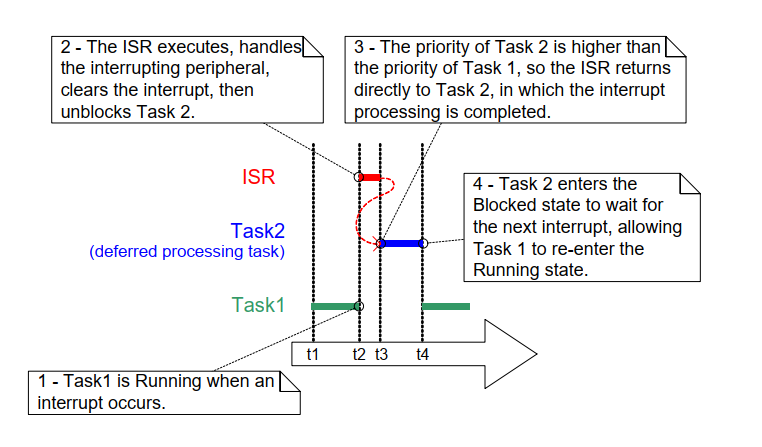
***Figure 7.1*** *Completing interrupt processing in a high priority task*
* * *

In Figure 7.1, interrupt processing starts at time t2, and effectively
ends at time t4, but only the period between times t2 and t3 is spent in
the ISR. If deferred interrupt processing had not been used then the
entire period between times t2 and t4 would have been spent in the ISR.

There is no absolute rule as to when it is best to perform all
processing necessitated by an interrupt in the ISR, and when it is best
to defer part of the processing to a task. Deferring processing to a
task is most useful when:

- The processing necessitated by the interrupt is not trivial. For
  example, if the interrupt is just storing the result of an analog to
  digital conversion, then it is almost certain this is best performed
  inside the ISR, but if result of the conversion must also be passed
  through a software filter, then it may be best to execute the filter
  in a task.

- It is convenient for the interrupt processing to perform an action
  that cannot be performed inside an ISR, such as write to a console,
  or allocate memory.

- The interrupt processing is not deterministic—meaning it is not
  known in advance how long the processing will take.

The following sections describe and demonstrate the concepts introduced
in this chapter so far, including FreeRTOS features that can be used to
implement deferred interrupt processing.


## 7.4 Binary Semaphores Used for Synchronization

The interrupt safe version of the Binary Semaphore API can be used to
unblock a task each time a particular interrupt occurs, effectively
synchronizing the task with the interrupt. This allows the majority of
the interrupt event processing to be implemented within the synchronized
task, with only a very fast and short portion remaining directly in the
ISR. As described in the previous section, the binary semaphore is used
to 'defer' interrupt processing to a task[^14].

[^14]: It is more efficient to unblock a task from an interrupt using a
direct to task notification than it is using a binary semaphore.
Direct to task notifications are not covered until Chapter 10, Task
Notifications.

As previously demonstrated in Figure 7.1, if the interrupt processing is
particularly time critical, then the priority of the deferred processing
task can be set to ensure the task always pre-empts the other tasks in
the system. The ISR can then be implemented to include a call to
`portYIELD_FROM_ISR()`, ensuring the ISR returns directly to the task to
which interrupt processing is being deferred. This has the effect of
ensuring the entire event processing executes contiguously (without a
break) in time, just as if it had all been implemented within the ISR
itself. Figure 7.2 repeats the scenario shown in Figure 7.1, but with the
text updated to describe how the execution of the deferred processing
task can be controlled using a semaphore.


<a name="fig7.2" title="Figure 7.2 Using a binary semaphore to implement deferred interrupt processing"></a>

* * *
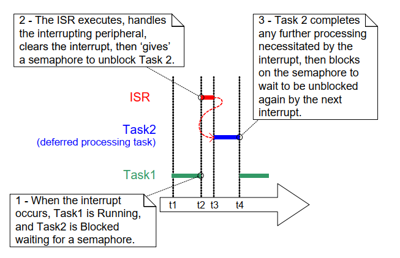
***Figure 7.2*** *Using a binary semaphore to implement deferred interrupt processing*
* * *

The deferred processing task uses a blocking 'take' call to a semaphore
as a means of entering the Blocked state to wait for the event to occur.
When the event occurs, the ISR uses a 'give' operation on the same
semaphore to unblock the task so that the required event processing can
proceed.

'Taking a semaphore' and 'giving a semaphore' are concepts that have
different meanings depending on their usage scenario. In this interrupt
synchronization scenario, the binary semaphore can be considered
conceptually as a queue with a length of one. The queue can contain a
maximum of one item at any time, so is always either empty or full
(hence, binary). By calling `xSemaphoreTake()`, the task to which
interrupt processing is deferred effectively attempts to read from the
queue with a block time, causing the task to enter the Blocked state if
the queue is empty. When the event occurs, the ISR uses the
`xSemaphoreGiveFromISR()` function to place a token (the semaphore) into
the queue, making the queue full. This causes the task to exit the
Blocked state and remove the token, leaving the queue empty once more.
When the task has completed its processing, it once more attempts to
read from the queue and, finding the queue empty, re-enters the Blocked
state to wait for the next event. This sequence is demonstrated in
Figure 7.3.

Figure 7.3 shows the interrupt 'giving' the semaphore, even though it has
not first 'taken' it, and the task 'taking' the semaphore, but never
giving it back. This is why the scenario is described as being
conceptually similar to writing to and reading from a queue. It often
causes confusion as it does not follow the same rules as other semaphore
usage scenarios, where a task that takes a semaphore must always give it
back—such as the scenarios described in Chapter 8, Resource Management.


<a name="fig7.3" title="Figure 7.3 Using a binary semaphore to synchronize a task with an interrupt"></a>

* * *
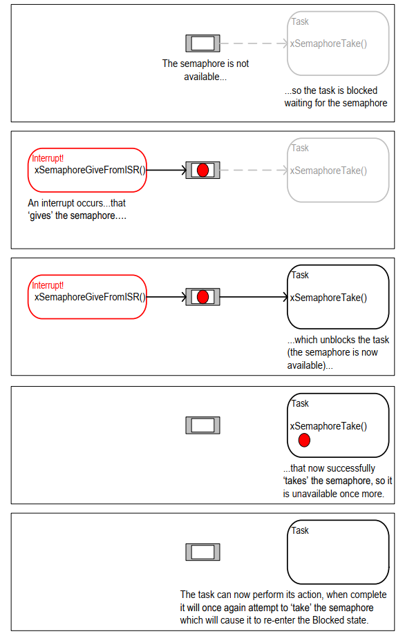
***Figure 7.3*** *Using a binary semaphore to synchronize a task with an interrupt*
* * *


### 7.4.1 The xSemaphoreCreateBinary() API Function

FreeRTOS also includes the `xSemaphoreCreateBinaryStatic()`
function, which allocates the memory required to create a binary
semaphore statically at compile time: Handles to all the various types
of FreeRTOS semaphore are stored in a variable of type
`SemaphoreHandle_t`.

Before a semaphore can be used, it must be created. To create a binary
semaphore, use the `xSemaphoreCreateBinary()` API function[^15].

[^15]: Some Semaphore API functions are actually macros, not functions.
For simplicity, they are all referred to as functions throughout
this book.


<a name="list7.3" title="Listing 7.3 The xSemaphoreCreateBinary() API function prototype"></a>

```c
SemaphoreHandle_t xSemaphoreCreateBinary( void );
```
***Listing 7.3*** *The xSemaphoreCreateBinary() API function prototype*

**xSemaphoreCreateBinary() Return Value**

- Return value

  If NULL is returned, then the semaphore cannot be created because
  there is insufficient heap memory available for FreeRTOS to allocate the
  semaphore data structures.

  If a non-NULL value is returned, it indicates that the semaphore has been
  created successfully. The returned value should be stored as the handle
  to the created semaphore.


### 7.4.2 The xSemaphoreTake() API Function

'Taking' a semaphore means to 'obtain' or 'receive' the semaphore. The
semaphore can be taken only if it is available.

All the various types of FreeRTOS semaphore, except recursive mutexes,
can be 'taken' using the `xSemaphoreTake()` function.

`xSemaphoreTake()` must not be used from an interrupt service routine.


<a name="list7.4" title="Listing 7.4 The xSemaphoreTake() API function prototype"></a>

```c
BaseType_t xSemaphoreTake( SemaphoreHandle_t xSemaphore, TickType_t xTicksToWait );
```
***Listing 7.4*** *The xSemaphoreTake() API function prototype*

**xSemaphoreTake() parameters and return value**

- `xSemaphore`

  The semaphore being 'taken'.

  A semaphore is referenced by a variable of type `SemaphoreHandle_t`. It
  must be explicitly created before it can be used.

- `xTicksToWait`

  The maximum amount of time the task should remain in the Blocked
  state to wait for the semaphore if it is not already available.

  If `xTicksToWait` is zero, then `xSemaphoreTake()` will return
  immediately if the semaphore is not available.

  The block time is specified in tick periods, so the absolute time it
  represents is dependent on the tick frequency. The macro `pdMS_TO_TICKS()`
  can be used to convert a time specified in milliseconds to a time
  specified in ticks.

  Setting `xTicksToWait` to `portMAX_DELAY` will cause the task to wait
  indefinitely (without a timeout) if `INCLUDE_vTaskSuspend` is set to 1 in
  FreeRTOSConfig.h.

- Return value

  There are two possible return values:

  - `pdPASS`

    `pdPASS` is returned only if the call to `xSemaphoreTake()` was
    successful in obtaining the semaphore.

    If a block time was specified (`xTicksToWait` was not zero), then it is
    possible that the calling task was placed into the Blocked state to wait
    for the semaphore if it was not immediately available, but the semaphore
    became available before the block time expired.

  - `pdFALSE`

    The semaphore is not available.

    If a block time was specified (`xTicksToWait` was not zero), then the
    calling task will have been placed into the Blocked state to wait for
    the semaphore to become available, but the block time expired before
    this happened.


### 7.4.3 The xSemaphoreGiveFromISR() API Function

Binary and counting semaphores[^16] can be 'given' using the
`xSemaphoreGiveFromISR()` function.

[^16]: Counting semaphores are described in a later section of this book.

`xSemaphoreGiveFromISR()` is the interrupt safe version of
`xSemaphoreGive()`, so has the `pxHigherPriorityTaskWoken` parameter that
was described at the start of this chapter.


<a name="list" title="Listing 7.5 The xSemaphoreGiveFromISR() API function prototype"></a>

```c
BaseType_t xSemaphoreGiveFromISR( SemaphoreHandle_t xSemaphore,
                                  BaseType_t *pxHigherPriorityTaskWoken );
```
***Listing 7.5*** *The xSemaphoreGiveFromISR() API function prototype*

**xSemaphoreGiveFromISR() parameters and return value**

- `xSemaphore`

  The semaphore being 'given'.

  A semaphore is referenced by a variable of type `SemaphoreHandle_t`,
  and must be explicitly created before being used.

- `pxHigherPriorityTaskWoken`

  It is possible that a single semaphore will have one or more
  tasks blocked on it waiting for the semaphore to become available.
  Calling `xSemaphoreGiveFromISR()` can make the semaphore available, and so
  cause a task that was waiting for the semaphore to leave the Blocked
  state. If calling `xSemaphoreGiveFromISR()` causes a task to leave the
  Blocked state, and the unblocked task has a priority higher than the
  currently executing task (the task that was interrupted), then,
  internally, `xSemaphoreGiveFromISR()` will set `*pxHigherPriorityTaskWoken`
  to `pdTRUE`.

  If `xSemaphoreGiveFromISR()` sets this value to `pdTRUE`, then normally a
  context switch should be performed before the interrupt is exited. This
  will ensure that the interrupt returns directly to the highest priority
  Ready state task.

- Return value

  There are two possible return values:

  - `pdPASS`

    `pdPASS` will be returned only if the call to `xSemaphoreGiveFromISR()`
    is successful.

  - `pdFAIL`

    If a semaphore is already available, it cannot be given, and
    `xSemaphoreGiveFromISR()` will return `pdFAIL`.


<a name="example7.1" title="Example 7.1 Using a binary semaphore to synchronize a task with an interrupt"></a>
---
***Example 7.1*** *Using a binary semaphore to synchronize a task with an interrupt*

---

This example uses a binary semaphore to unblock a task from an interrupt
service routine, effectively synchronizing the task with the interrupt.

A simple periodic task is used to generate a software interrupt every
500 milliseconds. A software interrupt is used for convenience because
of the complexity of hooking into a real interrupt in some target
environments. Listing 7.6 shows the implementation of the periodic task.
Note that the task prints out a string both before and after the
interrupt is generated. This allows the sequence of execution to be
observed in the output produced when the example is executed.


<a name="list7.6" title="Listing 7.6 Implementation of the task that periodically generates a software interrupt in Example 7.1"></a>

```c
/* The number of the software interrupt used in this example. The code
   shown is from the Windows project, where numbers 0 to 2 are used by the
   FreeRTOS Windows port itself, so 3 is the first number available to the
   application. */
#define mainINTERRUPT_NUMBER 3

static void vPeriodicTask( void *pvParameters )
{
    const TickType_t xDelay500ms = pdMS_TO_TICKS( 500UL );

    /* As per most tasks, this task is implemented within an infinite loop. */
    for( ;; )
    {
        /* Block until it is time to generate the software interrupt again. */
        vTaskDelay( xDelay500ms );

        /* Generate the interrupt, printing a message both before and after
           the interrupt has been generated, so the sequence of execution is
           evident from the output.

           The syntax used to generate a software interrupt is dependent on
           the FreeRTOS port being used. The syntax used below can only be
           used with the FreeRTOS Windows port, in which such interrupts are
           only simulated. */
        vPrintString( "Periodic task - About to generate an interrupt.\r\n" );
        vPortGenerateSimulatedInterrupt( mainINTERRUPT_NUMBER );
        vPrintString( "Periodic task - Interrupt generated.\r\n\r\n\r\n" );
    }
}
```
***Listing 7.6*** *Implementation of the task that periodically generates a software interrupt in Example 7.1*


Listing 7.7 shows the implementation of the task to which the interrupt
processing is deferred—the task that is synchronized with the software
interrupt through the use of a binary semaphore. Again, a string is
printed out on each iteration of the task, so the sequence in which the
task and the interrupt execute is evident from the output produced when
the example is executed.

It should be noted that, while the code shown in Listing 7.7 is adequate
for Example 7.1, where interrupts are generated by software, it is not
adequate for scenarios where interrupts are generated by hardware
peripherals. A following sub-section describes how the structure of the
code needs to be changed to make it suitable for use with hardware
generated interrupts.


<a name="list7.7." title="Listing 7.7 The implementation of the task to which the interrupt processing is deferred (the task that..."></a>

```c
static void vHandlerTask( void *pvParameters )
{
    /* As per most tasks, this task is implemented within an infinite loop. */
    for( ;; )
    {
        /* Use the semaphore to wait for the event. The semaphore was created
           before the scheduler was started, so before this task ran for the
           first time. The task blocks indefinitely, meaning this function
           call will only return once the semaphore has been successfully
           obtained - so there is no need to check the value returned by
           xSemaphoreTake(). */
        xSemaphoreTake( xBinarySemaphore, portMAX_DELAY );

        /* To get here the event must have occurred. Process the event (in
           this Case, just print out a message). */
        vPrintString( "Handler task - Processing event.\r\n" );
    }
}
```
***Listing 7.7*** *The implementation of the task to which the interrupt processing is deferred (the task that synchronizes with the interrupt) in Example 7.1*


Listing 7.8 shows the ISR. This does very little other than 'give' the
semaphore to unblock the task to which interrupt processing is deferred.

Note how the `xHigherPriorityTaskWoken` variable is used. It is set to
`pdFALSE` before calling `xSemaphoreGiveFromISR()`, then used as the
parameter when `portYIELD_FROM_ISR()` is called. A context switch will be
requested inside the `portYIELD_FROM_ISR()` macro if
`xHigherPriorityTaskWoken` equals `pdTRUE`.

The prototype of the ISR, and the macro called to force a context
switch, are both correct for the FreeRTOS Windows port, and may be
different for other FreeRTOS ports. Refer to the port specific
documentation pages on the FreeRTOS.org website, and the examples
provided in the FreeRTOS download, to find the syntax required for the
port you are using.

Unlike most architectures on which FreeRTOS runs, the FreeRTOS Windows
port requires an ISR to return a value. The implementation of the
`portYIELD_FROM_ISR()` macro provided with the Windows port includes the
return statement, so Listing 7.8 does not show a value being returned
explicitly.


<a name="list7.8" title="Listing 7.8 The ISR for the software interrupt used in Example 7.1"></a>

```c
static uint32_t ulExampleInterruptHandler( void )
{
    BaseType_t xHigherPriorityTaskWoken;

    /* The xHigherPriorityTaskWoken parameter must be initialized to
       pdFALSE as it will get set to pdTRUE inside the interrupt safe
       API function if a context switch is required. */
    xHigherPriorityTaskWoken = pdFALSE;

    /* 'Give' the semaphore to unblock the task, passing in the address of
       xHigherPriorityTaskWoken as the interrupt safe API function's
       pxHigherPriorityTaskWoken parameter. */
    xSemaphoreGiveFromISR( xBinarySemaphore, &xHigherPriorityTaskWoken );

    /* Pass the xHigherPriorityTaskWoken value into portYIELD_FROM_ISR().
       If xHigherPriorityTaskWoken was set to pdTRUE inside
       xSemaphoreGiveFromISR() then calling portYIELD_FROM_ISR() will request
       a context switch. If xHigherPriorityTaskWoken is still pdFALSE then
       calling portYIELD_FROM_ISR() will have no effect. Unlike most FreeRTOS
       ports, the Windows port requires the ISR to return a value - the return
       statement is inside the Windows version of portYIELD_FROM_ISR(). */
    portYIELD_FROM_ISR( xHigherPriorityTaskWoken );
}
```
***Listing 7.8*** *The ISR for the software interrupt used in Example 7.1*

The `main()` function creates the binary semaphore, creates the tasks,
installs the interrupt handler, and starts the scheduler. The
implementation is shown in Listing 7.9.

The syntax of the function called to install an interrupt handler is
specific to the FreeRTOS Windows port, and may be different for other
FreeRTOS ports. Refer to the port specific documentation pages on the
FreeRTOS.org website, and the examples provided in the FreeRTOS
download, to find the syntax required for the port you are using.


<a name="list7.9" title="Listing 7.9 The implementation of main() for Example 7.1"></a>

```c
int main( void )
{
    /* Before a semaphore is used it must be explicitly created. In this
       example a binary semaphore is created. */
    xBinarySemaphore = xSemaphoreCreateBinary();

    /* Check the semaphore was created successfully. */
    if( xBinarySemaphore != NULL )
    {
        /* Create the 'handler' task, which is the task to which interrupt
           processing is deferred. This is the task that will be synchronized
           with the interrupt. The handler task is created with a high priority
           to ensure it runs immediately after the interrupt exits. In this
           case a priority of 3 is chosen. */
        xTaskCreate( vHandlerTask, "Handler", 1000, NULL, 3, NULL );

        /* Create the task that will periodically generate a software
           interrupt. This is created with a priority below the handler task
           to ensure it will get preempted each time the handler task exits
           the Blocked state. */
        xTaskCreate( vPeriodicTask, "Periodic", 1000, NULL, 1, NULL );

        /* Install the handler for the software interrupt. The syntax necessary
           to do this is dependent on the FreeRTOS port being used. The syntax
           shown here can only be used with the FreeRTOS windows port, where
           such interrupts are only simulated. */
        vPortSetInterruptHandler( mainINTERRUPT_NUMBER,
                                  ulExampleInterruptHandler );

        /* Start the scheduler so the created tasks start executing. */
        vTaskStartScheduler();
    }

    /* As normal, the following line should never be reached. */
    for( ;; );
}
```
***Listing 7.9*** *The implementation of main() for Example 7.1*


Example 7.1 produces the output shown in Figure 7.4. As expected,
`vHandlerTask()` enters the Running state as soon as the interrupt is
generated, so the output from the task splits the output produced by the
periodic task. Further explanation is provided in Figure 7.5.


<a name="fig7.4" title="Figure 7.4 The output produced when Example 7.1 is executed"></a>
<a name="fig7.5" title="Figure 7.5 The sequence of execution when Example 7.1 is executed"></a>

* * *

***Figure 7.4*** *The output produced when Example 7.1 is executed*

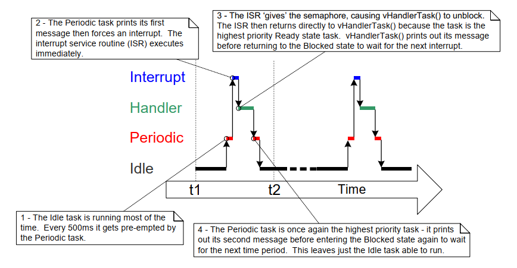
***Figure 7.5*** *The sequence of execution when Example 7.1 is executed*
* * *


### 7.4.4 Improving the Implementation of the Task Used in Example 7.1

Example 7.1 used a binary semaphore to synchronize a task with an
interrupt. The execution sequence was as follows:

1. The interrupt occurred.

1. The ISR executed and 'gave' the semaphore to unblock the task.

1. The task executed immediately after the ISR, and 'took' the
   semaphore.

1. The task processed the event, then attempted to 'take' the semaphore
   again—entering the Blocked state because the semaphore was not yet
   available (another interrupt had not yet occurred).

The structure of the task used in Example 7.1 is adequate only if
interrupts occur at a relatively low frequency. To understand why,
consider what would happen if a second, and then a third, interrupt had
occurred before the task had completed its processing of the first
interrupt:

- When the second ISR executed, the semaphore would be empty, so the
  ISR would give the semaphore, and the task would process the second
  event immediately after it had completed processing the first event.
  That scenario is shown in Figure 7.6.

- When the third ISR executed, the semaphore would already be
  available, preventing the ISR giving the semaphore again, so the
  task would not know the third event had occurred. That scenario is
  shown in Figure 7.7.


<a name="fig7.6" title="Figure 7.6 The scenario when one interrupt occurs before the task has finished processing the first event"></a>
<a name="fig7.7" title="Figure 7.7 The scenario when two interrupts occur before the task has finished processing the first event"></a>

* * *
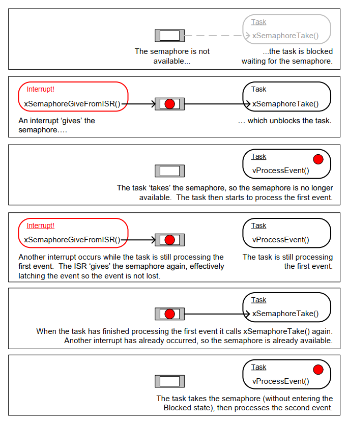
***Figure 7.6*** *The scenario when one interrupt occurs before the task has finished processing the first event*

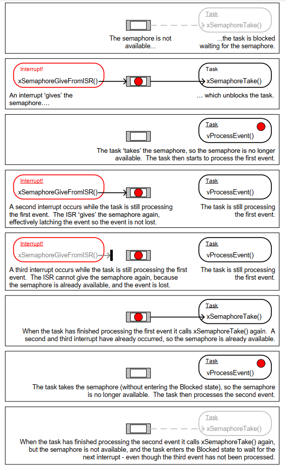
***Figure 7.7*** *The scenario when two interrupts occur before the task has finished processing the first event*
* * *

The deferred interrupt handling task used in Example 7.1, and shown in
Listing 7.7, is structured so that it only processes one event between
each call to `xSemaphoreTake()`. That was adequate for Example 7.1, because
the interrupts that generated the events were triggered by software, and
occurred at a predictable time. In real applications, interrupts are
generated by hardware, and occur at unpredictable times. Therefore, to
minimize the chance of an interrupt being missed, the deferred interrupt
handling task must be structured so that it processes all the events
that are already available between each call to `xSemaphoreTake()`[^17].
This is demonstrated by Listing 7.10, which shows how a deferred interrupt
handler for a UART could be structured. In Listing 7.10, it is assumed the
UART generates a receive interrupt each time a character is received,
and that the UART places received characters into a hardware FIFO (a
hardware buffer).

[^17]: Alternatively, a counting semaphore, or a direct to task
notification, can be used to count events. Counting semaphores are
described in the next section. Direct to task notifications are
described in Chapter 10, Task Notifications. Direct to task
notifications are the preferred method as they are the most
efficient in both run time and RAM usage.

The deferred interrupt handling task used in Example 7.1 had one other
weakness; it did not use a timeout when it called `xSemaphoreTake()`.
Instead, the task passed `portMAX_DELAY` as the `xSemaphoreTake()`
`xTicksToWait` parameter, which results in the task waiting indefinitely
(without a timeout) for the semaphore to be available. Indefinite
timeouts are often used in example code because their use simplifies the
structure of the example, and therefore makes the example easier to
understand. However, indefinite timeouts are normally bad practice in
real applications, because they make it difficult to recover from an
error. As an example, consider the scenario where a task is waiting for
an interrupt to give a semaphore, but an error state in the hardware is
preventing the interrupt from being generated:

- If the task is waiting without a timeout, it will not know about
  the error state, and will wait forever.

- If the task is waiting with a timeout, then `xSemaphoreTake()` will
  return `pdFAIL` when the timeout expires, and the task can then
  detect and clear the error the next time it executes. This scenario
  is also demonstrated in Listing 7.10.


<a name="list7.10" title="Listing 7.10 The recommended structure of a deferred interrupt processing task, using a UART receive..."></a>

```c
static void vUARTReceiveHandlerTask( void *pvParameters )
{
    /* xMaxExpectedBlockTime holds the maximum time expected between two
       interrupts. */
    const TickType_t xMaxExpectedBlockTime = pdMS_TO_TICKS( 500 );

    /* As per most tasks, this task is implemented within an infinite loop. */
    for( ;; )
    {
        /* The semaphore is 'given' by the UART's receive (Rx) interrupt.
           Wait a maximum of xMaxExpectedBlockTime ticks for the next
           interrupt. */
        if( xSemaphoreTake( xBinarySemaphore, xMaxExpectedBlockTime ) == pdPASS)
        {
            /* The semaphore was obtained. Process ALL pending Rx events before
               calling xSemaphoreTake() again. Each Rx event will have placed a
               character in the UART's receive FIFO, and UART_RxCount() is
               assumed to return the number of characters in the FIFO. */
            while( UART_RxCount() > 0 )
            {
                /* UART_ProcessNextRxEvent() is assumed to process one Rx
                   character, reducing the number of characters in the FIFO
                   by 1. */
                UART_ProcessNextRxEvent();
            }

            /* No more Rx events are pending (there are no more characters in
               the FIFO), so loop back and call xSemaphoreTake() to wait for
               the next interrupt. Any interrupts occurring between this point
               in the code and the call to xSemaphoreTake() will be latched in
               the semaphore, so will not be lost. */
        }
        else
        {
            /* An event was not received within the expected time. Check for,
               and if necessary clear, any error conditions in the UART that
               might be preventing the UART from generating any more
               interrupts. */
            UART_ClearErrors();
        }
    }
}
```
***Listing 7.10*** *The recommended structure of a deferred interrupt processing task, using a UART receive handler as an example*


## 7.5 Counting Semaphores

Just as binary semaphores can be thought of as queues that have a length
of one, counting semaphores can be thought of as queues that have a
length of more than one. Tasks are not interested in the data that is
stored in the queue—just the number of items in the queue.
`configUSE_COUNTING_SEMAPHORES` must be set to 1 in FreeRTOSConfig.h for
counting semaphores to be available.

Each time a counting semaphore is 'given', another space in its queue is
used. The number of items in the queue is the semaphore's 'count' value.

Counting semaphores are typically used for two things:

1. Counting events[^18]

   In this scenario, an event handler will 'give' a semaphore each time
   an event occurs, causing the semaphore's count value to be
   incremented on each 'give'. A task will 'take' a semaphore each time
   it processes an event, causing the semaphore's count value to be
   decremented on each 'take'. The count value is the difference
   between the number of events that have occurred and the number that
   have been processed. This mechanism is shown in Figure 7.8.

   Counting semaphores that are used to count events are created with
   an initial count value of zero.

   [^18]: It is more efficient to count events using a direct to task
   notification than it is using a counting semaphore. Direct to task
   notifications are not covered until Chapter 10.

1. Resource management.

   In this scenario, the count value indicates the number of resources
   available. To obtain control of a resource, a task must first obtain
   a semaphore, which decrements the semaphore's count value. When the count
   value reaches zero, there are no free resources. When a task
   finishes with the resource, it 'gives' the semaphore
   back, which increments the semaphore's count value.

   Counting semaphores that are used to manage resources are created so
   that their initial count value equals the number of resources that
   are available. Chapter 7 covers using semaphores to manage
   resources.


<a name="fig7.8" title="Figure 7.8 Using a counting semaphore to 'count' events"></a>

* * *
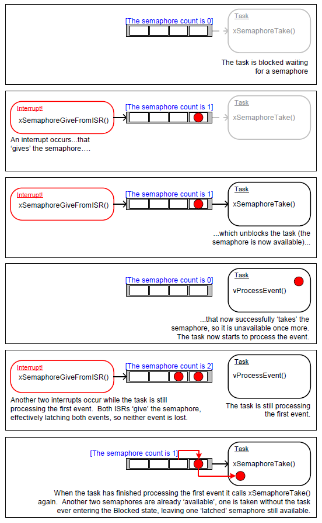
***Figure 7.8*** *Using a counting semaphore to 'count' events*
* * *

### 7.5.1 The xSemaphoreCreateCounting() API Function

FreeRTOS also includes the `xSemaphoreCreateCountingStatic()`
function, which allocates the memory required to create a counting
semaphore statically at compile time: Handles to all the various types
of FreeRTOS semaphores are stored in a variable of type `SemaphoreHandle_t`.

Before a semaphore can be used, it must be created. To create a counting
semaphore, use the `xSemaphoreCreateCounting()` API function.


<a name="list7.11" title="Listing 7.11 The xSemaphoreCreateCounting() API function prototype"></a>

```c
SemaphoreHandle_t xSemaphoreCreateCounting( UBaseType_t uxMaxCount,
                                            UBaseType_t uxInitialCount );
```
***Listing 7.11*** *The xSemaphoreCreateCounting() API function prototype*


**xSemaphoreCreateCounting() parameters and return value**

- `uxMaxCount`

   The maximum value to which the semaphore will count. To continue
   the queue analogy, the `uxMaxCount` value is effectively the length of the
   queue.

   When the semaphore is to be used to count or latch events, `uxMaxCount`
   is the maximum number of events that can be latched.

   When the semaphore is to be used to manage access to a collection of
   resources, `uxMaxCount` should be set to the total number of resources
   that are available.

- `uxInitialCount`

  The initial count value of the semaphore after it has been created.

  When the semaphore is to be used to count or latch events,
  `uxInitialCount` should be set to zero (because when the semaphore
  is created we assume no events have occurred yet).

  When the semaphore is to be used to manage access to a collection of
  resources, `uxInitialCount` should be set to equal `uxMaxCount` (because
  when the semaphore is created we assume all the resources are available).

- Return value

  If NULL is returned, the semaphore cannot be created because
  there is insufficient heap memory available for FreeRTOS to allocate the
  semaphore data structures. Chapter 3 provides more information on heap
  memory management.

  If a non-NULL value is returned, it indicates that the semaphore has been
  created successfully. The returned value should be stored as the handle
  to the created semaphore.


<a name="example7.2" title="Example 7.2 Using a counting semaphore to synchronize a task with an interrupt"></a>
---
***Example 7.2*** *Using a counting semaphore to synchronize a task with an interrupt*

---

Example 7.2 improves on the Example 7.1 implementation by using a counting
semaphore in place of the binary semaphore. `main()` is changed to include
a call to `xSemaphoreCreateCounting()` in place of the call to
`xSemaphoreCreateBinary()`. The new API call is shown in Listing 7.12.


<a name="list7.12" title="Listing 7.12 The call to xSemaphoreCreateCounting() used to create the counting semaphore in Example 7.2"></a>

```c
/* Before a semaphore is used it must be explicitly created. In this example a
   counting semaphore is created. The semaphore is created to have a maximum
   count value of 10, and an initial count value of 0. */
xCountingSemaphore = xSemaphoreCreateCounting( 10, 0 );
```
***Listing 7.12*** *The call to xSemaphoreCreateCounting() used to create the counting semaphore in Example 7.2*


To simulate multiple events occurring at high frequency, the interrupt
service routine is changed to 'give' the semaphore more than once per
interrupt. Each event is latched in the semaphore's count value. The
modified interrupt service routine is shown in Listing 7.13.


<a name="list7.13" title="Listing 7.13 The implementation of the interrupt service routine used by Example 7.2"></a>

```c
static uint32_t ulExampleInterruptHandler( void )
{
    BaseType_t xHigherPriorityTaskWoken;

    /* The xHigherPriorityTaskWoken parameter must be initialized to pdFALSE
       as it will get set to pdTRUE inside the interrupt safe API function if
       a context switch is required. */
    xHigherPriorityTaskWoken = pdFALSE;

    /* 'Give' the semaphore multiple times. The first will unblock the deferred
       interrupt handling task, the following 'gives' are to demonstrate that
       the semaphore latches the events to allow the task to which interrupts
       are deferred to process them in turn, without events getting lost. This
       simulates multiple interrupts being received by the processor, even
       though in this case the events are simulated within a single interrupt
       occurrence. */
    xSemaphoreGiveFromISR( xCountingSemaphore, &xHigherPriorityTaskWoken );
    xSemaphoreGiveFromISR( xCountingSemaphore, &xHigherPriorityTaskWoken );
    xSemaphoreGiveFromISR( xCountingSemaphore, &xHigherPriorityTaskWoken );

    /* Pass the xHigherPriorityTaskWoken value into portYIELD_FROM_ISR().
       If xHigherPriorityTaskWoken was set to pdTRUE inside
       xSemaphoreGiveFromISR() then calling portYIELD_FROM_ISR() will request
       a context switch. If xHigherPriorityTaskWoken is still pdFALSE then
       calling portYIELD_FROM_ISR() will have no effect. Unlike most FreeRTOS
       ports, the Windows port requires the ISR to return a value - the return
       statement is inside the Windows version of portYIELD_FROM_ISR(). */
    portYIELD_FROM_ISR( xHigherPriorityTaskWoken );
}
```
***Listing 7.13*** *The implementation of the interrupt service routine used by Example 7.2*

All the other functions remain unmodified from those used in Example 7.1.

The output produced when Example 7.2 is executed is shown in Figure 7.9.
As can be seen, the task to which interrupt handling is deferred
processes all three (simulated) events each time an interrupt is
generated. The events are latched into the count value of the semaphore,
allowing the task to process them in turn.


<a name="fig7.9" title="Figure 7.9 The output produced when Example 7.2 is executed"></a>

* * *

***Figure 7.9*** *The output produced when Example 7.2 is executed*
* * *


## 7.6 Deferring Work to the RTOS Daemon Task

The deferred interrupt handling examples presented so far have required
the application writer to create a task for each interrupt that uses the
deferred processing technique. It is also possible to use the
`xTimerPendFunctionCallFromISR()`[^19] API function to defer interrupt
processing to the RTOS daemon task, which removes the need to create a
separate task for each interrupt. Deferring interrupt processing to the
daemon task is called 'centralized deferred interrupt processing'.

[^19]: The daemon task was originally
called the timer service task because it was originally only used to
execute software timer callback functions. Hence,
`xTimerPendFunctionCall()` is implemented in timers.c, and, in
accordance with the convention of prefixing a function's name with
the name of the file in which the function is implemented, the
function's name is prefixed with 'Timer'.

Chapter 6 described how software timer-related FreeRTOS API functions
send commands to the daemon task on the timer command queue. The
`xTimerPendFunctionCall()` and `xTimerPendFunctionCallFromISR()` API
functions use the same timer command queue to send an 'execute function'
command to the daemon task. The function sent to the daemon task is then
executed in the context of the daemon task.

Advantages of centralized deferred interrupt processing include:

- Lower resource usage

  It removes the need to create a separate task for each deferred
  interrupt.

- Simplified user model

  The deferred interrupt handling function is a standard C function.

Disadvantages of centralized deferred interrupt processing include:

- Less flexibility

  It is not possible to set the priority of each deferred interrupt
  handling task separately. Each deferred interrupt handling function
  executes at the priority of the daemon task. As described in Chapter
  6, the priority of the daemon task is set by the
  `configTIMER_TASK_PRIORITY` compile time configuration constant within
  FreeRTOSConfig.h.

- Less determinism

  `xTimerPendFunctionCallFromISR()` sends a command to the back of the
  timer command queue. Commands that were already in the timer command
  queue will be processed by the daemon task before the 'execute
  function' command sent to the queue by
  `xTimerPendFunctionCallFromISR()`.

Different interrupts have different timing constraints, so it is common
to use both methods of deferring interrupt processing within the same
application.


### 7.6.1 The xTimerPendFunctionCallFromISR() API Function

`xTimerPendFunctionCallFromISR()` is the interrupt safe version of
`xTimerPendFunctionCall()`. Both API functions allow a function provided
by the application writer to be executed by, and therefore in the
context of, the RTOS daemon task. Both the function to be executed, and
the value of the function's input parameters, are sent to the daemon
task on the timer command queue. When the function actually executes is
therefore dependent on the priority of the daemon task relative to other
tasks in the application.


<a name="list7.14" title="Listing 7.14 The xTimerPendFunctionCallFromISR() API function prototype"></a>

```c
BaseType_t xTimerPendFunctionCallFromISR( PendedFunction_t
                                          xFunctionToPend,
                                          void *pvParameter1,
                                          uint32_t ulParameter2,
                                          BaseType_t *pxHigherPriorityTaskWoken );
```
***Listing 7.14*** *The xTimerPendFunctionCallFromISR() API function prototype*


<a name="list7.15" title="Listing 7.15 The prototype to which a function passed in the xFunctionToPend parameter of xTimerPendFunctionCallFromISR()..."></a>

```c
void vPendableFunction( void *pvParameter1, uint32_t ulParameter2 );
```
***Listing 7.15*** *The prototype to which a function passed in the xFunctionToPend parameter of xTimerPendFunctionCallFromISR() must conform*


**xTimerPendFunctionCallFromISR() parameters and return value**

- `xFunctionToPend`

  A pointer to the function that will be executed in the daemon task
  (in effect, just the function name). The prototype of the function must
  be the same as that shown in Listing 7.15.

- `pvParameter1`

  The value that will be passed into the function that is executed by
  the daemon task as that function's `pvParameter1` parameter. The parameter
  has a `void *` type to allow it to be used to pass any data type. For
  example, integer types can be directly cast to a `void *`, alternatively
  the `void *` can be used to point to a structure.

- `ulParameter2`

  The value that will be passed into the function that is executed by
  the daemon task as that function's `ulParameter2` parameter.

- `pxHigherPriorityTaskWoken`

  `xTimerPendFunctionCallFromISR()` writes to the timer command
  queue. If the RTOS daemon task was in the Blocked state to wait for data
  to become available on the timer command queue, then writing to the
  timer command queue will cause the daemon task to leave the Blocked
  state. If the priority of the daemon task is higher than the priority of
  the currently executing task (the task that was interrupted), then,
  internally, `xTimerPendFunctionCallFromISR()` will set
  `*pxHigherPriorityTaskWoken` to `pdTRUE`.

  If `xTimerPendFunctionCallFromISR()` sets this value to `pdTRUE`, then a
  context switch must be performed before the interrupt is exited. This
  will ensure that the interrupt returns directly to the daemon task, as
  the daemon task will be the highest priority Ready state task.

- Return value

  There are two possible return values:

  - `pdPASS`

    `pdPASS` will be returned if the 'execute function' command was written
    to the timer command queue.

  - `pdFAIL`

    `pdFAIL` will be returned if the 'execute function' command could not
    be written to the timer command queue because the timer command queue
    was already full. Chapter 6 describes how to set the length of the timer
    command queue.


<a name="example7.3" title="Example 7.3 Centralized deferred interrupt processing"></a>
---
***Example 7.3*** *Centralized deferred interrupt processing*

---

Example 7.3 provides similar functionality to Example 7.1, but without
using a semaphore, and without creating a task specifically to perform
the processing necessitated by the interrupt. Instead, the processing is
performed by the RTOS daemon task.

The interrupt service routine used by Example 7.3 is shown in Listing 7.16.
It calls `xTimerPendFunctionCallFromISR()` to pass a pointer to a
function called `vDeferredHandlingFunction()` to the daemon task. The
deferred interrupt processing is performed by the
`vDeferredHandlingFunction()` function.

The interrupt service routine increments a variable called
`ulParameterValue` each time it executes. `ulParameterValue` is used as the
value of `ulParameter2` in the call to `xTimerPendFunctionCallFromISR()`, so it
will also be used as the value of `ulParameter2` in the call to
`vDeferredHandlingFunction()` when `vDeferredHandlingFunction()` is executed
by the daemon task. The function's other parameter, `pvParameter1`, is not
used in this example.


<a name="list7.16" title="Listing 7.16 The software interrupt handler used in Example 7.3"></a>

```c
static uint32_t ulExampleInterruptHandler( void )
{
    static uint32_t ulParameterValue = 0;
    BaseType_t xHigherPriorityTaskWoken;

    /* The xHigherPriorityTaskWoken parameter must be initialized to pdFALSE
       as it will get set to pdTRUE inside the interrupt safe API function if
       a context switch is required. */
    xHigherPriorityTaskWoken = pdFALSE;

    /* Send a pointer to the interrupt's deferred handling function to the
       daemon task. The deferred handling function's pvParameter1 parameter
       is not used so just set to NULL. The deferred handling function's
       ulParameter2 parameter is used to pass a number that is incremented by
       one each time this interrupt handler executes. */
    xTimerPendFunctionCallFromISR( vDeferredHandlingFunction, /* Function to execute */
                                   NULL, /* Not used */
                                   ulParameterValue, /* Incrementing value. */
                                   &xHigherPriorityTaskWoken );
    ulParameterValue++;

    /* Pass the xHigherPriorityTaskWoken value into portYIELD_FROM_ISR(). If
       xHigherPriorityTaskWoken was set to pdTRUE inside
       xTimerPendFunctionCallFromISR() then calling portYIELD_FROM_ISR() will
       request a context switch. If xHigherPriorityTaskWoken is still pdFALSE
       then calling portYIELD_FROM_ISR() will have no effect. Unlike most
       FreeRTOS ports, the Windows port requires the ISR to return a value -
       the return statement is inside the Windows version
       of portYIELD_FROM_ISR(). */
    portYIELD_FROM_ISR( xHigherPriorityTaskWoken );
}
```
***Listing 7.16*** *The software interrupt handler used in Example 7.3*


The implementation of `vDeferredHandlingFunction()` is shown in Listing
7.17. It prints out a fixed string, and the value of its `ulParameter2`
parameter.

`vDeferredHandlingFunction()` must have the prototype shown in Listing
7.15, even though, in this example, only one of its parameters is
actually used.


<a name="list7.17" title="Listing 7.17 The function that performs the processing necessitated by the interrupt in Example 7.3"></a>

```c
static void vDeferredHandlingFunction( void *pvParameter1, uint32_t ulParameter2 )
{
    /* Process the event - in this case just print out a message and the value
       of ulParameter2. pvParameter1 is not used in this example. */
    vPrintStringAndNumber( "Handler function - Processing event ", ulParameter2 );
}
```
***Listing 7.17*** *The function that performs the processing necessitated by the interrupt in Example 7.3*


The `main()` function used by Example 7.3 is shown in Listing 7.18. It is
simpler than the `main()` function used by Example 7.1 because it does not
create either a semaphore or a task to perform the deferred interrupt
processing.

`vPeriodicTask()` is the task that periodically generates software
interrupts. It is created with a priority below the priority of the
daemon task to ensure it is pre-empted by the daemon task as soon as the
daemon task leaves the Blocked state.


<a name="list7.18" title="Listing 7.18 The implementation of main() for Example 7.3"></a>

```c
int main( void )
{
    /* The task that generates the software interrupt is created at a priority
       below the priority of the daemon task. The priority of the daemon task
       is set by the configTIMER_TASK_PRIORITY compile time configuration
       constant in FreeRTOSConfig.h. */
    const UBaseType_t ulPeriodicTaskPriority = configTIMER_TASK_PRIORITY - 1;

    /* Create the task that will periodically generate a software interrupt. */
    xTaskCreate( vPeriodicTask, "Periodic", 1000, NULL, ulPeriodicTaskPriority,
                 NULL );

    /* Install the handler for the software interrupt. The syntax necessary to
       do this is dependent on the FreeRTOS port being used. The syntax shown
       here can only be used with the FreeRTOS windows port, where such
       interrupts are only simulated. */
    vPortSetInterruptHandler( mainINTERRUPT_NUMBER, ulExampleInterruptHandler );

    /* Start the scheduler so the created task starts executing. */
    vTaskStartScheduler();

    /* As normal, the following line should never be reached. */
    for( ;; );
}
```
***Listing 7.18*** *The implementation of main() for Example 7.3*


Example 7.3 produces the output shown in Figure 7.10. The priority of the
daemon task is higher than the priority of the task that generates the
software interrupt, so `vDeferredHandlingFunction()` is executed by the
daemon task as soon as the interrupt is generated. That results in the
message output by `vDeferredHandlingFunction()` appear in between the
two messages output by the periodic task, just as it did when a
semaphore was used to unblock a dedicated deferred interrupt processing
task. Further explanation is provided in Figure 7.11.


<a name="fig7.10" title="Figure 7.10 The output produced when Example 7.3 is executed"></a>
<a name="fig7.11" title="Figure 7.11 The sequence of execution when Example 7.3 is executed"></a>

* * *

***Figure 7.10*** *The output produced when Example 7.3 is executed*

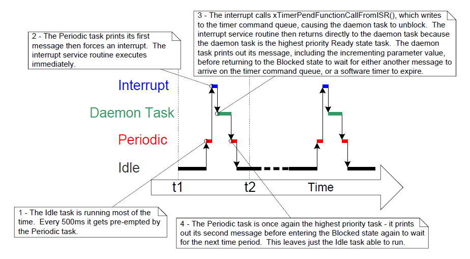
***Figure 7.11*** *The sequence of execution when Example 7.3 is executed*
* * *


## 7.7 Using Queues within an Interrupt Service Routine

Binary and counting semaphores are used to communicate events. Queues
are used to communicate events and to transfer data.

`xQueueSendToFrontFromISR()` is the version of `xQueueSendToFront()` that is
safe to use in an interrupt service routine, `xQueueSendToBackFromISR()`
is the version of `xQueueSendToBack()` that is safe to use in an interrupt
service routine, and `xQueueReceiveFromISR()` is the version of
`xQueueReceive()` that is safe to use in an interrupt service routine.


### 7.7.1 The xQueueSendToFrontFromISR() and xQueueSendToBackFromISR() API Functions


<a name="list7.19" title="Listing 7.19 The xQueueSendToFrontFromISR() API function prototype"></a>

```c
BaseType_t xQueueSendToFrontFromISR( QueueHandle_t xQueue,
                                     const void *pvItemToQueue
                                     BaseType_t *pxHigherPriorityTaskWoken );
```
***Listing 7.19*** *The xQueueSendToFrontFromISR() API function prototype*


<a name="list7.20" title="Listing 7.20 The xQueueSendToBackFromISR() API function prototype"></a>

```c
BaseType_t xQueueSendToBackFromISR( QueueHandle_t xQueue,
                                    const void *pvItemToQueue
                                    BaseType_t *pxHigherPriorityTaskWoken );
```
***Listing 7.20*** *The xQueueSendToBackFromISR() API function prototype*


`xQueueSendFromISR()` and `xQueueSendToBackFromISR()` are functionally equivalent.

**xQueueSendToFrontFromISR() and xQueueSendToBackFromISR() parameters and return values**

- `xQueue`

  The handle of the queue to which the data is being sent (written).
  The queue handle will have been returned from the call to `xQueueCreate()`
  used to create the queue.

- `pvItemToQueue`

  A pointer to the item that is to be placed on the queue.

  The size of each item the queue will hold was defined when the queue was
  created, so this many bytes will be copied from `pvItemToQueue` into the
  queue storage area.

- `pxHigherPriorityTaskWoken`

  It is possible that a single queue will have one or more tasks
  blocked on it, waiting for data to become available. Calling
  `xQueueSendToFrontFromISR()` or `xQueueSendToBackFromISR()` can make data
  available, and so cause such a task to leave the Blocked state. If
  calling the API function causes a task to leave the Blocked state, and
  the unblocked task has a priority higher than the currently executing
  task (the task that was interrupted), then, internally, the API function
  will set `*pxHigherPriorityTaskWoken` to `pdTRUE`.

  If `xQueueSendToFrontFromISR()` or `xQueueSendToBackFromISR()` sets this
  value to `pdTRUE`, then a context switch should be performed before the
  interrupt is exited. This will ensure that the interrupt returns
  directly to the highest priority Ready state task.

- Return value

  There are two possible return values:

  - `pdPASS`

    `pdPASS` is returned only if data has been sent successfully to the queue.

  - `errQUEUE_FULL

    `errQUEUE_FULL` is returned if data cannot be sent to the queue because
    the queue is already full.


### 7.7.2 Considerations When Using a Queue From an ISR

Queues provide an easy and convenient way of passing data from an
interrupt to a task, but it is not efficient to use a queue if data is
arriving at a high frequency.

Many of the demo applications in the FreeRTOS download include a simple
UART driver that uses a queue to pass characters out of the UART's
receive ISR. In those demos a queue is used for two reasons: to
demonstrate queues being used from an ISR, and to deliberately load the
system in order to test the FreeRTOS port. The ISRs that use a queue in
this manner are definitely not intended to represent an efficient
design, and unless the data is arriving slowly, it is recommended that
production code does not copy this technique. More efficient techniques,
that are suitable for production code, include:

- Using Direct Memory Access (DMA) hardware to receive and buffer
  characters. This method has practically no software overhead. A
  direct to task notification[^20] can then be used to unblock the
  task that will process the buffer only after a break in transmission
  has been detected.

  [^20]: Direct to task notifications provide the most efficient method of
  unblocking a task from an ISR. Direct to task notifications are
  covered in Chapter 10, Task Notifications.

- Copying each received character into a thread safe RAM buffer[^21].
  Again, a direct to task notification can be used to unblock the task
  that will process the buffer after a complete message has been
  received, or after a break in transmission has been detected.

  [^21]: The 'Stream Buffer', provided as part of FreeRTOS+TCP
  ([https://www.FreeRTOS.org/tcp](http://www.FreeRTOS.org/tcp)), can
  be used for this purpose.

- Processing the received characters directly within the ISR, then
  using a queue to send just the result of processing the data (rather
  than the raw data) to a task. This was previously demonstrated by
  Figure 5.4.

<a name="example7.4" title="Example 7.4 Sending and receiving on a queue from within an interrupt"></a>
---
***Example 7.4*** *Sending and receiving on a queue from within an interrupt*

---

This example demonstrates `xQueueSendToBackFromISR()` and
`xQueueReceiveFromISR()` being used within the same interrupt. As before,
for convenience the interrupt is generated by software.

A periodic task is created that sends five numbers to a queue every 200
milliseconds. It generates a software interrupt only after all five
values have been sent. The task implementation is shown in Listing 7.21.


<a name="list7.21" title="Listing 7.21 The implementation of the task that writes to the queue in Example 7.4"></a>

```c
static void vIntegerGenerator( void *pvParameters )
{
    TickType_t xLastExecutionTime;
    uint32_t ulValueToSend = 0;
    int i;

    /* Initialize the variable used by the call to vTaskDelayUntil(). */
    xLastExecutionTime = xTaskGetTickCount();

    for( ;; )
    {
        /* This is a periodic task. Block until it is time to run again. The
           task will execute every 200ms. */
        vTaskDelayUntil( &xLastExecutionTime, pdMS_TO_TICKS( 200 ) );

        /* Send five numbers to the queue, each value one higher than the
           previous value. The numbers are read from the queue by the interrupt
           service routine. The interrupt service routine always empties the
           queue, so this task is guaranteed to be able to write all five
           values without needing to specify a block time. */
        for( i = 0; i < 5; i++ )
        {
            xQueueSendToBack( xIntegerQueue, &ulValueToSend, 0 );
            ulValueToSend++;
        }

        /* Generate the interrupt so the interrupt service routine can read the
           values from the queue. The syntax used to generate a software
           interrupt is dependent on the FreeRTOS port being used. The syntax
           used below can only be used with the FreeRTOS Windows port, in which
           such interrupts are only simulated. */
        vPrintString( "Generator task - About to generate an interrupt.\r\n" );
        vPortGenerateSimulatedInterrupt( mainINTERRUPT_NUMBER );
        vPrintString( "Generator task - Interrupt generated.\r\n\r\n\r\n" );
    }
}
```
***Listing 7.21*** *The implementation of the task that writes to the queue in Example 7.4*


The interrupt service routine calls `xQueueReceiveFromISR()` repeatedly
until all the values written to the queue by the periodic task have been
read out, and the queue is left empty. The last two bits of each
received value are used as an index into an array of strings. A pointer
to the string at the corresponding index position is then sent to a
different queue using a call to `xQueueSendFromISR()`. The implementation
of the interrupt service routine is shown in Listing 7.22.


<a name="list7.22" title="Listing 7.22 The implementation of the interrupt service routine used by Example 7.4"></a>

```c
static uint32_t ulExampleInterruptHandler( void )
{
    BaseType_t xHigherPriorityTaskWoken;
    uint32_t ulReceivedNumber;

    /* The strings are declared static const to ensure they are not allocated
       on the interrupt service routine's stack, and so exist even when the
       interrupt service routine is not executing. */

    static const char *pcStrings[] =
    {
        "String 0\r\n",
        "String 1\r\n",
        "String 2\r\n",
        "String 3\r\n"
    };

    /* As always, xHigherPriorityTaskWoken is initialized to pdFALSE to be
       able to detect it getting set to pdTRUE inside an interrupt safe API
       function.  Note that as an interrupt safe API function can only set
       xHigherPriorityTaskWoken to pdTRUE, it is safe to use the same
       xHigherPriorityTaskWoken variable in both the call to
       xQueueReceiveFromISR() and the call to xQueueSendToBackFromISR(). */
    xHigherPriorityTaskWoken = pdFALSE;

    /* Read from the queue until the queue is empty. */
    while( xQueueReceiveFromISR( xIntegerQueue,
                                 &ulReceivedNumber,
                                 &xHigherPriorityTaskWoken ) != errQUEUE_EMPTY )
    {
        /* Truncate the received value to the last two bits (values 0 to 3
           inclusive), then use the truncated value as an index into the
           pcStrings[] array to select a string (char *) to send on the other
           queue. */
        ulReceivedNumber &= 0x03;
        xQueueSendToBackFromISR( xStringQueue,
                                 &pcStrings[ ulReceivedNumber ],
                                 &xHigherPriorityTaskWoken );
    }

    /* If receiving from xIntegerQueue caused a task to leave the Blocked
       state, and if the priority of the task that left the Blocked state is
       higher than the priority of the task in the Running state, then
       xHigherPriorityTaskWoken will have been set to pdTRUE inside
       xQueueReceiveFromISR().

       If sending to xStringQueue caused a task to leave the Blocked state, and
       if the priority of the task that left the Blocked state is higher than
       the priority of the task in the Running state, then
       xHigherPriorityTaskWoken will have been set to pdTRUE inside
       xQueueSendToBackFromISR().

       xHigherPriorityTaskWoken is used as the parameter to portYIELD_FROM_ISR().
       If xHigherPriorityTaskWoken equals pdTRUE then calling portYIELD_FROM_ISR()
       will request a context switch. If xHigherPriorityTaskWoken is still
       pdFALSE then calling portYIELD_FROM_ISR() will have no effect.

       The implementation of portYIELD_FROM_ISR() used by the Windows port
       includes a return statement, which is why this function does not
       explicitly return a value. */
    portYIELD_FROM_ISR( xHigherPriorityTaskWoken );
}
```
***Listing 7.22*** *The implementation of the interrupt service routine used by Example 7.4*


The task that receives the character pointers from the interrupt service
routine blocks on the queue until a message arrives, printing out each
string as it is received. Its implementation is shown in Listing 7.23.


<a name="list7.23" title="Listing 7.23 The task that prints out the strings received from the interrupt service routine in Example 7.4"></a>

```c
static void vStringPrinter( void *pvParameters )
{
    char *pcString;

    for( ;; )
    {
        /* Block on the queue to wait for data to arrive. */
        xQueueReceive( xStringQueue, &pcString, portMAX_DELAY );

        /* Print out the string received. */
        vPrintString( pcString );
    }
}
```
***Listing 7.23*** *The task that prints out the strings received from the interrupt service routine in Example 7.4*

As normal, `main()` creates the required queues and tasks before starting
the scheduler. Its implementation is shown in Listing 7.24.


<a name="list7.24" title="Listing 7.24 The main() function for Example 7.4"></a>

```c
int main( void )
{
    /* Before a queue can be used it must first be created. Create both queues
       used by this example. One queue can hold variables of type uint32_t, the
       other queue can hold variables of type char*. Both queues can hold a
       maximum of 10 items. A real application should check the return values
       to ensure the queues have been successfully created. */
    xIntegerQueue = xQueueCreate( 10, sizeof( uint32_t ) );
    xStringQueue = xQueueCreate( 10, sizeof( char * ) );

    /* Create the task that uses a queue to pass integers to the interrupt
       service routine. The task is created at priority 1. */
    xTaskCreate( vIntegerGenerator, "IntGen", 1000, NULL, 1, NULL );

    /* Create the task that prints out the strings sent to it from the
       interrupt service routine. This task is created at the higher
       priority of 2. */
    xTaskCreate( vStringPrinter, "String", 1000, NULL, 2, NULL );

    /* Install the handler for the software interrupt. The syntax necessary to
       do this is dependent on the FreeRTOS port being used. The syntax shown
       here can only be used with the FreeRTOS Windows port, where such
       interrupts are only simulated. */
    vPortSetInterruptHandler( mainINTERRUPT_NUMBER, ulExampleInterruptHandler );

    /* Start the scheduler so the created tasks start executing. */
    vTaskStartScheduler();

    /* If all is well then main() will never reach here as the scheduler will
       now be running the tasks. If main() does reach here then it is likely
       that there was insufficient heap memory available for the idle task
       to be created. Chapter 2 provides more information on heap memory
       management. */
    for( ;; );
}
```
***Listing 7.24*** *The main() function for Example 7.4*

The output produced when Example 7.4 is executed is shown in Figure 7.12.
As can be seen, the interrupt receives all five integers, and produces
five strings in response. More explanation is given in Figure 7.13.


<a name="fig7.12" title="Figure 7.12 The output produced when Example 7.4 is executed"></a>
<a name="fig7.13" title="Figure 7.13 The sequence of execution produced by Example 7.4"></a>

* * *

***Figure 7.12*** *The output produced when Example 7.4 is executed*

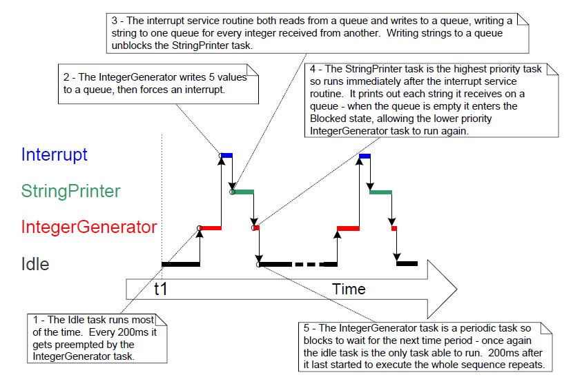
***Figure 7.13*** *The sequence of execution produced by Example 7.4*
* * *


## 7.8 Interrupt Nesting

It is common for confusion to arise between task priorities and
interrupt priorities. This section discusses interrupt priorities, which
are the priorities at which interrupt service routines (ISRs) execute
relative to each other. The priority assigned to a task is in no way
related to the priority assigned to an interrupt. Hardware decides when
an ISR will execute, whereas software decides when a task will execute.
An ISR executed in response to a hardware interrupt will interrupt a
task, but a task cannot pre-empt an ISR.

Ports that support interrupt nesting require one or both of the
constants detailed below to be defined in FreeRTOSConfig.h.
`configMAX_SYSCALL_INTERRUPT_PRIORITY` and
`configMAX_API_CALL_INTERRUPT_PRIORITY` both define the same property.
Older FreeRTOS ports use `configMAX_SYSCALL_INTERRUPT_PRIORITY`, and newer
FreeRTOS ports use `configMAX_API_CALL_INTERRUPT_PRIORITY`.

**Constants that control interrupt nesting**

- `configMAX_SYSCALL_INTERRUPT_PRIORITY` or `configMAX_API_CALL_INTERRUPT_PRIORITY`

  Sets the highest interrupt priority from which interrupt-safe
  FreeRTOS API functions can be called.

- `configKERNEL_INTERRUPT_PRIORITY`

  Sets the interrupt priority used by the tick interrupt, and must
  always be set to the lowest possible interrupt priority.

  If the FreeRTOS port in use does not also use the
  `configMAX_SYSCALL_INTERRUPT_PRIORITY` constant, then any interrupt that
  uses interrupt-safe FreeRTOS API functions must also execute at the
  priority defined by `configKERNEL_INTERRUPT_PRIORITY`.

Each interrupt source has a numeric priority, and a logical priority:

- Numeric priority

  The numeric priority is simply the number assigned to the interrupt
  priority. For example, if an interrupt is assigned a priority of 7,
  then its numeric priority is 7. Likewise, if an interrupt is assigned
  a priority of 200, then its numeric priority is 200.

- Logical priority

  An interrupt's logical priority describes that interrupt's precedence
  over other interrupts.

  If two interrupts of differing priority occur at the same time, then
  the processor will execute the ISR for whichever of the two interrupts
  has the higher logical priority before it executes the ISR for
  whichever of the two interrupts has the lower logical priority.

  An interrupt can interrupt (nest with) any interrupt that has a lower
  logical priority, but an interrupt cannot interrupt (nest with) any
  interrupt that has an equal or higher logical priority.

The relationship between an interrupt's numeric priority and logical
priority is dependent on the processor architecture; on some processors,
the higher the numeric priority assigned to an interrupt the *higher*
that interrupt's logical priority will be, while on other processor
architectures the higher the numeric priority assigned to an interrupt
the *lower* that interrupt's logical priority will be.

A full interrupt nesting model is created by setting
`configMAX_SYSCALL_INTERRUPT_PRIORITY` to a higher logical interrupt
priority than `configKERNEL_INTERRUPT_PRIORITY`. This is demonstrated in
Figure 7.14, which shows a scenario where:

- The processor has seven unique interrupt priorities.
- Interrupts assigned a numeric priority of 7 have a higher logical
  priority than interrupts assigned a numeric priority of 1.
- `configKERNEL_INTERRUPT_PRIORITY` is set to one.
- `configMAX_SYSCALL_INTERRUPT_PRIORITY` is set to three.


<a name="fig7.14" title="Figure 7.14 Constants affecting interrupt nesting behavior"></a>

* * *
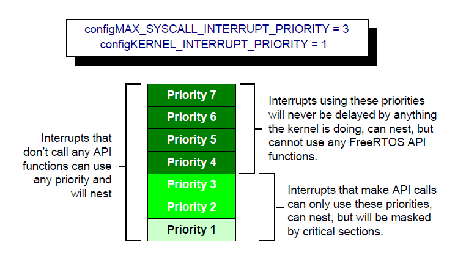
***Figure 7.14*** *Constants affecting interrupt nesting behavior*
* * *

Referring to Figure 7.14:

- Interrupts that use priorities 1 to 3, inclusive, are prevented from
  executing while the kernel or the application is inside a critical
  section. ISRs running at these priorities can use interrupt-safe
  FreeRTOS API functions. Critical sections are described in Chapter 8.

- Interrupts that use priority 4, or above, are not affected by
  critical sections, so nothing the scheduler does will prevent these
  interrupts from executing immediately—within the limitations of the
  hardware itself. ISRs executing at these priorities cannot use any
  FreeRTOS API functions.

- Typically, functionality that requires very strict timing accuracy
  (motor control, for example) would use a priority above
  `configMAX_SYSCALL_INTERRUPT_PRIORITY` to ensure the scheduler does
  not introduce jitter into the interrupt response time.


### 7.8.1 A Note to ARM Cortex-M[^22] and ARM GIC Users

[^22]: This section only partially applies to Cortex-M0 and Cortex-M0+ cores.

Interrupt configuration on Cortex-M processors is confusing, and prone
to error. To assist your development, the FreeRTOS Cortex-M ports
automatically check the interrupt configuration, but only if
`configASSERT()` is defined. `configASSERT()` is described in section 11.2.

The ARM Cortex cores, and ARM Generic Interrupt Controllers (GICs), use
numerically *low* priority numbers to represent logically *high*
priority interrupts. This can seem counter-intuitive, and is easy to
forget. If you wish to assign an interrupt a logically low priority,
then it must be assigned a numerically high value. If you wish to assign
an interrupt a logically high priority, then it must be assigned a
numerically low value.

The Cortex-M interrupt controller allows a maximum of eight bits to be
used to specify each interrupt priority, making 255 the lowest possible
priority. Zero is the highest priority. However, Cortex-M
microcontrollers normally only implement a subset of the eight possible
bits. The number of bits actually implemented is dependent on the
microcontroller family.

When only a subset of the eight possible bits has been implemented, it
is only the most significant bits of the byte that can be used—leaving
the least significant bits unimplemented. Unimplemented bits can take
any value, but it is normal to set them to 1. This is demonstrated by
Figure 7.15, which shows how a priority of binary 101 is stored in a
Cortex-M microcontroller that implements four priority bits.


<a name="fig7.15" title="Figure 7.15 How a priority of binary 101 is stored by a Cortex-M microcontroller that implements four priority bits"></a>

* * *
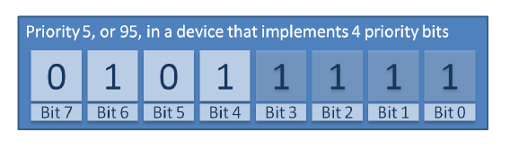
***Figure 7.15*** *How a priority of binary 101 is stored by a Cortex-M microcontroller that implements four priority bits*
* * *

In Figure 7.15 the binary value 101 has been shifted into the most
significant four bits because the least significant four bits are not
implemented. The unimplemented bits have been set to 1.

Some library functions expect priority values to be specified after they
have been shifted up into the implemented (most significant) bits. When
using such a function, the priority shown in Figure 7.15 can be specified
as decimal 95. Decimal 95 is binary 101 shifted up by four to make
binary 101nnnn (where 'n' is an unimplemented bit), and with the
unimplemented bits set to 1 to make binary 1011111.

Some library functions expect priority values to be specified before
they have been shifted up into the implemented (most significant) bits.
When using such a function the priority shown in Figure 7.15 must be
specified as decimal 5. Decimal 5 is binary 101 without any shift.

`configMAX_SYSCALL_INTERRUPT_PRIORITY` and `configKERNEL_INTERRUPT_PRIORITY`
must be specified in a way that allows them to be written directly to
the Cortex-M registers, so after the priority values have been shifted
up into the implemented bits.

`configKERNEL_INTERRUPT_PRIORITY` must always be set to the lowest
possible interrupt priority. Unimplemented priority bits can be set to
1, so the constant can always be set to 255, no matter how many priority
bits are actually implemented.

Cortex-M interrupts will default to a priority of zero—the highest
possible priority. The implementation of the Cortex-M hardware does not
permit `configMAX_SYSCALL_INTERRUPT_PRIORITY` to be set to 0, so the
priority of an interrupt that uses the FreeRTOS API must never be left
at its default value.
