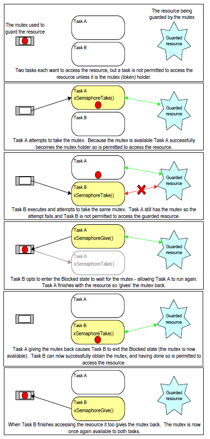
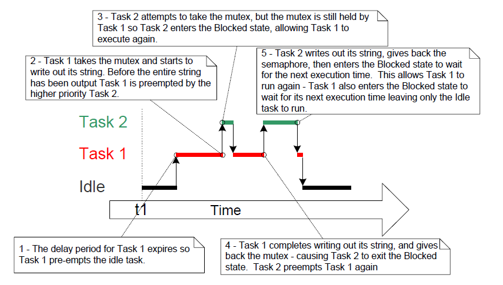
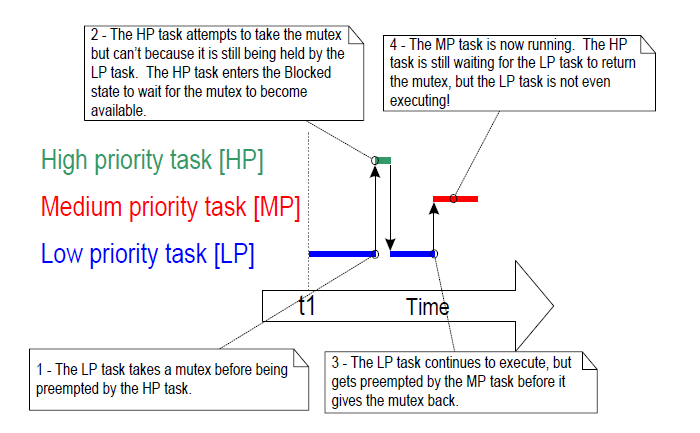
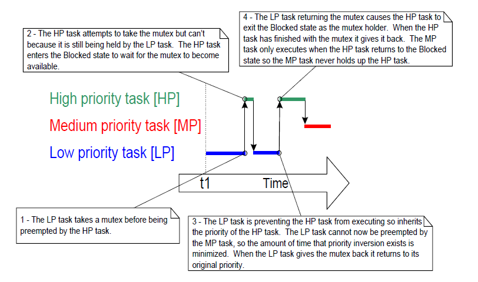
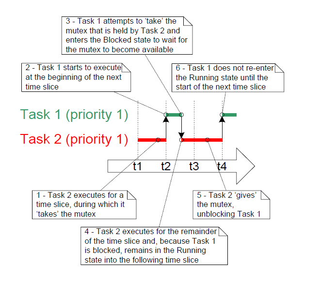
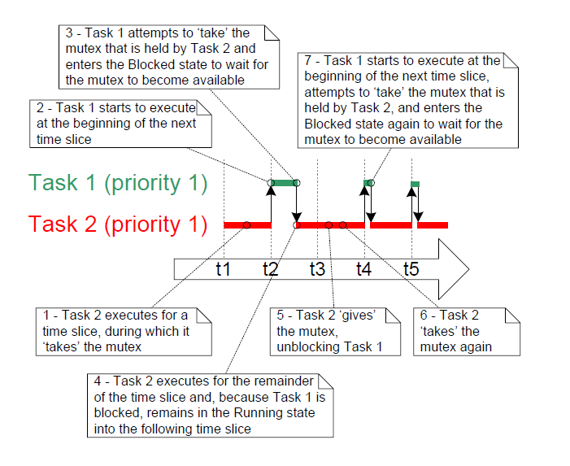

# 8 Resource Management

## 8.1 Chapter Introduction and Scope

In a multitasking system there is potential for error if one task starts
to access a resource, but does not complete its access before being
transitioned out of the Running state. If the task leaves the resource
in an inconsistent state, then access to the same resource by any other
task or interrupt could result in data corruption, or other similar
issue.

Following are some examples:

* Accessing Peripherals

  Consider the following scenario where two tasks attempt to write to an
  Liquid Crystal Display (LCD).

  1. Task A executes and starts to write the string "Hello world" to the
     LCD.

  2. Task A is pre-empted by Task B after outputting just the beginning
     of the string—"Hello w".

  3. Task B writes "Abort, Retry, Fail?" to the LCD before entering the
     Blocked state.

  4. Task A continues from the point at which it was pre-empted, and
     completes outputting the remaining characters of its string—"orld".

  The LCD now displays the corrupted string "Hello wAbort, Retry, Fail?orld".

* Read, Modify, Write Operations

  Listing 8.1 shows a line of C code, and an example of how the C code
  would typically be translated into assembly code. It can be seen that
  the value of PORTA is first read from memory into a register, modified
  within the register, and then written back to memory. This is called a
  read, modify, write operation.


   <a name="list8.1" title="Listing 8.1 An example read, modify, write sequence"></a>

   ```c
   /* The C code being compiled. */
   PORTA |= 0x01;

   /* The assembly code produced when the C code is compiled. */
   LOAD  R1,[#PORTA] ; Read a value from PORTA into R1
   MOVE  R2,#0x01    ; Move the absolute constant 1 into R2
   OR    R1,R2       ; Bitwise OR R1 (PORTA) with R2 (constant 1)
   STORE R1,[#PORTA] ; Store the new value back to PORTA
   ```
   ***Listing 8.1*** *An example read, modify, write sequence*
 
   This is a 'non-atomic' operation because it takes more than one
   instruction to complete, and can be interrupted. Consider the following
   scenario where two tasks attempt to update a memory mapped register
   called PORTA.

   1. Task A loads the value of PORTA into a register—the read portion of
      the operation.

   2. Task A is pre-empted by Task B before it completes the modify and
      write portions of the same operation.

   3. Task B updates the value of PORTA, then enters the Blocked state.

   4. Task A continues from the point at which it was pre-empted. It
      modifies the copy of the PORTA value that it already holds in a
      register, before writing the updated value back to PORTA.

   In this scenario, Task A updates and writes back an out of date value
   for PORTA. Task B modifies PORTA after Task A takes a copy of the PORTA
   value, and before Task A writes its modified value back to the PORTA
   register. When Task A writes to PORTA, it overwrites the modification
   that has already been performed by Task B, effectively corrupting the
   PORTA register value.

   This example uses a peripheral register, but the same principle applies
   when performing read, modify, write operations on variables.

- Non-atomic Access to Variables

  Updating multiple members of a structure, or updating a variable that is
  larger than the natural word size of the architecture (for example,
  updating a 32-bit variable on a 16-bit machine), are examples of
  non-atomic operations. If they are interrupted, they can result in data
  loss or corruption.

- Function Reentrancy

  A function is 'reentrant' if it is safe to call the function from more
  than one task, or from both tasks and interrupts. Reentrant functions
  are said to be 'thread safe' because they can be accessed from more than
  one thread of execution without the risk of data or logical operations
  becoming corrupted.

  Each task maintains its own stack and its own set of processor
  (hardware) register values. If a function does not access any data other
  than data stored on the stack or held in a register, then the function
  is reentrant, and thread safe. Listing 8.2 is an example of a reentrant
  function. Listing 8.3 is an example of a function that is not reentrant.
  
  If an application uses the newlib C Library, it must set `configUSE_NEWLIB_REENTRANT` to 1
  in FreeRTOSConfig.h to ensure that the Thread Local Storage required by newlib is
  allocated correctly.

  If an application uses the picolibc C Library, it must set `configUSE_PICOLIBC_TLS` to 1 in
  FreeRTOSConfig.h to ensure that the Thread Local Storage required by picolibc is
  allocated correctly.

  If an application uses any other C library and it requires Thread Local Storage (TLS), it
  must set `configUSE_C_RUNTIME_TLS_SUPPORT` to 1 in FreeRTOSConfig.h and must implement
  the following macros-
  - `configTLS_BLOCK_TYPE` - Type of the per task TLS block.
  - `configINIT_TLS_BLOCK` - Initialize per task TLS block.
  - `configSET_TLS_BLOCK` - Update current TLS block. Called during context switch to ensure
    that the correct TLS block is used.
  - `configDEINIT_TLS_BLOCK` - Free the TLS block.


  <a name="list8.2" title="Listing 8.2 An example of a reentrant function"></a>

  ```c
  /* A parameter is passed into the function. This will either be passed on the 
     stack, or in a processor register. Either way is safe as each task or 
     interrupt that calls the function maintains its own stack and its own set 
     of register values, so each task or interrupt that calls the function will 
     have its own copy of lVar1. */
  long lAddOneHundred( long lVar1 )
  {
      /* This function scope variable will also be allocated to the stack or a 
         register, depending on the compiler and optimization level. Each task
         or interrupt that calls this function will have its own copy of lVar2. */
      long lVar2;

      lVar2 = lVar1 + 100;
      return lVar2;
  }
  ```
  ***Listing 8.2*** *An example of a reentrant function*


  <a name="list8.3" title="Listing 8.3 An example of a function that is not reentrant"></a>

  ```c
  /* In this case lVar1 is a global variable, so every task that calls
     lNonsenseFunction will access the same single copy of the variable. */
  long lVar1;

  long lNonsenseFunction( void )
  {
      /* lState is static, so is not allocated on the stack. Each task that
         calls this function will access the same single copy of the variable. */
      static long lState = 0;
      long lReturn;

      switch( lState )
      {
          case 0 : lReturn = lVar1 + 10;
                   lState = 1;
                   break;

          case 1 : lReturn = lVar1 + 20;
                   lState = 0;
                   break;
      }
  }
  ```
  ***Listing 8.3*** *An example of a function that is not reentrant*


### 8.1.1 Mutual Exclusion

To ensure data consistency is maintained at all times, access to a
resource that is shared between tasks, or is shared between tasks and interrupts,
must be managed using a 'mutual exclusion' technique. The goal is to
ensure that, once a task starts to access a shared resource that is not
re-entrant and not thread-safe, the same task has exclusive access to
the resource until the resource has been returned to a consistent state.

FreeRTOS provides several features that can be used to implement mutual
exclusion, but the best mutual exclusion method is to (whenever
possible, as it is often not practical) design the application in such a
way that resources are not shared, and each resource is accessed only
from a single task.


### 8.1.2 Scope

This chapter covers:

- When and why resource management and control is necessary.
- What a critical section is.
- What mutual exclusion means.
- What it means to suspend the scheduler.
- How to use a mutex.
- How to create and use a gatekeeper task.
- What priority inversion is, and how priority inheritance can reduce
  (but not remove) its impact.


## 8.2 Critical Sections and Suspending the Scheduler

### 8.2.1 Basic Critical Sections

Basic critical sections are regions of code that are surrounded by calls
to the macros `taskENTER_CRITICAL()` and `taskEXIT_CRITICAL()`,
respectively. Critical sections are also known as critical regions.

`taskENTER_CRITICAL()` and `taskEXIT_CRITICAL()` do not take any parameters,
or return a value[^23]. Their use is demonstrated in Listing 8.4.

[^23]: A function-like macro does not really 'return a value' in the
same way that a real function does. This book applies the term
'return a value' to macros when it is simplest to think of the macro
as if it were a function.


<a name="list8.4" title="Listing 8.4 Using a critical section to guard access to a register"></a>

```c
/* Ensure access to the PORTA register cannot be interrupted by placing
   it within a critical section. Enter the critical section. */
taskENTER_CRITICAL();

/* A switch to another task cannot occur between the call to
   taskENTER_CRITICAL() and the call to taskEXIT_CRITICAL(). Interrupts may
   still execute on FreeRTOS ports that allow interrupt nesting, but only
   interrupts whose logical priority is above the value assigned to the
   configMAX_SYSCALL_INTERRUPT_PRIORITY constant – and those interrupts are
   not permitted to call FreeRTOS API functions. */
PORTA |= 0x01;

/* Access to PORTA has finished, so it is safe to exit the critical section. */
taskEXIT_CRITICAL();
```
***Listing 8.4*** *Using a critical section to guard access to a register*


The example projects that accompany this book use a function called
`vPrintString()` to write strings to standard out, which is the terminal
window when the FreeRTOS Windows port is used. `vPrintString()` is called
from many different tasks; so, in theory, its implementation could
protect access to standard out using a critical section, as shown in
Listing 8.5.


<a name="list8.5" title="Listing 8.5 A possible implementation of vPrintString()"></a>

```c
void vPrintString( const char *pcString )
{
    /* Write the string to stdout, using a critical section as a crude method of
       mutual exclusion. */
    taskENTER_CRITICAL();
    {
        printf( "%s", pcString );
        fflush( stdout );
    }
    taskEXIT_CRITICAL();
}
```
***Listing 8.5*** *A possible implementation of vPrintString()*


Critical sections implemented in this way are a very crude method of
providing mutual exclusion. They work by disabling interrupts, either
completely, or up to the interrupt priority set by
`configMAX_SYSCALL_INTERRUPT_PRIORITY`, depending on the FreeRTOS port
being used. Pre-emptive context switches can occur only from within an
interrupt, so, as long as interrupts remain disabled, the task that
called `taskENTER_CRITICAL()` is guaranteed to remain in the Running state
until the critical section is exited.

Basic critical sections must be kept very short, otherwise they will
adversely affect interrupt response times. Every call to
`taskENTER_CRITICAL()` must be closely paired with a call to
`taskEXIT_CRITICAL()`. For this reason, standard out (stdout, or the
stream where a computer writes its output data) should not be protected
using a critical section (as shown in Listing 8.5), because writing to
the terminal can be a relatively long operation. The examples in this
chapter explore alternative solutions.

It is safe for critical sections to become nested, because the kernel
keeps a count of the nesting depth. The critical section will be exited
only when the nesting depth returns to zero, which is when one call to
`taskEXIT_CRITICAL()` has been executed for every preceding call to
`taskENTER_CRITICAL()`.

Calling `taskENTER_CRITICAL()` and `taskEXIT_CRITICAL()` is the only
legitimate way for a task to alter the interrupt enable state of the
processor on which FreeRTOS is running. Altering the interrupt enable
state by any other means will invalidate the macro's nesting count.

`taskENTER_CRITICAL()` and `taskEXIT_CRITICAL()` do not end in 'FromISR', so
must not be called from an interrupt service routine.
`taskENTER_CRITICAL_FROM_ISR()` is an interrupt safe version of
`taskENTER_CRITICAL()`, and `taskEXIT_CRITICAL_FROM_ISR()` is an interrupt
safe version of `taskEXIT_CRITICAL()`. The interrupt safe versions are
only provided for FreeRTOS ports that allow interrupts to nest—they
would be obsolete in ports that do not allow interrupts to nest.

`taskENTER_CRITICAL_FROM_ISR()` returns a value that must be passed into
the matching call to `taskEXIT_CRITICAL_FROM_ISR()`. This is demonstrated
in Listing 8.6.


<a name="list8.6" title="Listing 8.6 Using a critical section in an interrupt service routine"></a>

```c
void vAnInterruptServiceRoutine( void )
{
    /* Declare a variable in which the return value from 
       taskENTER_CRITICAL_FROM_ISR() will be saved. */
    UBaseType_t uxSavedInterruptStatus;

    /* This part of the ISR can be interrupted by any higher priority 
       interrupt. */

    /* Use taskENTER_CRITICAL_FROM_ISR() to protect a region of this ISR.
       Save the value returned from taskENTER_CRITICAL_FROM_ISR() so it can 
       be passed into the matching call to taskEXIT_CRITICAL_FROM_ISR(). */
    uxSavedInterruptStatus = taskENTER_CRITICAL_FROM_ISR();

    /* This part of the ISR is between the call to 
       taskENTER_CRITICAL_FROM_ISR() and taskEXIT_CRITICAL_FROM_ISR(), so can 
       only be interrupted by interrupts that have a priority above that set 
       by the configMAX_SYSCALL_INTERRUPT_PRIORITY constant. */

    /* Exit the critical section again by calling taskEXIT_CRITICAL_FROM_ISR(),
       passing in the value returned by the matching call to 
       taskENTER_CRITICAL_FROM_ISR(). */
    taskEXIT_CRITICAL_FROM_ISR( uxSavedInterruptStatus );

    /* This part of the ISR can be interrupted by any higher priority 
       interrupt. */
}
```
***Listing 8.6*** *Using a critical section in an interrupt service routine*


It is wasteful to use more processing time executing the code that
enters, and then subsequently exits, a critical section, than executing
the code actually being protected by the critical section. Basic
critical sections are very fast to enter, very fast to exit, and always
deterministic, making their use ideal when the region of code being
protected is very short.


### 8.2.2 Suspending (or Locking) the Scheduler

Critical sections can also be created by suspending the scheduler.
Suspending the scheduler is sometimes also known as 'locking' the
scheduler.

Basic critical sections protect a region of code from access by other
tasks and by interrupts, but a critical section implemented by suspending
the scheduler only protects a region of code from access by other tasks,
because interrupts remain enabled.

A critical section that is too long to be implemented by simply
disabling interrupts can, instead, be implemented by suspending the
scheduler. However, interrupt activity while the scheduler is suspended
can make resuming (or 'un-suspending') the scheduler a relatively long
operation, so consideration must be given to which is the best method to
use in each case.


### 8.2.3 The vTaskSuspendAll() API Function


<a name="list8.7" title="Listing 8.7 The vTaskSuspendAll() API function prototype"></a>

```c
void vTaskSuspendAll( void );
```
***Listing 8.7*** *The vTaskSuspendAll() API function prototype*


The scheduler is suspended by calling `vTaskSuspendAll()`. Suspending the
scheduler prevents a context switch from occurring, but leaves
interrupts enabled. If an interrupt requests a context switch while the
scheduler is suspended, then the request is held pending, and is
performed only when the scheduler is resumed (un-suspended).

FreeRTOS API functions must not be called while the scheduler is suspended.


### 8.2.4 The xTaskResumeAll() API Function


<a name="list8.8" title="Listing 8.8 The xTaskResumeAll() API function prototype"></a>

```c
BaseType_t xTaskResumeAll( void );
```
***Listing 8.8*** *The xTaskResumeAll() API function prototype*


The scheduler is resumed (un-suspended) by calling `xTaskResumeAll()`.

**xTaskResumeAll() return value**

- Return value

  Context switches that are requested while the scheduler is suspended are held pending and performed 
  only as the scheduler is being resumed. If a pending context switch is performed before `xTaskResumeAll()` 
  returns, then `pdTRUE` is returned. Otherwise `pdFALSE` is returned.

It is safe for calls to `vTaskSuspendAll()` and `xTaskResumeAll()` to become
nested, because the kernel keeps a count of the nesting depth. The
scheduler will be resumed only when the nesting depth returns to
zero—which is when one call to `xTaskResumeAll()` has been executed for
every preceding call to `vTaskSuspendAll()`.

Listing 8.9 shows the actual implementation of `vPrintString()`, which
suspends the scheduler to protect access to the terminal output.


<a name="list8.9" title="Listing 8.9 The implementation of vPrintString()"></a>

```c
void vPrintString( const char *pcString )
{
    /* Write the string to stdout, suspending the scheduler as a method of 
       mutual exclusion. */
    vTaskSuspendScheduler();
    {
        printf( "%s", pcString );
        fflush( stdout );
    }
    xTaskResumeScheduler();
}
```
***Listing 8.9*** *The implementation of vPrintString()*


## 8.3 Mutexes (and Binary Semaphores)

A Mutex is a special type of binary semaphore that is used to control
access to a resource that is shared between two or more tasks. The word
MUTEX originates from 'MUTual EXclusion'. `configUSE_MUTEXES` must be set
to 1 in FreeRTOSConfig.h for mutexes to be available.

When used in a mutual exclusion scenario, the mutex can be thought of as
a token that is associated with the resource being shared. For a task to
access the resource legitimately, it must first successfully 'take' the
token (be the token holder). When the token holder has finished with the
resource, it must 'give' the token back. Only when the token has been
returned can another task successfully take the token, and then safely
access the same shared resource. A task is not permitted to access the
shared resource unless it holds the token. This mechanism is shown in
Figure 8.1.

Even though mutexes and binary semaphores share many characteristics,
the scenario shown in Figure 8.1 (where a mutex is used for mutual
exclusion) is completely different to that shown in Figure 7.6 (where a
binary semaphore is used for synchronization). The primary difference is
what happens to the semaphore after it has been obtained:

- A semaphore that is used for mutual exclusion must always be
  returned.
- A semaphore that is used for synchronization is normally discarded
  and not returned.


<a name="fig8.1" title="Figure 8.1 Mutual exclusion implemented using a mutex"></a>

* * *
   
***Figure 8.1*** *Mutual exclusion implemented using a mutex*
* * *

The mechanism works purely through the discipline of the application
writer. There is no reason why a task cannot access the resource at any
time, but each task 'agrees' not to do so, unless it is able to become
the mutex holder.


### 8.3.1 The xSemaphoreCreateMutex() API Function

FreeRTOS also includes the `xSemaphoreCreateMutexStatic()`
function, which allocates the memory required to create a mutex
statically at compile time: A mutex is a type of semaphore. Handles to
all the various types of FreeRTOS semaphore are stored in a variable of
type `SemaphoreHandle_t`.

Before a mutex can be used, it must be created. To create a mutex type
semaphore, use the `xSemaphoreCreateMutex()` API function.


<a name="list8.10" title="Listing 8.10 The xSemaphoreCreateMutex() API function prototype"></a>

```c
SemaphoreHandle_t xSemaphoreCreateMutex( void );
```
***Listing 8.10*** *The xSemaphoreCreateMutex() API function prototype*


**xSemaphoreCreateMutex() return value**

- Return value

  If NULL is returned, then the mutex could not be created because
  there is insufficient heap memory available for FreeRTOS to allocate the
  mutex data structures. Chapter 3 provides more information on heap
  memory management.

  A non-NULL return value indicates that the mutex has been created
  successfully. The returned value should be stored as the handle to the
  created mutex.


<a name="example8.1" title="Example 8.1 Rewriting vPrintString() to use a semaphore"></a>
---
***Example 8.1*** *Rewriting vPrintString() to use a semaphore*

---

This example creates a new version of `vPrintString()` called
`prvNewPrintString()`, then calls the new function from multiple tasks.
`prvNewPrintString()` is functionally identical to `vPrintString()`, but
controls access to standard out using a mutex, rather than by locking
the scheduler. The implementation of `prvNewPrintString()` is shown in
Listing 8.11.


<a name="list8.11" title="Listing 8.11 The implementation of prvNewPrintString()"></a>

```c
static void prvNewPrintString( const char *pcString )
{
    /* The mutex is created before the scheduler is started, so already exists
       by the time this task executes.

       Attempt to take the mutex, blocking indefinitely to wait for the mutex
       if it is not available straight away. The call to xSemaphoreTake() will
       only return when the mutex has been successfully obtained, so there is 
       no need to check the function return value. If any other delay period 
       was used then the code must check that xSemaphoreTake() returns pdTRUE 
       before accessing the shared resource (which in this case is standard 
       out). As noted earlier in this book, indefinite time outs are not 
       recommended for production code. */
    xSemaphoreTake( xMutex, portMAX_DELAY );
    {
        /* The following line will only execute once the mutex has been 
           successfully obtained. Standard out can be accessed freely now as 
           only one task can have the mutex at any one time. */
        printf( "%s", pcString );
        fflush( stdout );

        /* The mutex MUST be given back! */
    }
    xSemaphoreGive( xMutex );
}
```
***Listing 8.11*** *The implementation of prvNewPrintString()*


`prvNewPrintString()` is called repeatedly by two instances of a task
implemented by `prvPrintTask()`. A random delay time is used between each
call. The task parameter is used to pass a unique string into each
instance of the task. The implementation of `prvPrintTask()` is shown in
Listing 8.12.


<a name="list8.12" title="Listing 8.12 The implementation of prvPrintTask() for Example 8.1"></a>

```c
static void prvPrintTask( void *pvParameters )
{
    char *pcStringToPrint;
    const TickType_t xMaxBlockTimeTicks = 0x20;

    /* Two instances of this task are created. The string printed by the task 
       is passed into the task using the task's parameter. The parameter is 
       cast to the required type. */
    pcStringToPrint = ( char * ) pvParameters;

    for( ;; )
    {
        /* Print out the string using the newly defined function. */
        prvNewPrintString( pcStringToPrint );

        /* Wait a pseudo random time. Note that rand() is not necessarily
           reentrant, but in this case it does not really matter as the code 
           does not care what value is returned. In a more secure application 
           a version of rand() that is known to be reentrant should be used - 
           or calls to rand() should be protected using a critical section. */
        vTaskDelay( ( rand() % xMaxBlockTimeTicks ) );
    }
}
```
***Listing 8.12*** *The implementation of prvPrintTask() for Example 8.1*


As normal, `main()` simply creates the mutex, creates the tasks, then
starts the scheduler. The implementation is shown in Listing 8.13.

The two instances of `prvPrintTask()` are created at different priorities,
so the lower priority task will sometimes be pre-empted by the higher
priority task. As a mutex is used to ensure each task gets mutually
exclusive access to the terminal, even when pre-emption occurs, the
strings that are displayed will be correct and in no way corrupted. The
frequency of pre-emption can be increased by reducing the maximum time
the tasks spend in the Blocked state, which is set by the
`xMaxBlockTimeTicks` constant.

Notes specific to using Example 8.1 with the FreeRTOS Windows port:

- Calling `printf()` generates a Windows system call. Windows system
  calls are outside the control of FreeRTOS, and can introduce
  instability.

- The way in which Windows system calls execute mean it is rare to see
  a corrupted string, even when the mutex is not used.


<a name="list8.13" title="Listing 8.13 The implementation of main() for Example 8.1"></a>

```c
int main( void )
{
    /* Before a semaphore is used it must be explicitly created. In this
       example a mutex type semaphore is created. */
    xMutex = xSemaphoreCreateMutex();

    /* Check the semaphore was created successfully before creating the
       tasks. */
    if( xMutex != NULL )
    {
        /* Create two instances of the tasks that write to stdout. The string
           they write is passed in to the task as the task's parameter. The 
           tasks are created at different priorities so some pre-emption will 
           occur. */
        xTaskCreate( prvPrintTask, "Print1", 1000,
                     "Task 1 ***************************************\r\n",
                     1, NULL );

        xTaskCreate( prvPrintTask, "Print2", 1000,
                     "Task 2 ---------------------------------------\r\n", 
                     2, NULL );

        /* Start the scheduler so the created tasks start executing. */
        vTaskStartScheduler();
    }

    /* If all is well then main() will never reach here as the scheduler will
       now be running the tasks. If main() does reach here then it is likely 
       that there was insufficient heap memory available for the idle task to 
       be created.  Chapter 3 provides more information on heap memory 
       management. */
    for( ;; );
}
```
***Listing 8.13*** *The implementation of main() for Example 8.1*


The output produced when Example 8.1 is executed is shown in Figure 8.2. A
possible execution sequence is described in Figure 8.3.

<a name="fig8.2" title="Figure 8.2 The output produced when Example 8.1 is executed"></a>

* * *
   
***Figure 8.2*** *The output produced when Example 8.1 is executed*
* * *

Figure 8.2 shows that, as expected, there is no corruption in the strings
that are displayed on the terminal. The random ordering is a result of
the random delay periods used by the tasks.


<a name="fig8.3" title="Figure 8.3 A possible sequence of execution for Example 8.1"></a>

* * *
   
***Figure 8.3*** *A possible sequence of execution for Example 8.1*
* * *


### 8.3.2 Priority Inversion

Figure 8.3 demonstrates one of the potential pitfalls of using a mutex to
provide mutual exclusion. The sequence of execution depicted shows the
higher priority Task 2 having to wait for the lower priority Task 1 to
give up control of the mutex. A higher priority task being delayed by a
lower priority task in this manner is called 'priority inversion'. This
undesirable behavior would be exaggerated further if a medium priority
task started to execute while the high priority task was waiting for the
semaphore—the result would be a high priority task waiting for a low
priority task—without the low priority task even being able to execute.
This is most often referred to as _unbounded priority inversion_ because
the medium priority task could block the low and high priority tasks
indefinitely.
This worst case scenario is shown in Figure 8.4.


<a name="fig8.4" title="Figure 8.4 A worst case priority inversion scenario"></a>

* * *
   
***Figure 8.4*** *A worst case priority inversion scenario*
* * *

Priority inversion can be a significant problem, but in small embedded
systems it can often be avoided at system design time by considering
how resources are accessed.


### 8.3.3 Priority Inheritance

FreeRTOS mutexes and binary semaphores are very similar—the difference
being that mutexes include a basic 'priority inheritance' mechanism,
whereas binary semaphores do not. Priority inheritance is a scheme that
minimizes the negative effects of priority inversion. It does not 'fix'
priority inversion, but merely lessens its impact by ensuring that the
inversion is always time bounded. However, priority inheritance
complicates system timing analysis, and it is not good practice to rely
on it for correct system operation.

Priority inheritance works by temporarily raising the priority of the
mutex holder to the priority of the highest priority task that is
attempting to obtain the same mutex. The low priority task that holds
the mutex 'inherits' the priority of the task waiting for the mutex.
This is demonstrated by Figure 8.5. The priority of the mutex holder is
reset automatically to its original value when it gives the mutex back.


<a name="fig8.5" title="Figure 8.5 Priority inheritance minimizing the effect of priority inversion"></a>

* * *
   
***Figure 8.5*** *Priority inheritance minimizing the effect of priority inversion*
* * *

As just seen, priority inheritance functionality effects the priority of
tasks that are using the mutex. For that reason, mutexes must not be
used from interrupt service routines.

FreeRTOS implements a basic priority inheritance mechanism which was
designed with optimizing both space and execution cycles in mind. A full
priority inheritance mechanism requires significantly more data and
processor cycles to determine inherited priority at any moment,
especially when a task holds more than one mutex at a time.

Specific behaviors of the priority inheritance mechanism to keep in mind:
* A task can have its inherited priority raised further if it
  takes a mutex without first releasing mutexes it already holds.
* A task remains at its highest inherited priority until
  it has released all the mutexes it holds. This is regardless of
  the order the mutexes are released.
* A task will remain at the highest inherited priority if multiple
  mutexes are held regardless of tasks waiting on any of the held
  mutexes completing their wait (timing out).


### 8.3.4 Deadlock (or Deadly Embrace)

'Deadlock' is another potential pitfall of using mutexes for mutual
exclusion. Deadlock is sometimes also known by the more dramatic name
'deadly embrace'.

Deadlock occurs when two tasks cannot proceed because they are both
waiting for a resource that is held by the other. Consider the following
scenario where Task A and Task B both need to acquire mutex X *and*
mutex Y in order to perform an action:

1. Task A executes and successfully takes mutex X.

2. Task A is pre-empted by Task B.

3. Task B successfully takes mutex Y before attempting to also take
   mutex X—but mutex X is held by Task A so is not available to Task B.
   Task B opts to enter the Blocked state to wait for mutex X to be
   released.

4. Task A continues executing. It attempts to take mutex Y—but mutex Y
   is held by Task B, so is not available to Task A. Task A opts to
   enter the Blocked state to wait for mutex Y to be released.

At the end of this scenario, Task A is waiting for a mutex held by Task
B, and Task B is waiting for a mutex held by Task A. Deadlock has
occurred because neither task can proceed.

As with priority inversion, the best method of avoiding deadlock is to
consider its potential at design time, and design the system to ensure
that deadlock cannot occur. In particular, and as previously stated in
this book, it is normally bad practice for a task to wait indefinitely
(without a time out) to obtain a mutex. Instead, use a time out that is
a little longer than the maximum time it is expected to have to wait for
the mutex—then failure to obtain the mutex within that time will be a
symptom of a design error, which might be a deadlock.

In practice, deadlock is not a big problem in small embedded systems,
because the system designers can have a good understanding of the entire
application, and so can identify and remove the areas where it could
occur.


### 8.3.5 Recursive Mutexes

It is also possible for a task to deadlock with itself. This will happen
if a task attempts to take the same mutex more than once, without first
returning the mutex. Consider the following scenario:

1. A task successfully obtains a mutex.

2. While holding the mutex, the task calls a library function.

3. The implementation of the library function attempts to take the same
   mutex, and enters the Blocked state to wait for the mutex to become
   available.

At the end of this scenario the task is in the Blocked state to wait for
the mutex to be returned, but the task is already the mutex holder. A
deadlock has occurred because the task is in the Blocked state to wait
for itself.

This type of deadlock can be avoided by using a recursive mutex in place
of a standard mutex. A recursive mutex can be 'taken' more than once by
the same task, and will be returned only after one call to 'give' the
recursive mutex has been executed for every preceding call to 'take' the
recursive mutex.

Standard mutexes and recursive mutexes are created and used in a similar
way:

- Standard mutexes are created using `xSemaphoreCreateMutex()`.
  Recursive mutexes are created using
  `xSemaphoreCreateRecursiveMutex()`. The two API functions have the
  same prototype.

- Standard mutexes are 'taken' using `xSemaphoreTake()`. Recursive
  mutexes are 'taken' using `xSemaphoreTakeRecursive()`. The two API
  functions have the same prototype.

- Standard mutexes are 'given' using `xSemaphoreGive()`. Recursive
  mutexes are 'given' using `xSemaphoreGiveRecursive()`. The two API
  functions have the same prototype.

Listing 8.14 demonstrates how to create and use a recursive mutex.


<a name="list8.14" title="Listing 8.14 Creating and using a recursive mutex"></a>

```c
/* Recursive mutexes are variables of type SemaphoreHandle_t. */
SemaphoreHandle_t xRecursiveMutex;

/* The implementation of a task that creates and uses a recursive mutex. */
void vTaskFunction( void *pvParameters )
{
    const TickType_t xMaxBlock20ms = pdMS_TO_TICKS( 20 );

    /* Before a recursive mutex is used it must be explicitly created. */
    xRecursiveMutex = xSemaphoreCreateRecursiveMutex();

    /* Check the semaphore was created successfully. configASSERT() is 
       described in section 11.2. */
    configASSERT( xRecursiveMutex );

    /* As per most tasks, this task is implemented as an infinite loop. */
    for( ;; )
    {
        /* ... */

        /* Take the recursive mutex. */
        if( xSemaphoreTakeRecursive( xRecursiveMutex, xMaxBlock20ms ) == pdPASS )
        {
            /* The recursive mutex was successfully obtained. The task can now
               access the resource the mutex is protecting. At this point the 
               recursive call count (which is the number of nested calls to 
               xSemaphoreTakeRecursive()) is 1, as the recursive mutex has 
               only been taken once. */

            /* While it already holds the recursive mutex, the task takes the 
               mutex again. In a real application, this is only likely to occur
               inside a sub-function called by this task, as there is no 
               practical reason to knowingly take the same mutex more than 
               once. The calling task is already the mutex holder, so the 
               second call to xSemaphoreTakeRecursive() does nothing more than
               increment the recursive call count to 2. */
            xSemaphoreTakeRecursive( xRecursiveMutex, xMaxBlock20ms );

            /* ... */

            /* The task returns the mutex after it has finished accessing the
               resource the mutex is protecting. At this point the recursive 
               call count is 2, so the first call to xSemaphoreGiveRecursive()
               does not return the mutex. Instead, it simply decrements the 
               recursive call count back to 1. */
            xSemaphoreGiveRecursive( xRecursiveMutex );

            /* The next call to xSemaphoreGiveRecursive() decrements the 
               recursive call count to 0, so this time the recursive mutex is 
               returned. */
            xSemaphoreGiveRecursive( xRecursiveMutex );

            /* Now one call to xSemaphoreGiveRecursive() has been executed for
               every proceeding call to xSemaphoreTakeRecursive(), so the task
               is no longer the mutex holder. */
        }
    }
}
```
***Listing 8.14*** *Creating and using a recursive mutex*


### 8.3.6 Mutexes and Task Scheduling

If two tasks of different priority use the same mutex, then the FreeRTOS
scheduling policy makes the order in which the tasks will execute clear;
the highest priority task that is able to run will be selected as the
task that enters the Running state. For example, if a high priority task
is in the Blocked state to wait for a mutex that is held by a low
priority task, then the high priority task will pre-empt the low
priority task as soon as the low priority task returns the mutex. The
high priority task will then become the mutex holder. This scenario has
already been seen in Figure 8.5.

It is, however, common to make an incorrect assumption as to the order in
which the tasks will execute when the tasks have the same priority. If
Task 1 and Task 2 have the same priority, and Task 1 is in the Blocked
state to wait for a mutex that is held by Task 2, then Task 1 will not
pre-empt Task 2 when Task 2 'gives' the mutex. Instead, Task 2 will
remain in the Running state, and Task 1 will simply move from the
Blocked state to the Ready state. This scenario is shown in Figure 8.6,
in which the vertical lines mark the times at which a tick interrupt
occurs.


<a name="fig8.6" title="Figure 8.6 A possible sequence of execution when tasks that have the same priority use the same mutex"></a>

* * *
   
***Figure 8.6*** *A possible sequence of execution when tasks that have the same priority use the same mutex*
* * *

In the scenario shown in Figure 8.6, the FreeRTOS scheduler does *not*
make Task 1 the Running state task as soon as the mutex is available
because:

- Task 1 and Task 2 have the same priority, so unless Task 2 enters
  the Blocked state, a switch to Task 1 should not occur until the
  next tick interrupt (assuming `configUSE_TIME_SLICING` is set to 1 in
  FreeRTOSConfig.h).

- If a task uses a mutex in a tight loop, and a context switch
  occurred each time the task 'gave' the mutex, then the task would
  only ever remain in the Running state for a short time. If two or
  more tasks used the same mutex in a tight loop, then processing time
  would be wasted by rapidly switching between the tasks.

If a mutex is used in a tight loop by more than one task, and the tasks
that use the mutex have the same priority, then care must be taken to
ensure the tasks receive an approximately equal amount of processing
time. The reason the tasks might not receive an equal amount of
processing time is demonstrated by Figure 8.7, which shows a sequence of
execution that could occur if two instances of the task shown by Listing
8.15 are created at the same priority.


<a name="list8.15" title="Listing 8.15 A task that uses a mutex in a tight loop"></a>

```c
/* The implementation of a task that uses a mutex in a tight loop. The task 
   creates a text string in a local buffer, then writes the string to a display.
   Access to the display is protected by a mutex. */

void vATask( void *pvParameter )
{
    extern SemaphoreHandle_t xMutex;
    char cTextBuffer[ 128 ];

    for( ;; )
    {
        /* Generate the text string – this is a fast operation. */
        vGenerateTextInALocalBuffer( cTextBuffer );

        /* Obtain the mutex that is protecting access to the display. */
        xSemaphoreTake( xMutex, portMAX_DELAY );

        /* Write the generated text to the display–this is a slow operation. */
        vCopyTextToFrameBuffer( cTextBuffer );

        /* The text has been written to the display, so return the mutex. */
        xSemaphoreGive( xMutex );
    }
}
```
***Listing 8.15*** *A task that uses a mutex in a tight loop*


The comments in Listing 8.15 note that creating the string is a fast
operation, and updating the display is a slow operation. Therefore, as
the mutex is held while the display is being updated, the task will hold
the mutex for the majority of its run time.

In Figure 8.7, the vertical lines mark the times at which a tick
interrupt occurs.


<a name="fig8.7" title="Figure 8.7 A sequence of execution that could occur if two instances of the task shown by Listing 8.15 are created at the same priority"></a>

* * *
   
***Figure 8.7*** *A sequence of execution that could occur if two instances of the task shown by Listing 8.15 are created at the same priority*
* * *

Step 7 in Figure 8.7 shows Task 1 re-entering the Blocked state—that
happens inside the `xSemaphoreTake()` API function.

Figure 8.7 demonstrates that Task 1 will be prevented from obtaining the
mutex until the start of a time slice coincides with one of the short
periods during which Task 2 is not the mutex holder.

The scenario shown in Figure 8.7 can be avoided by adding a call to
`taskYIELD()` after the call to `xSemaphoreGive()`. This is demonstrated in
Listing 8.16, where `taskYIELD()` is called if the tick count changed while
the task held the mutex.


<a name="list8.16" title="Listing 8.16 Ensuring tasks that use a mutex in a loop receive a more equal amount of processing time..."></a>

```c
void vFunction( void *pvParameter )
{
    extern SemaphoreHandle_t xMutex;
    char cTextBuffer[ 128 ];
    TickType_t xTimeAtWhichMutexWasTaken;

    for( ;; )
    {
        /* Generate the text string – this is a fast operation. */
        vGenerateTextInALocalBuffer( cTextBuffer );

        /* Obtain the mutex that is protecting access to the display. */
        xSemaphoreTake( xMutex, portMAX_DELAY );

        /* Record the time at which the mutex was taken. */
        xTimeAtWhichMutexWasTaken = xTaskGetTickCount();

        /* Write the generated text to the display–this is a slow operation. */
        vCopyTextToFrameBuffer( cTextBuffer );

        /* The text has been written to the display, so return the mutex. */
        xSemaphoreGive( xMutex );

        /* If taskYIELD() was called on each iteration then this task would
           only ever remain in the Running state for a short period of time, 
           and processing time would be wasted by rapidly switching between 
           tasks. Therefore, only call taskYIELD() if the tick count changed 
           while the mutex was held. */
        if( xTaskGetTickCount() != xTimeAtWhichMutexWasTaken )
        {
            taskYIELD();
        }
    }
}
```
***Listing 8.16*** *Ensuring tasks that use a mutex in a loop receive a more equal amount of processing time, while also ensuring processing time is not wasted by switching between tasks too rapidly*


## 8.4 Gatekeeper Tasks

Gatekeeper tasks provide a clean method of implementing mutual exclusion
without the risk of priority inversion or deadlock.

A gatekeeper task is a task that has sole ownership of a resource. Only
the gatekeeper task is allowed to access the resource directly—any other
task needing to access the resource can do so only indirectly by using
the services of the gatekeeper.


### 8.4.1 Re-writing vPrintString() to use a gatekeeper task

Example 8.2 provides another alternative implementation for
`vPrintString()`. This time, a gatekeeper task is used to manage access to
standard out. When a task wants to write a message to standard out, it
does not call a print function directly but, instead, sends the message
to the gatekeeper.

The gatekeeper task uses a FreeRTOS queue to serialize access to
standard out. The internal implementation of the task does not have to
consider mutual exclusion because it is the only task permitted to
access standard out directly.

The gatekeeper task spends most of its time in the Blocked state,
waiting for messages to arrive on the queue. When a message arrives, the
gatekeeper simply writes the message to standard out, before returning
to the Blocked state to wait for the next message. The implementation of
the gatekeeper task is shown by Listing 8.18.

Interrupts can send to queues, so interrupt service routines can also
safely use the services of the gatekeeper to write messages to the
terminal. In this example, a tick hook function is used to write out a
message every 200 ticks.

A tick hook (or tick callback) is a function that is called by the
kernel during each tick interrupt. To use a tick hook function:

1.  Set `configUSE_TICK_HOOK` to 1 in FreeRTOSConfig.h.

2. Provide the implementation of the hook function, using the exact
   function name and prototype shown in Listing 8.17.


<a name="list8.17" title="Listing 8.17 The name and prototype for a tick hook function"></a>

```c
void vApplicationTickHook( void );
```
***Listing 8.17*** *The name and prototype for a tick hook function*


Tick hook functions execute within the context of the tick interrupt,
and so must be kept very short, must use only a moderate amount of stack
space, and must not call any FreeRTOS API functions that do not end with
'FromISR()'.

The scheduler will always execute immediately after the tick hook
function, so interrupt safe FreeRTOS API functions called from the tick
hook do not need to use their `pxHigherPriorityTaskWoken` parameter, and
that parameter can be set to NULL.


<a name="list8.18" title="Listing 8.18 The gatekeeper task"></a>

```c
static void prvStdioGatekeeperTask( void *pvParameters )
{
    char *pcMessageToPrint;

    /* This is the only task that is allowed to write to standard out. Any
       other task wanting to write a string to the output does not access 
       standard out directly, but instead sends the string to this task. As 
       only this task accesses standard out there are no mutual exclusion or 
       serialization issues to consider within the implementation of the task 
       itself. */
    for( ;; )
    {
        /* Wait for a message to arrive. An indefinite block time is specified
           so there is no need to check the return value – the function will 
           only return when a message has been successfully received. */
        xQueueReceive( xPrintQueue, &pcMessageToPrint, portMAX_DELAY );

        /* Output the received string. */
        printf( "%s", pcMessageToPrint );
        fflush( stdout );

        /* Loop back to wait for the next message. */
    }
}
```
***Listing 8.18*** *The gatekeeper task*


<a name="example8.2" title="Example 8.2 The alternative implementation for print task"></a>
---
***Example 8.2*** *The alternative implementation for print task*

---

The task that writes to the queue is shown in Listing 8.19. As before,
two separate instances of the task are created, and the string the task
writes to the queue is passed into the task using the task parameter.

<a name="list8.19" title="The print task implementation for Example 8.2"></a>


```c
static void prvPrintTask( void *pvParameters )
{
    int iIndexToString;
    const TickType_t xMaxBlockTimeTicks = 0x20;

    /* Two instances of this task are created. The task parameter is used to 
       pass an index into an array of strings into the task. Cast this to the
       required type. */
    iIndexToString = ( int ) pvParameters;

    for( ;; )
    {
        /* Print out the string, not directly, but instead by passing a pointer
           to the string to the gatekeeper task via a queue. The queue is 
           created before the scheduler is started so will already exist by the
           time this task executes for the first time. A block time is not 
           specified because there should always be space in the queue. */
        xQueueSendToBack( xPrintQueue, &( pcStringsToPrint[ iIndexToString ]), 0 );

        /* Wait a pseudo random time. Note that rand() is not necessarily
           reentrant, but in this case it does not really matter as the code 
           does not care what value is returned. In a more secure application 
           a version of rand() that is known to be reentrant should be used - 
           or calls to rand() should be protected using a critical section. */
        vTaskDelay( ( rand() % xMaxBlockTimeTicks ) );
    }
}
```

***Listing 8.19*** *The print task implementation for Example 8.2*


The tick hook function counts the number of times it is called, sending
its message to the gatekeeper task each time the count reaches 200. For
demonstration purposes only, the tick hook writes to the front of the
queue, and the tasks write to the back of the queue. The tick hook
implementation is shown in Listing 8.20.


<a name="list8.20" title="Listing 8.20 The tick hook implementation"></a>

```c
void vApplicationTickHook( void )
{
    static int iCount = 0;

    /* Print out a message every 200 ticks. The message is not written out
       directly, but sent to the gatekeeper task. */
    iCount++;

    if( iCount >= 200 )
    {
        /* As xQueueSendToFrontFromISR() is being called from the tick hook, it
           is not necessary to use the xHigherPriorityTaskWoken parameter (the 
           third parameter), and the parameter is set to NULL. */
        xQueueSendToFrontFromISR( xPrintQueue, 
                                  &( pcStringsToPrint[ 2 ] ), 
                                  NULL );

        /* Reset the count ready to print out the string again in 200 ticks
           time. */
        iCount = 0;
    }
}
```
***Listing 8.20*** *The tick hook implementation*


As normal, `main()` creates the queues and tasks necessary to run the
example, then starts the scheduler. The implementation of `main()` is
shown in Listing 8.21.

```c
/* Define the strings that the tasks and interrupt will print out via the
   gatekeeper. */
static char *pcStringsToPrint[] =
{
    "Task 1 ****************************************************\r\n",
    "Task 2 ----------------------------------------------------\r\n",
    "Message printed from the tick hook interrupt ##############\r\n"
};

/*-----------------------------------------------------------*/

/* Declare a variable of type QueueHandle_t. The queue is used to send messages
   from the print tasks and the tick interrupt to the gatekeeper task. */
QueueHandle_t xPrintQueue;

/*-----------------------------------------------------------*/

int main( void )
{
    /* Before a queue is used it must be explicitly created. The queue is 
       created to hold a maximum of 5 character pointers. */
    xPrintQueue = xQueueCreate( 5, sizeof( char * ) );

    /* Check the queue was created successfully. */
    if( xPrintQueue != NULL )
    {
        /* Create two instances of the tasks that send messages to the 
           gatekeeper. The index to the string the task uses is passed to the 
           task via the task parameter (the 4th parameter to xTaskCreate()). 
           The tasks are created at different priorities so the higher priority
           task will occasionally preempt the lower priority task. */
        xTaskCreate( prvPrintTask, "Print1", 1000, ( void * ) 0, 1, NULL );
        xTaskCreate( prvPrintTask, "Print2", 1000, ( void * ) 1, 2, NULL );

        /* Create the gatekeeper task. This is the only task that is permitted
           to directly access standard out. */
        xTaskCreate( prvStdioGatekeeperTask, "Gatekeeper", 1000, NULL, 0, NULL );

        /* Start the scheduler so the created tasks start executing. */
        vTaskStartScheduler();
    }

    /* If all is well then main() will never reach here as the scheduler will 
       now be running the tasks. If main() does reach here then it is likely 
       that there was insufficient heap memory available for the idle task to 
       be created. Chapter 3 provides more information on heap memory 
       management. */
    for( ;; );
}
```
<a name="list8.21" title="Listing 8.21 The implementation of main() for Example 8.2"></a>

***Listing 8.21*** *The implementation of main() for Example 8.2*


The output produced when Example 8.2 is executed is shown in Figure 8.8.
As can be seen, the strings originating from the tasks, and the strings
originating from the interrupt, all print out correctly with no
corruption.


<a name="fig8.8" title="Figure 8.8 The output produced when Example 8.2 is executed"></a>

* * *
   
***Figure 8.8*** *The output produced when Example 8.2 is executed*
* * *

The gatekeeper task is assigned a lower priority than the print tasks—so
messages sent to the gatekeeper remain in the queue until both print
tasks are in the Blocked state. In some situations, it would be
appropriate to assign the gatekeeper a higher priority, so messages get
processed immediately—but doing so would be at the cost of the
gatekeeper delaying lower priority tasks until it has completed
accessing the protected resource.
