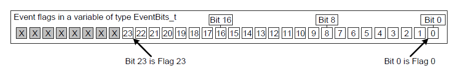
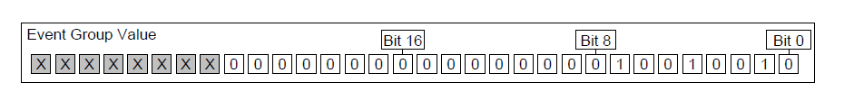
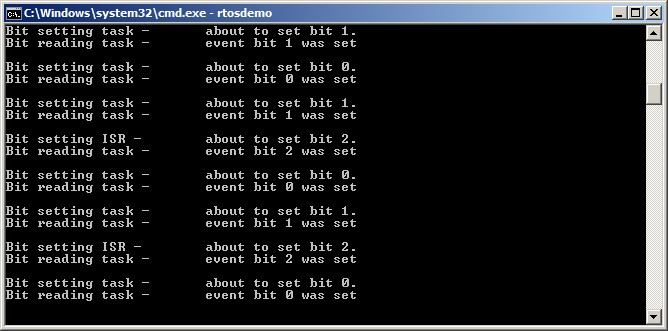
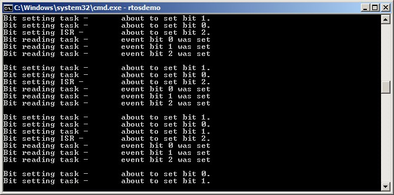
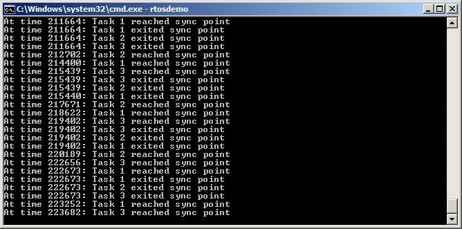

# 9 Event Groups

## 9.1 Chapter Introduction and Scope

It has already been noted that real-time embedded systems have to take
actions in response to events. Previous chapters have described features
of FreeRTOS that allow events to be communicated to tasks. Examples of
such features include semaphores and queues, both of which have the
following properties:

- They allow a task to wait in the Blocked state for a single event to
  occur.

- They unblock a single task when the event occurs. The task that is
  unblocked is the highest priority task that was waiting for the
  event.

Event groups are another feature of FreeRTOS that allow events to be
communicated to tasks. Unlike queues and semaphores:

- Event groups allow a task to wait in the Blocked state for a
  combination of one of more events to occur.

- Event groups unblock all the tasks that were waiting for the same
  event, or combination of events, when the event occurs.

These unique properties of event groups make them useful for
synchronizing multiple tasks, broadcasting events to more than one task,
allowing a task to wait in the Blocked state for any one of a set of
events to occur, and allowing a task to wait in the Blocked state for
multiple actions to complete.

Event groups also provide the opportunity to reduce the RAM used by an
application as, often, it is possible to replace many binary semaphores
with a single event group.

Event group functionality is optional. To include event group
functionality, build the FreeRTOS source file event\_groups.c as part of
your project.


### 9.1.1 Scope

This chapter aims to give readers a good understanding of:

- Practical uses for event groups.
- The advantages and disadvantages of event groups relative to other
  FreeRTOS features.
- How to set bits in an event group.
- How to wait in the Blocked state for bits to become set in an event
  group.
- How to use an event group to synchronize a set of tasks.


## 9.2 Characteristics of an Event Group

### 9.2.1 Event Groups, Event Flags and Event Bits

An event 'flag' is a Boolean (1 or 0) value used to indicate if an event
has occurred or not. An event 'group' is a set of event flags.

An event flag can only be 1 or 0, allowing the state of an event flag to
be stored in a single bit, and the state of all the event flags in an
event group to be stored in a single variable; the state of each event
flag in an event group is represented by a single bit in a variable of
type `EventBits_t`. For that reason, event flags are also known as event
'bits'. If a bit is set to 1 in the `EventBits_t` variable, then the event
represented by that bit has occurred. If a bit is set to 0 in the
`EventBits_t` variable, then the event represented by that bit has not
occurred.

Figure 9.1 shows how individual event flags are mapped to individual bits
in a variable of type `EventBits_t`.


<a name="fig9.1" title="Figure 9.1 Event flag to bit number mapping in a variable of type EventBits\_t"></a>

* * *

***Figure 9.1*** *Event flag to bit number mapping in a variable of type EventBits\_t*
* * *

As an example, if the value of an event group is 0x92 (binary 1001 0010)
then only event bits 1, 4 and 7 are set, so only the events represented
by bits 1, 4 and 7 have occurred. Figure 9.2 shows a variable of type
`EventBits_t` that has event bits 1, 4 and 7 set, and all the other event
bits clear, giving the event group a value of 0x92.


<a name="fig9.2" title="Figure 9.2 An event group in which only bits 1, 4 and 7 are set, and all the other event flags are clear, making the event group's value 0x92"></a>

* * *

***Figure 9.2*** *An event group in which only bits 1, 4 and 7 are set, and all the other event flags are clear, making the event group's value 0x92*
* * *

It is up to the application writer to assign a meaning to individual
bits within an event group. For example, the application writer might
create an event group, then:

- Define bit 0 within the event group to mean "a message has been
  received from the network".

- Define bit 1 within the event group to mean "a message is ready to
  be sent onto the network".

- Define bit 2 within the event group to mean "abort the current
  network connection".


### 9.2.2 More About the EventBits\_t Data Type

The number of event bits in an event group is dependent on the
`configTICK_TYPE_WIDTH_IN_BITS` compile time configuration constant in
FreeRTOSConfig.h[^24]:

[^24]: `configTICK_TYPE_WIDTH_IN_BITS` configures the type used to hold the RTOS
tick count, so would seem unrelated to the event groups feature. Its
effect on the `EventBits_t` type is a consequence of FreeRTOS's
internal implementation, and desirable as it is to set `configTICK_TYPE_WIDTH_IN_BITS`
to `TICK_TYPE_WIDTH_16_BITS`, this should be done only when FreeRTOS is executing on an
architecture that can handle 16-bit types more efficiently than
32-bit types.

- If `configTICK_TYPE_WIDTH_IN_BITS` is `TICK_TYPE_WIDTH_16_BITS`, then each
  event group contains 8 usable event bits.

- If `configTICK_TYPE_WIDTH_IN_BITS` is `TICK_TYPE_WIDTH_32_BITS`, then each event group contains 24
  usable event bits.

- If `configTICK_TYPE_WIDTH_IN_BITS` is `TICK_TYPE_WIDTH_64_BITS`, then each
  event group contains 56 usable event bits.


### 9.2.3 Access by Multiple Tasks

Event groups are objects in their own right that can be accessed by any
task or ISR that knows of their existence. Any number of tasks can set
bits in the same event group, and any number of tasks can read bits from
the same event group.


### 9.2.4 A Practical Example of Using an Event Group

The implementation of the FreeRTOS+TCP TCP/IP stack provides a practical
example of how an event group can be used to simultaneously simplify a
design, and minimize resource usage.

A TCP socket must respond to many different events. Examples of events
include accept events, bind events, read events and close events. The
events a socket can expect at any given time are dependent on the state
of the socket. For example, if a socket has been created, but not yet
bound to an address, then it can expect to receive a bind event, but
would not expect to receive a read event (it cannot read data if it does
not have an address).

The state of a FreeRTOS+TCP socket is held in a structure called
`FreeRTOS_Socket_t`. The structure contains an event group that has an
event bit defined for each event the socket must process. FreeRTOS+TCP
API calls that block to wait for an event, or group of events, simply
block on the event group.

The event group also contains an 'abort' bit, allowing a TCP connection
to be aborted, no matter which event the socket is waiting for at the
time.


## 9.3 Event Management Using Event Groups

### 9.3.1 The xEventGroupCreate() API Function

FreeRTOS also includes the `xEventGroupCreateStatic()` function,
which allocates the memory required to create an event group statically
at compile time: An event group must be explicitly created before it can
be used.

Event groups are referenced using variables of type `EventGroupHandle_t`.
The `xEventGroupCreate()` API function is used to create an event group,
and returns an `EventGroupHandle_t` to reference the event group it
creates.


<a name="list9.1" title="Listing 9.1 The xEventGroupCreate() API function prototype"></a>

```c
EventGroupHandle_t xEventGroupCreate( void );
```
***Listing 9.1*** *The xEventGroupCreate() API function prototype*


**xEventGroupCreate() return value**

- Return Value

  If NULL is returned, then the event group cannot be created
  because there is insufficient heap memory available for FreeRTOS to
  allocate the event group data structures. Chapter 3 provides more
  information on heap memory management.

  A non-NULL value being returned indicates that the event group has
  been created successfully. The returned value should be stored as the
  handle to the created event group.


### 9.3.2 The xEventGroupSetBits() API Function

The `xEventGroupSetBits()` API function sets one or more bits in an event
group, and is typically used to notify a task that the events
represented by the bit, or bits, being set has occurred.

> *Note: Never call `xEventGroupSetBits()` from an interrupt service
> routine. The interrupt-safe version `xEventGroupSetBitsFromISR()` should
> be used in its place.*


<a name="list9.2" title="Listing 9.2. The xEventGroupSetBits() API function prototype"></a>

```c
EventBits_t xEventGroupSetBits( EventGroupHandle_t xEventGroup,

const EventBits_t uxBitsToSet );
```
***Listing 9.2*** *The xEventGroupSetBits() API function prototype*


**xEventGroupSetBits() parameters and return value**

- `xEventGroup`

  The handle of the event group in which bits are being set. The event
  group handle will have been returned from the call to
  `xEventGroupCreate()` used to create the event group.

- `uxBitsToSet`

  A bit mask that specifies the event bit, or event bits, to set to
  1 in the event group. The value of the event group is updated by bitwise
  ORing the event group's existing value with the value passed in
  `uxBitsToSet`.

  As an example, setting `uxBitsToSet` to 0x04 (binary 0100) will result
  in event bit 3 in the event group becoming set (if it was not already
  set), while leaving all the other event bits in the event group
  unchanged.

- Return Value

  The value of the event group at the time the call to
  `xEventGroupSetBits()` returned. Note that the value returned will not
  necessarily have the bits specified by `uxBitsToSet` set, because the bits
  may have been cleared again by a different task.


### 9.3.3 The xEventGroupSetBitsFromISR() API Function

`xEventGroupSetBitsFromISR()` is the interrupt safe version of
`xEventGroupSetBits()`.

Giving a semaphore is a deterministic operation because it is known in
advance that giving a semaphore can result in at most one task leaving
the Blocked state. When bits are set in an event group it is not known
in advance how many tasks will leave the Blocked state, so setting bits
in an event group is not a deterministic operation.

The FreeRTOS design and implementation standard does not permit
non-deterministic operations to be performed inside an interrupt service
routine, or when interrupts are disabled. For that reason,
`xEventGroupSetBitsFromISR()` does not set event bits directly inside the
interrupt service routine, but instead defers the action to the RTOS
daemon task.


<a name="list9.3" title="Listing 9.3 The xEventGroupSetBitsFromISR() API function prototype"></a>

```c
BaseType_t xEventGroupSetBitsFromISR( EventGroupHandle_t xEventGroup,
                                      const EventBits_t uxBitsToSet,
                                      BaseType_t *pxHigherPriorityTaskWoken );
```
***Listing 9.3*** *The xEventGroupSetBitsFromISR() API function prototype*


**xEventGroupSetBitsFromISR() parameters and return value**

- `xEventGroup`

  The handle of the event group in which bits are being set. The event
  group handle will have been returned from the call to
  `xEventGroupCreate()` used to create the event group.

- `uxBitsToSet`

  A bit mask that specifies the event bit, or event bits, to set to
  1 in the event group. The value of the event group is updated by bitwise
  ORing the event group's existing value with the value passed in
  `uxBitsToSet`.

  As an example, setting `uxBitsToSet` to 0x05 (binary 0101) will result
  in event bit 2 and event bit 0 in the event group becoming set (if they
  were not already set), while leaving all the other event bits in the
  event group unchanged.

- `pxHigherPriorityTaskWoken`

  `xEventGroupSetBitsFromISR()` does not set the event bits directly
  inside the interrupt service routine, but instead defers the action to
  the RTOS daemon task by sending a command on the timer command queue. If
  the daemon task was in the Blocked state to wait for data to become
  available on the timer command queue, then writing to the timer command
  queue will cause the daemon task to leave the Blocked state. If the
  priority of the daemon task is higher than the priority of the currently
  executing task (the task that was interrupted), then, internally,
  `xEventGroupSetBitsFromISR()` will set `*pxHigherPriorityTaskWoken` to
  `pdTRUE`.

  If `xEventGroupSetBitsFromISR()` sets this value to `pdTRUE`, then a
  context switch should be performed before the interrupt is exited. This
  will ensure that the interrupt returns directly to the daemon task, as
  the daemon task will be the highest priority Ready state task.

- Return Value

  There are two possible return values:

  - `pdPASS` will be returned only if data was successfully sent to the
    timer command queue.

  - `pdFALSE` will be returned if the 'set bits' command could not be
    written to the timer command queue because the queue was already
    full.


### 9.3.4 The xEventGroupWaitBits() API Function

The `xEventGroupWaitBits()` API function allows a task to read the value
of an event group, and optionally wait in the Blocked state for one or
more event bits in the event group to become set, if the event bits are
not already set.


<a name="list9.4" title="Listing 9.4 The xEventGroupWaitBits() API function prototype"></a>

```c
EventBits_t xEventGroupWaitBits( EventGroupHandle_t xEventGroup,
                                 const EventBits_t uxBitsToWaitFor,
                                 const BaseType_t xClearOnExit,
                                 const BaseType_t xWaitForAllBits,
                                 TickType_t xTicksToWait );
```
***Listing 9.4*** *The xEventGroupWaitBits() API function prototype*

The condition used by the scheduler to determine if a task will enter
the Blocked state, and when a task will leave the Blocked state, is
called the 'unblock condition'. The unblock condition is specified by a
combination of the `uxBitsToWaitFor` and the `xWaitForAllBits` parameter
values:

- `uxBitsToWaitFor` specifies which event bits in the event group to
  test

- `xWaitForAllBits` specifies whether to use a bitwise OR test, or a
  bitwise AND test

A task will not enter the Blocked state if its unblock condition is met
at the time `xEventGroupWaitBits()` is called.

Examples of conditions that will result in a task either entering the
Blocked state, or exiting the Blocked state, are provided in Table 6.
Table 6 only shows the least significant four binary bits of the event
group and uxBitsToWaitFor values—the other bits of those two values are
assumed to be zero.

<a name="tbl6" title="Table 6 The Effect of the uxBitsToWaitFor and xWaitForAllBits Parameters"></a>

* * *
| Existing Event Group Value | uxBitsToWaitFor value | xWaitForAllBits value | Resultant Behavior |
| -------------------------- | --------------------- | --------------------- | ------------------ |
| 0000 | 0101 | pdFALSE | The calling task will enter the Blocked state because neither of bit 0 or bit 2 are set in the event group, and will leave the Blocked state when either bit 0 OR bit 2 are set in the event group. |
| 0100 | 0101 | pdTRUE | The calling task will enter the Blocked state because bit 0 and bit 2 are not both set in the event group, and will leave the Blocked state when both bit 0 AND bit 2 are set in the event group. |
| 0100 | 0110 | pdFALSE | The calling task will not enter the Blocked state because xWaitForAllBits is pdFALSE, and one of the two bits specified by uxBitsToWaitFor is already set in the event group. |
| 0100 | 0110 | pdTRUE | The calling task will enter the Blocked state because xWaitForAllBits is pdTRUE, and only one of the two bits specified by uxBitsToWaitFor is already set in the event group. The task will leave the Blocked state when both bit 1 and bit 2 are set in the event group. |

***Table 6*** *The Effect of the uxBitsToWaitFor and xWaitForAllBits Parameters*
* * *

The calling task specifies bits to test using the `uxBitsToWaitFor`
parameter, and it is likely the calling task will need to clear these
bits back to zero after its unblock condition has been met. Event bits
can be cleared using the `xEventGroupClearBits()` API function, but using
that function to manually clear event bits will lead to race conditions
in the application code if:

- There is more than one task using the same event group.
- Bits are set in the event group by a different task, or by an
  interrupt service routine.

The `xClearOnExit` parameter is provided to avoid these potential race
conditions. If `xClearOnExit` is set to `pdTRUE`, then the testing and
clearing of event bits appears to the calling task to be an atomic
operation (uninterruptable by other tasks or interrupts).

**xEventGroupWaitBits() parameters and return value**

- `xEventGroup`

  The handle of the event group that contains the event bits being
  read. The event group handle will have been returned from the call to
  `xEventGroupCreate()` used to create the event group.

- `uxBitsToWaitFor`

  A bit mask that specifies the event bit, or event bits, to test
  in the event group.

  For example, if the calling task wants to wait for event bit 0 and/or
  event bit 2 to become set in the event group, then set `uxBitsToWaitFor`
  to 0x05 (binary 0101). Refer to Table 6 for further examples.

- `xClearOnExit`

  If the calling task's unblock condition has been met, and
  `xClearOnExit` is set to `pdTRUE`, then the event bits specified by
  `uxBitsToWaitFor` will be cleared back to 0 in the event group before the
  calling task exits the `xEventGroupWaitBits()` API function.

  If `xClearOnExit` is set to `pdFALSE`, then the state of the event bits
  in the event group are not modified by the `xEventGroupWaitBits()` API
  function.

- `xWaitForAllBits`

  The `uxBitsToWaitFor` parameter specifies the event bits to test in
  the event group. `xWaitForAllBits` specifies if the calling task should be
  removed from the Blocked state when one or more of the events bits
  specified by the `uxBitsToWaitFor` parameter are set, or only when all of
  the event bits specified by the `uxBitsToWaitFor` parameter are set.

  If `xWaitForAllBits` is set to `pdFALSE`, then a task that entered the
  Blocked state to wait for its unblock condition to be met will leave the
  Blocked state when any of the bits specified by `uxBitsToWaitFor` become
  set (or the timeout specified by the `xTicksToWait` parameter expires).

  If `xWaitForAllBits` is set to `pdTRUE`, then a task that entered the
  Blocked state to wait for its unblock condition to be met will only
  leave the Blocked state when all of the bits specified by
  `uxBitsToWaitFor` are set (or the timeout specified by the `xTicksToWait`
  parameter expires).

  Refer to Table 6 for examples.

- `xTicksToWait`

  The maximum amount of time the task should remain in the Blocked
  state to wait for its unblock condition to be met.

  `xEventGroupWaitBits()` will return immediately if `xTicksToWait` is
  zero, or the unblock condition is met at the time `xEventGroupWaitBits()`
  is called.

  The block time is specified in tick periods, so the absolute time it
  represents is dependent on the tick frequency. The macro `pdMS_TO_TICKS()`
  can be used to convert a time specified in milliseconds into a time
  specified in ticks.

  Setting `xTicksToWait` to `portMAX_DELAY` will cause the task to wait
  indefinitely (without timing out), provided `INCLUDE_vTaskSuspend` is set
  to 1 in FreeRTOSConfig.h.

- Returned Value

  If `xEventGroupWaitBits()` returned because the calling task's
  unblock condition was met, then the returned value is the value of the
  event group at the time the calling task's unblock condition was met
  (before any bits were automatically cleared if `xClearOnExit` was `pdTRUE`).
  In this case the returned value will also meet the unblock condition.

  If `xEventGroupWaitBits()` returned because the block time specified by
  the `xTicksToWait` parameter expired, then the returned value is the value
  of the event group at the time the block time expired. In this case the
  returned value will not meet the unblock condition.


### 9.3.5 The xEventGroupGetStaticBuffer() API Function

The `xEventGroupGetStaticBuffer()` API function provides a method to retrieve a pointer
to a buffer of a statically created event group. It is the same buffer that is supplied
at the time of creation of the event group.

*Note: Never call `xEventGroupGetStaticBuffer()` from an interrupt service
routine.


<a name="list9.5" title="Listing 9.5 The xEventGroupGetStaticBuffer() API function prototype"></a>

```c
BaseType_t xEventGroupGetStaticBuffer( EventGroupHandle_t xEventGroup,

StaticEventGroup_t ** ppxEventGroupBuffer );
```
***Listing 9.5*** *The xEventGroupGetStaticBuffer() API function prototype*


**xEventGroupGetStaticBuffer() parameters and return value**

- `xEventGroup`

  The event group for which to retrieve the buffer. This event group must
  be created by `xEventGroupCreateStatic()`.

- `ppxEventGroupBuffer`

  Used to return a pointer to the event groups's data structure buffer.
  It is the same buffer that is supplied at the time of creation.

- Return Value

  There are two possible return values:

  - `pdTRUE` will be returned if the buffer was successfully retrieved.

  - `pdFALSE` will be returned if the buffer was not successfully retrieved.

<a name="example9.1" title="Example 9.1 Experimenting with event groups"></a>
---
***Example 9.1*** *Experimenting with event groups*

---

This example demonstrates how to:

- Create an event group.
- Set bits in an event group from an interrupt service routine.
- Set bits in an event group from a task.
- Block on an event group.

The effect of the `xEventGroupWaitBits()` `xWaitForAllBits` parameter is
demonstrated by first executing the example with `xWaitForAllBits` set to
`pdFALSE`, and then executing the example with `xWaitForAllBits` set to
`pdTRUE`.

Event bit 0 and event bit 1 are set from a task. Event bit 2 is set from
an interrupt service routine. These three bits are given descriptive
names using the \#define statements shown in Listing 9.6.


<a name="list9.6" title="Listing 9.6 Event bit definitions used in Example 9.1"></a>

```c
/* Definitions for the event bits in the event group. */
#define mainFIRST_TASK_BIT ( 1UL << 0UL )  /* Event bit 0, set by a task */
#define mainSECOND_TASK_BIT ( 1UL << 1UL ) /* Event bit 1, set by a task */
#define mainISR_BIT ( 1UL << 2UL )         /* Event bit 2, set by an ISR */
```
***Listing 9.6*** *Event bit definitions used in Example 9.1*


Listing 9.7 shows the implementation of the task that sets event bit 0
and event bit 1. It sits in a loop, repeatedly setting one bit, then the
other, with a delay of 200 milliseconds between each call to
`xEventGroupSetBits()`. A string is printed out before each bit is set to
allow the sequence of execution to be seen in the console.


<a name="list9.7" title="Listing 9.7 The task that sets two bits in the event group in Example 9.1"></a>

```c
static void vEventBitSettingTask( void *pvParameters )
{
    const TickType_t xDelay200ms = pdMS_TO_TICKS( 200UL );

    for( ;; )
    {
        /* Delay for a short while before starting the next loop. */
        vTaskDelay( xDelay200ms );

        /* Print out a message to say event bit 0 is about to be set by the
           task, then set event bit 0. */
        vPrintString( "Bit setting task -\t about to set bit 0.\r\n" );
        xEventGroupSetBits( xEventGroup, mainFIRST_TASK_BIT );

        /* Delay for a short while before setting the other bit. */
        vTaskDelay( xDelay200ms );

        /* Print out a message to say event bit 1 is about to be set by the
           task, then set event bit 1. */
        vPrintString( "Bit setting task -\t about to set bit 1.\r\n" );
        xEventGroupSetBits( xEventGroup, mainSECOND_TASK_BIT );
    }
}
```
***Listing 9.7*** *The task that sets two bits in the event group in Example 9.1*


Listing 9.8 shows the implementation of the interrupt service routine
that sets bit 2 in the event group. Again, a string is printed out
before the bit is set to allow the sequence of execution to be seen in
the console. In this case however, because console output should not be
performed directly in an interrupt service routine,
`xTimerPendFunctionCallFromISR()` is used to perform the output in the
context of the RTOS daemon task.

As in previous examples, the interrupt service routine is triggered by a
simple periodic task that forces a software interrupt. In this example,
the interrupt is generated every 500 milliseconds.


<a name="list9.8" title="Listing 9.8 The ISR that sets bit 2 in the event group in Example 9.1"></a>

```c
static uint32_t ulEventBitSettingISR( void )
{
    /* The string is not printed within the interrupt service routine, but is
       instead sent to the RTOS daemon task for printing. It is therefore
       declared static to ensure the compiler does not allocate the string on
       the stack of the ISR, as the ISR's stack frame will not exist when the
       string is printed from the daemon task. */
    static const char *pcString = "Bit setting ISR -\t about to set bit 2.\r\n";
    BaseType_t xHigherPriorityTaskWoken = pdFALSE;

    /* Print out a message to say bit 2 is about to be set. Messages cannot
       be printed from an ISR, so defer the actual output to the RTOS daemon
       task by pending a function call to run in the context of the RTOS
       daemon task. */
    xTimerPendFunctionCallFromISR( vPrintStringFromDaemonTask,
                                   ( void * ) pcString,
                                   0,
                                   &xHigherPriorityTaskWoken );

    /* Set bit 2 in the event group. */
    xEventGroupSetBitsFromISR( xEventGroup,
                               mainISR_BIT,
                               &xHigherPriorityTaskWoken );

    /* xTimerPendFunctionCallFromISR() and xEventGroupSetBitsFromISR() both
       write to the timer command queue, and both used the same
       xHigherPriorityTaskWoken variable. If writing to the timer command
       queue resulted in the RTOS daemon task leaving the Blocked state, and
       if the priority of the RTOS daemon task is higher than the priority of
       the currently executing task (the task this interrupt interrupted) then
       xHigherPriorityTaskWoken will have been set to pdTRUE.

       xHigherPriorityTaskWoken is used as the parameter to
       portYIELD_FROM_ISR(). If xHigherPriorityTaskWoken equals pdTRUE, then
       calling portYIELD_FROM_ISR() will request a context switch. If
       xHigherPriorityTaskWoken is still pdFALSE, then calling
       portYIELD_FROM_ISR() will have no effect.

       The implementation of portYIELD_FROM_ISR() used by the Windows port
       includes a return statement, which is why this function does not
       explicitly return a value. */

    portYIELD_FROM_ISR( xHigherPriorityTaskWoken );
}
```
***Listing 9.8*** *The ISR that sets bit 2 in the event group in Example 9.1*


Listing 9.9 shows the implementation of the task that calls
`xEventGroupWaitBits()` to block on the event group. The task prints out a
string for each bit that is set in the event group.

The `xEventGroupWaitBits()` `xClearOnExit` parameter is set to `pdTRUE`, so
the event bit, or bits, that caused the call to `xEventGroupWaitBits()` to
return will be cleared automatically before `xEventGroupWaitBits()`
returns.


<a name="list9.9" title="Listing 9.9 The task that blocks to wait for event bits to become set in Example 9.1"></a>

```c
static void vEventBitReadingTask( void *pvParameters )
{
    EventBits_t xEventGroupValue;
    const EventBits_t xBitsToWaitFor = ( mainFIRST_TASK_BIT  |
                                         mainSECOND_TASK_BIT |
                                         mainISR_BIT );

    for( ;; )
    {
        /* Block to wait for event bits to become set within the event
           group. */
        xEventGroupValue = xEventGroupWaitBits( /* The event group to read */
                                                xEventGroup,

                                                /* Bits to test */
                                                xBitsToWaitFor,

                                                /* Clear bits on exit if the
                                                   unblock condition is met */
                                                pdTRUE,

                                                /* Don't wait for all bits. This
                                                   parameter is set to pdTRUE for the
                                                   second execution. */
                                                pdFALSE,

                                                /* Don't time out. */
                                                portMAX_DELAY );

        /* Print a message for each bit that was set. */
        if( ( xEventGroupValue & mainFIRST_TASK_BIT ) != 0 )
        {
            vPrintString( "Bit reading task -\t Event bit 0 was set\r\n" );
        }

        if( ( xEventGroupValue & mainSECOND_TASK_BIT ) != 0 )
        {
            vPrintString( "Bit reading task -\t Event bit 1 was set\r\n" );
        }

        if( ( xEventGroupValue & mainISR_BIT ) != 0 )
        {
            vPrintString( "Bit reading task -\t Event bit 2 was set\r\n" );
        }
    }
}
```
***Listing 9.9*** *The task that blocks to wait for event bits to become set in Example 9.1*


The `main()` function creates the event group, and the tasks, before
starting the scheduler. See Listing 9.10 for its implementation. The
priority of the task that reads from the event group is higher than the
priority of the task that writes to the event group, ensuring the
reading task will pre-empt the writing task each time the reading task's
unblock condition is met.


<a name="list9.10" title="Listing 9.10 Creating the event group and tasks in Example 9.1"></a>

```c
int main( void )
{
    /* Before an event group can be used it must first be created. */
    xEventGroup = xEventGroupCreate();

    /* Create the task that sets event bits in the event group. */
    xTaskCreate( vEventBitSettingTask, "Bit Setter", 1000, NULL, 1, NULL );

    /* Create the task that waits for event bits to get set in the event
       group. */
    xTaskCreate( vEventBitReadingTask, "Bit Reader", 1000, NULL, 2, NULL );

    /* Create the task that is used to periodically generate a software
       interrupt. */
    xTaskCreate( vInterruptGenerator, "Int Gen", 1000, NULL, 3, NULL );

    /* Install the handler for the software interrupt. The syntax necessary
       to do this is dependent on the FreeRTOS port being used. The syntax
       shown here can only be used with the FreeRTOS Windows port, where such
       interrupts are only simulated. */
    vPortSetInterruptHandler( mainINTERRUPT_NUMBER, ulEventBitSettingISR );

    /* Start the scheduler so the created tasks start executing. */
    vTaskStartScheduler();

    /* The following line should never be reached. */
    for( ;; );
    return 0;
}
```
***Listing 9.10*** *Creating the event group and tasks in Example 9.1*


The output produced when Example 9.1 is executed with the
`xEventGroupWaitBits()` `xWaitForAllBits` parameter set to `pdFALSE` is shown
in Figure 9.3. In Figure 9.3, it can be seen that, because the
`xWaitForAllBits` parameter in the call to `xEventGroupWaitBits()` was set
to `pdFALSE`, the task that reads from the event group leaves the Blocked
state and executes immediately every time any of the event bits are set.


<a name="fig9.3" title="Figure 9.3 The output produced when Example 9.1 is executed with xWaitForAllBits set to pdFALSE"></a>

* * *

***Figure 9.3*** *The output produced when Example 9.1 is executed with xWaitForAllBits set to pdFALSE*
* * *

The output produced when Example 9.1 is executed with the
`xEventGroupWaitBits()` `xWaitForAllBits` parameter set to `pdTRUE` is shown
in Figure 9.4. In Figure 9.4 it can be seen that, because the
`xWaitForAllBits` parameter was set to `pdTRUE`, the task that reads from
the event group only leaves the Blocked state after all three of the
event bits are set.


<a name="fig9.4" title="Figure 9.4 The output produced when Example 9.1 is executed with xWaitForAllBits set to pdTRUE"></a>

* * *

***Figure 9.4*** *The output produced when Example 9.1 is executed with xWaitForAllBits set to pdTRUE*
* * *


## 9.4 Task Synchronization Using an Event Group

Sometimes the design of an application requires two or more tasks to
synchronize with each other. For example, consider a design where Task A
receives an event, then delegates some of the processing necessitated by
the event to three other tasks: Task B, Task C and Task D. If Task A
cannot receive another event until tasks B, C and D have all completed
processing the previous event, then all four tasks will need to
synchronize with each other. Each task's synchronization point will be
after that task has completed its processing, and cannot proceed further
until each of the other tasks have done the same. Task A can only
receive another event after all four tasks have reached their
synchronization point.

A less abstract example of the need for this type of task
synchronization is found in one of the FreeRTOS+TCP demonstration
projects. The demonstration shares a TCP socket between two tasks; one
task sends data to the socket, and a different task receives data from
the same socket[^25]. It is not safe for either task to close the TCP
socket until it is sure the other task will not attempt to access the
socket again. If either of the two tasks wishes to close the socket,
then it must inform the other task of its intent, and then wait for the
other task to stop using the socket before proceeding. The scenario
where it is the task that sends data to the socket that wishes to close
the socket is demonstrated by the pseudo code shown in Listing 9.10.

[^25]: At the time of writing, this is the only way a single
FreeRTOS+TCP socket can be shared between tasks.

The scenario demonstrated by Listing 9.10 is trivial, as there are only
two tasks that need to synchronize with each other, but it is easy to
see how the scenario would become more complex, and require more tasks
to join the synchronization, if other tasks were performing processing
that was dependent on the socket being open.


<a name="list9.11" title="Listing 9.11 Pseudo code for two tasks that synchronize with each other to ensure a shared TCP socket..."></a>

```c
void SocketTxTask( void *pvParameters )
{
    xSocket_t xSocket;
    uint32_t ulTxCount = 0UL;

    for( ;; )
    {
        /* Create a new socket. This task will send to this socket, and another
           task will receive from this socket. */
        xSocket = FreeRTOS_socket( ... );

        /* Connect the socket. */
        FreeRTOS_connect( xSocket, ... );

        /* Use a queue to send the socket to the task that receives data. */
        xQueueSend( xSocketPassingQueue, &xSocket, portMAX_DELAY );

        /* Send 1000 messages to the socket before closing the socket. */
        for( ulTxCount = 0; ulTxCount < 1000; ulTxCount++ )
        {
            if( FreeRTOS_send( xSocket, ... ) < 0 )
            {
                /* Unexpected error - exit the loop, after which the socket
                   will be closed. */
                break;
            }
        }

        /* Let the Rx task know the Tx task wants to close the socket. */
        TxTaskWantsToCloseSocket();

        /* This is the Tx task's synchronization point. The Tx task waits here
           for the Rx task to reach its synchronization point. The Rx task will
           only reach its synchronization point when it is no longer using the
           socket, and the socket can be closed safely. */
        xEventGroupSync( ... );

        /* Neither task is using the socket. Shut down the connection, then
           close the socket. */
        FreeRTOS_shutdown( xSocket, ... );
        WaitForSocketToDisconnect();
        FreeRTOS_closesocket( xSocket );
    }
}
/*-----------------------------------------------------------*/

void SocketRxTask( void *pvParameters )
{
    xSocket_t xSocket;

    for( ;; )
    {
        /* Wait to receive a socket that was created and connected by the Tx
           task. */
        xQueueReceive( xSocketPassingQueue, &xSocket, portMAX_DELAY );

        /* Keep receiving from the socket until the Tx task wants to close the
           socket. */
        while( TxTaskWantsToCloseSocket() == pdFALSE )
        {
           /* Receive then process data. */
           FreeRTOS_recv( xSocket, ... );
           ProcessReceivedData();
        }

        /* This is the Rx task's synchronization point - it only reaches here
           when it is no longer using the socket, and it is therefore safe for
           the Tx task to close the socket. */
        xEventGroupSync( ... );
    }
}
```
***Listing 9.11*** *Pseudo code for two tasks that synchronize with each other to ensure a shared TCP socket is no longer in use by either task before the socket is closed*


An event group can be used to create a synchronization point:

- Each task that must participate in the synchronization is assigned a
  unique event bit within the event group.

- Each task sets its own event bit when it reaches the synchronization
  point.

- Having set its own event bit, each task blocks on the event group to
  wait for the event bits that represent all the other synchronizing
  tasks to also become set.

However, the `xEventGroupSetBits()` and `xEventGroupWaitBits()` API
functions cannot be used in this scenario. If they were used, then the
setting of a bit (to indicate a task had reached its synchronization
point) and the testing of bits (to determine if the other synchronizing
tasks had reached their synchronization point) would be performed as two
separate operations. To see why that would be a problem, consider a
scenario where Task A, Task B and Task C attempt to synchronize using an
event group:

1. Task A and Task B have already reached the synchronization point, so
   their event bits are set in the event group, and they are in the
   Blocked state to wait for task C's event bit to also become set.

2. Task C reaches the synchronization point, and uses
   `xEventGroupSetBits()` to set its bit in the event group. As soon as
   Task C's bit is set, Task A and Task B leave the Blocked state, and
   clear all three event bits.

3. Task C then calls `xEventGroupWaitBits()` to wait for all three event
   bits to become set, but by that time, all three event bits have
   already been cleared, Task A and Task B have left their respective
   synchronization points, and so the synchronization has failed.

To successfully use an event group to create a synchronization point,
the setting of an event bit, and the subsequent testing of event bits,
must be performed as a single uninterruptable operation. The
`xEventGroupSync()` API function is provided for that purpose.


### 9.4.1 The xEventGroupSync() API Function

`xEventGroupSync()` is provided to allow two or more tasks to use an event
group to synchronize with each other. The function allows a task to set
one or more event bits in an event group, then wait for a combination of
event bits to become set in the same event group, as a single
uninterruptable operation.

The `xEventGroupSync()` `uxBitsToWaitFor` parameter specifies the calling
task's unblock condition. The event bits specified by `uxBitsToWaitFor`
will be cleared back to zero before `xEventGroupSync()` returns, if
`xEventGroupSync()` returned because the unblock condition had been met.


<a name="list9.12" title="Listing 9.12 The xEventGroupSync() API function prototype"></a>

```c
EventBits_t xEventGroupSync( EventGroupHandle_t xEventGroup,
                             const EventBits_t uxBitsToSet,
                             const EventBits_t uxBitsToWaitFor,
                             TickType_t xTicksToWait );
```
***Listing 9.12*** *The xEventGroupSync() API function prototype*


**xEventGroupSync() parameters and return value**

- `xEventGroup`

  The handle of the event group in which event bits are to be set, and
  then tested. The event group handle will have been returned from the
  call to `xEventGroupCreate()` used to create the event group.

- `uxBitsToSet`

  A bit mask that specifies the event bit, or event bits, to set to
  1 in the event group. The value of the event group is updated by bitwise
  ORing the event group's existing value with the value passed in
  `uxBitsToSet`.

  As an example, setting `uxBitsToSet` to 0x04 (binary 0100) will result
  in event bit 2 becoming set (if it was not already set), while leaving
  all the other event bits in the event group unchanged.

- `uxBitsToWaitFor`

  A bit mask that specifies the event bit, or event bits, to test
  in the event group.

  For example, if the calling task wants to wait for event bits 0, 1
  and 2 to become set in the event group, then set `uxBitsToWaitFor` to 0x07
  (binary 111).

- `xTicksToWait`

  The maximum amount of time the task should remain in the Blocked
  state to wait for its unblock condition to be met.

  `xEventGroupSync()` will return immediately if `xTicksToWait` is zero, or
  the unblock condition is met at the time `xEventGroupSync()` is
  called.

  The block time is specified in tick periods, so the absolute time it
  represents is dependent on the tick frequency. The macro `pdMS_TO_TICKS()`
  can be used to convert a time specified in milliseconds into a time
  specified in ticks.

  Setting `xTicksToWait` to `portMAX_DELAY` will cause the task to wait
  indefinitely (without timing out), provided `INCLUDE_vTaskSuspend` is set
  to 1 in FreeRTOSConfig.h.

- Returned Value

  If `xEventGroupSync()` returned because the calling task's unblock
  condition was met, then the returned value is the value of the event
  group at the time the calling task's unblock condition was met (before
  any bits were automatically cleared back to zero). In this case the
  returned value will also meet the calling task's unblock condition.

  If `xEventGroupSync()` returned because the block time specified by the
  `xTicksToWait` parameter expired, then the returned value is the value of
  the event group at the time the block time expired. In this case the
  returned value will not meet the calling task's unblock
  condition.


<a name="example9.2" title="Example 9.2 Synchronizing tasks"></a>
---
***Example 9.2*** *Synchronizing tasks*

---

Example 9.2 uses `xEventGroupSync()` to synchronize three instances of a
single task implementation. The task parameter is used to pass into each
instance the event bit the task will set when it calls
`xEventGroupSync()`.

The task prints a message before calling `xEventGroupSync()`, and again
after the call to `xEventGroupSync()` has returned. Each message includes
a time stamp. This allows the sequence of execution to be observed in
the output produced. A pseudo random delay is used to prevent all the
tasks reaching the synchronization point at the same time.

See Listing 9.12 for the task's implementation.


<a name="list9.13" title="Listing 9.13 The implementation of the task used in Example 9.2"></a>

```c
static void vSyncingTask( void *pvParameters )
{
    const TickType_t xMaxDelay = pdMS_TO_TICKS( 4000UL );
    const TickType_t xMinDelay = pdMS_TO_TICKS( 200UL );
    TickType_t xDelayTime;
    EventBits_t uxThisTasksSyncBit;
    const EventBits_t uxAllSyncBits = ( mainFIRST_TASK_BIT  |
                                        mainSECOND_TASK_BIT |
                                        mainTHIRD_TASK_BIT );

    /* Three instances of this task are created - each task uses a different
       event bit in the synchronization. The event bit to use is passed into
       each task instance using the task parameter. Store it in the
       uxThisTasksSyncBit variable. */
    uxThisTasksSyncBit = ( EventBits_t ) pvParameters;

    for( ;; )
    {
        /* Simulate this task taking some time to perform an action by delaying
           for a pseudo random time. This prevents all three instances of this
           task reaching the synchronization point at the same time, and so
           allows the example's behavior to be observed more easily. */
        xDelayTime = ( rand() % xMaxDelay ) + xMinDelay;
        vTaskDelay( xDelayTime );

        /* Print out a message to show this task has reached its synchronization
           point. pcTaskGetTaskName() is an API function that returns the name
           assigned to the task when the task was created. */
        vPrintTwoStrings( pcTaskGetTaskName( NULL ), "reached sync point" );

        /* Wait for all the tasks to have reached their respective
           synchronization points. */
        xEventGroupSync( /* The event group used to synchronize. */
                         xEventGroup,

                         /* The bit set by this task to indicate it has reached
                            the synchronization point. */
                         uxThisTasksSyncBit,

                         /* The bits to wait for, one bit for each task taking
                            part in the synchronization. */
                         uxAllSyncBits,

                         /* Wait indefinitely for all three tasks to reach the
                            synchronization point. */
                         portMAX_DELAY );

        /* Print out a message to show this task has passed its synchronization
           point. As an indefinite delay was used the following line will only
           be executed after all the tasks reached their respective
           synchronization points. */
        vPrintTwoStrings( pcTaskGetTaskName( NULL ), "exited sync point" );
    }
}
```
***Listing 9.13*** *The implementation of the task used in Example 9.2*

The `main()` function creates the event group, creates all three tasks,
and then starts the scheduler. See Listing 9.14 for its implementation.


<a name="list9.14" title="Listing 9.14 The main() function used in Example 9.2"></a>

```c
/* Definitions for the event bits in the event group. */

#define mainFIRST_TASK_BIT ( 1UL << 0UL ) /* Event bit 0, set by the 1st task */
#define mainSECOND_TASK_BIT( 1UL << 1UL ) /* Event bit 1, set by the 2nd task */
#define mainTHIRD_TASK_BIT ( 1UL << 2UL ) /* Event bit 2, set by the 3rd task */

/* Declare the event group used to synchronize the three tasks. */
EventGroupHandle_t xEventGroup;

int main( void )
{
    /* Before an event group can be used it must first be created. */
    xEventGroup = xEventGroupCreate();

    /* Create three instances of the task. Each task is given a different
       name, which is later printed out to give a visual indication of which
       task is executing. The event bit to use when the task reaches its
       synchronization point is passed into the task using the task parameter. */
    xTaskCreate( vSyncingTask, "Task 1", 1000, mainFIRST_TASK_BIT, 1, NULL );
    xTaskCreate( vSyncingTask, "Task 2", 1000, mainSECOND_TASK_BIT, 1, NULL );
    xTaskCreate( vSyncingTask, "Task 3", 1000, mainTHIRD_TASK_BIT, 1, NULL );

    /* Start the scheduler so the created tasks start executing. */
    vTaskStartScheduler();

    /* As always, the following line should never be reached. */
    for( ;; );
    return 0;
}
```
***Listing 9.14*** *The main() function used in Example 9.2*

The output produced when Example 9.2 is executed is shown in Figure 9.5.
It can be seen that, even though each task reaches the synchronization
point at a different (pseudo random) time, each task exits the
synchronization point at the same time[^26] (which is the time at which
the last task reached the synchronization point).

[^26]: Figure 9.5 shows the example running in the FreeRTOS Windows port,
which does not provide true real time behavior (especially when
using Windows system calls to print to the console), and will
therefore show some timing variation.


<a name="fig9.5" title="Figure 9.5 The output produced when Example 9.2 is executed"></a>

* * *

***Figure 9.5*** *The output produced when Example 9.2 is executed*
* * *

