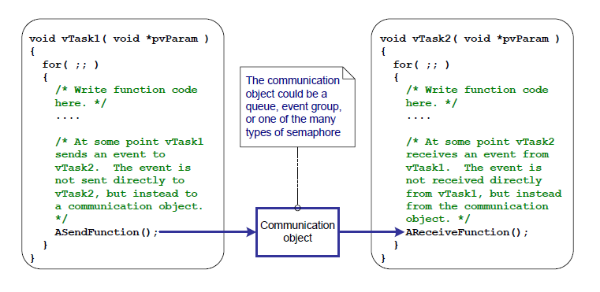
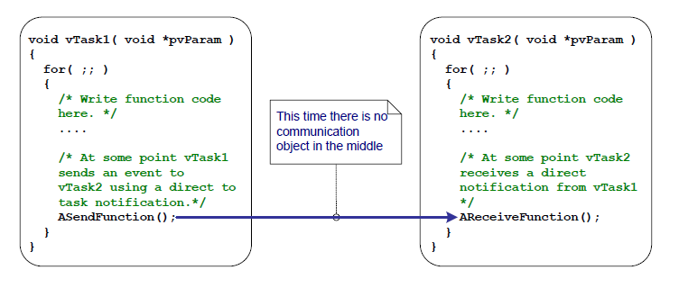
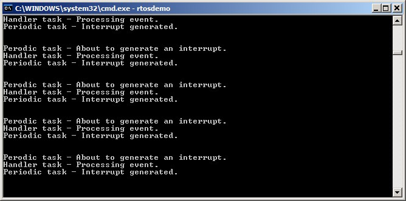
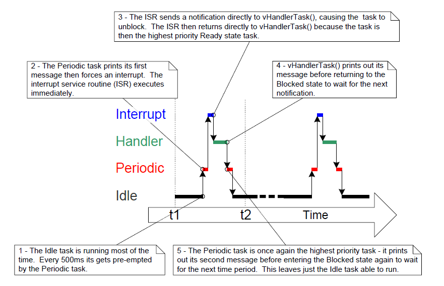
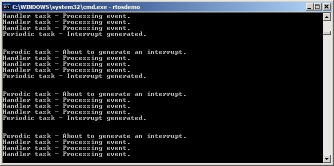
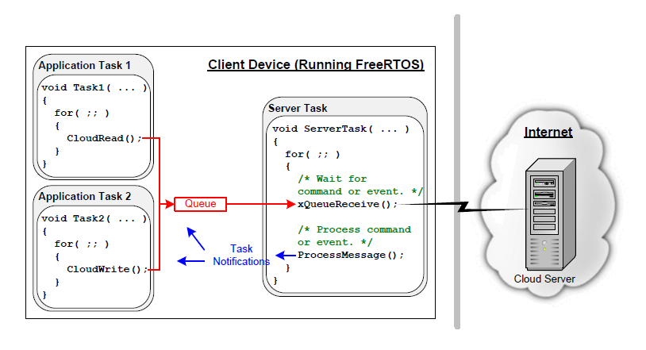

# 10 Task Notifications

## 10.1 Introduction

FreeRTOS applications are typically structured as a series of independent tasks that communicate with each other to collectively provide the system functionality.  Task notifications are an efficient mechanism allowing one task to directly notify another task.

### 10.1.1 Communicating Through Intermediary Objects

This book has already described various ways in which tasks can
communicate with each other. The methods described so far have required
the creation of a communication object. Examples of communication
objects include queues, event groups, and various different types of
semaphore.

When a communication object is used, events and data are not sent
directly to a receiving task, or a receiving ISR, but are instead sent
to the communication object. Likewise, tasks and ISRs receive events and
data from the communication object, rather than directly from the task
or ISR that sent the event or data. This is depicted in Figure 10.1.


<a name="fig10.1" title="Figure 10.1 A communication object being used to send an event from one task to another"></a>

* * *
    
***Figure 10.1*** *A communication object being used to send an event from one task to another*
* * *

### 10.1.2 Task Notifications—Direct to Task Communication

'Task Notifications' allow tasks to interact with other tasks, and to
synchronize with ISRs, without the need for a separate communication
object. By using a task notification, a task or ISR can send an event
directly to the receiving task. This is depicted in Figure 10.2.


<a name="fig10.2" title="Figure 10.2 A task notification used to send an event directly from one task to another"></a>

* * *
    
***Figure 10.2*** *A task notification used to send an event directly from one task to another*
* * *

Task notification functionality is optional. To include task
notification functionality set `configUSE_TASK_NOTIFICATIONS` to 1 in FreeRTOSConfig.h.

When `configUSE_TASK_NOTIFICATIONS` is set to 1, each task has at least one
'Notification State', which can be either 'Pending' or 'Not-Pending',
and a 'Notification Value', which is a 32-bit unsigned integer. When a
task receives a notification, its notification state is set to pending.
When a task reads its notification value, its notification state is set
to not-pending.  If the `configTASK_NOTIFICATION_ARRAY_ENTRIES` is set to a value
\> 1 then there are multiple Notification states and values identified by index.

A task can wait in the Blocked state, with an optional time out, for its
notification state to become pending.

### 10.1.3 Scope

This chapter discusses:

- A task's notification state and notification value.
- How and when a task notification can be used in place of a
  communication object, such as a semaphore.
- The advantages of using a task notification in place of a
  communication object.

## 10.2 Task Notifications; Benefits and Limitations

### 10.2.1 Performance Benefits of Task Notifications

Using a task notification to send an event or data to a task is
significantly faster than using a queue, semaphore or event group to
perform an equivalent operation.

### 10.2.2 RAM Footprint Benefits of Task Notifications

Likewise, using a task notification to send an event or data to a task
requires significantly less RAM than using a queue, semaphore or event
group to perform an equivalent operation. This is because each
communication object (queue, semaphore or event group) must be created
before it can be used, whereas enabling task notification functionality
has a fixed overhead.  The RAM cost for task notifications is
`configTASK_NOTIFICATION_ARRAY_ENTRIES` * 5 bytes per task.  The
default value for `configTASK_NOTIFICATION_ARRAY_ENTRIES` is 1 making
the default size for task notifications is 5 bytes per task.

### 10.2.3 Limitations of Task Notifications

Task notifications are faster and use less RAM than communication
objects, but task notifications cannot be used in all scenarios. This
section documents the scenarios in which a task notification cannot be
used:

- Sending an event or data to an ISR

  Communication objects can be used to send events and data from an ISR
  to a task, and from a task to an ISR.

  Task notifications can be used to send events and data from an ISR to
  a task, but they cannot be used to send events or data from a task to
  an ISR.

- Enabling more than one receiving task

  A communication object can be accessed by any task or ISR that knows
  its handle (which might be a queue handle, semaphore handle, or event
  group handle). Any number of tasks and ISRs can process events or data
  sent to any given communication object.

  Task notifications are sent directly to the receiving task, so they can
  only be processed by the task to which the notification is sent.
  However, this is rarely a limitation in practical cases because, while
  it is common to have multiple tasks and ISRs sending to the same
  communication object, it is rare to have multiple tasks and ISRs
  receiving from the same communication object.

- Buffering multiple data items

  A queue is a communication object that can hold more than one data
  item at a time. Data that has been sent to the queue, but not yet
  received from the queue, is buffered inside the queue object.

  Task notifications send data to a task by updating the receiving
  task's notification value. A task's notification value can only hold
  one value at a time.

- Broadcasting to more than one task

  An event group is a communication object that can be used to send an
  event to more than one task at a time.

  Task notifications are sent directly to the receiving task, so can
  only be processed by the receiving task.

- Waiting in the blocked state for a send to complete

  If a communication object is temporarily in a state that means no more
  data or events can be written to it (for example, when a queue is full
  no more data can be sent to the queue), then tasks attempting to write
  to the object can optionally enter the Blocked state to wait for their
  write operation to complete.

  If a task attempts to send a task notification to a task that already
  has a notification pending, then it is not possible for the sending
  task to wait in the Blocked state for the receiving task to reset its
  notification state. As will be seen, this is rarely a limitation in
  practical cases in which a task notification is used.

## 10.3 Using Task Notifications

### 10.3.1 Task Notification API Options

Task notifications are a very powerful feature that can often be used in
place of a binary semaphore, a counting semaphore, an event group, and
sometimes even a queue. This wide range of usage scenarios can be
achieved by using the `xTaskNotify()` API function to send a task
notification, and the `xTaskNotifyWait()` API function to receive a task
notification.

However, in the majority of cases, the full flexibility provided by the
`xTaskNotify()` and `xTaskNotifyWait()` API functions is not required, and
simpler functions would suffice. Therefore, the `xTaskNotifyGive()` API
function is provided as a simpler but less flexible alternative to
`xTaskNotify()`, and the `ulTaskNotifyTake()` API function is provided as a
simpler but less flexible alternative to `xTaskNotifyWait()`.

The task notification system is not limited to a single notification event.  The
configuration parameter `configTASK_NOTIFICATION_ARRAY_ENTRIES` is set to 1 by default.
If it is set to a value greater than 1, an array of notifications are created inside
each task.  This allows notifications to be managed by index.  Every task
notification api function has an indexed version.  Using the non-indexed version
will result in accessing notification[0] (the first one in the array).  The `indexed`
version of each API function is identified by the suffix `Indexed` so the function
`xTaskNotify` becomes `xTaskNotifyIndexed`.  For simplicity only the non-indexed
versions of each function will be used throughout this book.

The task notification API's are implemented as macro that make calls to the
underlying `Generic` versions of each API function type.  For simplicy the API
macros will be called functions throughout this book.

#### 10.3.1.1 The complete list of API functions <sup>27</sup>

- `xTaskNotifyGive`
- `xTaskNotifyGiveIndexed`
- `vTaskNotifyGiveFromISR`
- `vTaskNotifyGiveIndexedFromISR`
- `vTaskNotifyTake`
- `vTaskNotifyTakeIndexed`
- `xTaskNotify`
- `xTaskNotifyIndexed`
- `xTaskNotifyWait`
- `xTaskNotifyWaitIndexed`
- `xTaskNotifyStateClear`
- `xTaskNotifyStateClearIndexed`
- `ulTaskNotifyValueClear`
- `ulTaskNotifyValueClearIndexed`
- `xTaskNotifyAndQueryIndexedFromISR`
- `xTaskNotifyAndQueryFromISR`
- `xTaskNotifyFromISR`
- `xTaskNotifyIndexedFromISR`
- `xTaskNotifyAndQuery`
- `xTaskNotifyAndQueryIndexed`

*(27): These functions are actually implemented as macros.*

>Note: The `FromISR` functions do not exist for receiving notifications because a notification is always sent to a task and interrupts are not associated with any task.

### 10.3.2 The xTaskNotifyGive() API Functions

`xTaskNotifyGive()` sends a notification directly to a task, and
increments (adds one to) the receiving task's notification value.
Calling `xTaskNotifyGive()` will set the receiving task's notification
state to pending, if it was not already pending.

The `xTaskNotifyGive()` API function is provided to allow a task
notification to be used as a lighter weight and faster alternative to a
binary or counting semaphore.


<a name="list10.1" title="Listing 10.1 The xTaskNotifyGive() API function prototype"></a>


```c
BaseType_t xTaskNotifyGive( TaskHandle_t xTaskToNotify );
BaseType_t xTaskNotifyGiveIndexed( TaskHandle_t xTaskToNotify, UBaseType_t uxIndexToNotify );
```

***Listing 10.1*** *The xTaskNotifyGive() API function prototype*

**xTaskNotifyGive()/xTaskNotifyGiveIndexed() parameters and return value**

- `xTaskToNotify`

  The handle of the task to which the notification is being sent—see
  the `pxCreatedTask` parameter of the `xTaskCreate()` API function for
  information on obtaining handles to tasks.

- `uxIndexToNotify`

  The index into the array

- Return value

  `xTaskNotifyGive()` is a macro that calls `xTaskNotify()`. The
  parameters passed into `xTaskNotify()` by the macro are set such that
  `pdPASS` is the only possible return value. `xTaskNotify()` is described
  later in this book.

### 10.3.3 The vTaskNotifyGiveFromISR() API Function

`vTaskNotifyGiveFromISR()` is a version of `xTaskNotifyGive()` that can be
used in an interrupt service routine.


<a name="list10.2" title="Listing 10.2 The vTaskNotifyGiveFromISR() API function prototype"></a>


```c
void vTaskNotifyGiveFromISR( TaskHandle_t xTaskToNotify,
                             BaseType_t *pxHigherPriorityTaskWoken );
```

***Listing 10.2*** *The vTaskNotifyGiveFromISR() API function prototype*

**vTaskNotifyGiveFromISR() parameters and return value**

- `xTaskToNotify`

  The handle of the task to which the notification is being sent—see
  the `pxCreatedTask` parameter of the `xTaskCreate()` API function for
  information on obtaining handles to tasks.

- `pxHigherPriorityTaskWoken`

  If the task to which the notification is being sent is waiting in
  the Blocked state to receive a notification, then sending the
  notification will cause the task to leave the Blocked state.

  If calling `vTaskNotifyGiveFromISR()` causes a task to leave the
  Blocked state, and the unblocked task has a priority higher than the
  priority of the currently executing task (the task that was
  interrupted), then, internally, `vTaskNotifyGiveFromISR()` will set
  `*pxHigherPriorityTaskWoken` to `pdTRUE`.

  If `vTaskNotifyGiveFromISR()` sets this value to `pdTRUE`, then a context
  switch should be performed before the interrupt is exited. This will
  ensure that the interrupt returns directly to the highest priority Ready
  state task.

  As with all interrupt safe API functions, the
  `pxHigherPriorityTaskWoken` parameter must be set to `pdFALSE` before it is used.

### 10.3.4 The ulTaskNotifyTake() API Function

`ulTaskNotifyTake()` allows a task to wait in the Blocked state for its
notification value to be greater than zero, and either decrements
(subtracts one from) or clears the task's notification value before it
returns.

The `ulTaskNotifyTake()` API function is provided to allow a task
notification to be used as a lighter weight and faster alternative to a
binary or counting semaphore.


<a name="list10.3" title="Listing 10.3 The ulTaskNotifyTake() API function prototype"></a>


```c
uint32_t ulTaskNotifyTake( BaseType_t xClearCountOnExit, TickType_t
xTicksToWait );
```

***Listing 10.3*** *The ulTaskNotifyTake() API function prototype*

**ulTaskNotifyTake() parameters and return value**

- `xClearCountOnExit`

  If `xClearCountOnExit` is set to `pdTRUE`, then the calling task's
  notification value will be cleared to zero before the call to
  `ulTaskNotifyTake()` returns.

  If `xClearCountOnExit` is set to `pdFALSE`, and the calling task's
  notification value is greater than zero, then the calling task's
  notification value will be decremented before the call to
  `ulTaskNotifyTake()` returns.

- `xTicksToWait`

  The maximum amount of time the calling task should remain in the
  Blocked state to wait for its notification value to be greater than
  zero.

  The block time is specified in tick periods, so the absolute time it
  represents is dependent on the tick frequency. The macro `pdMS_TO_TICKS()`
  can be used to convert a time specified in milliseconds to a time
  specified in ticks.

  Setting `xTicksToWait` to `portMAX_DELAY` will cause the task to wait
  indefinitely (without timing out), provided `INCLUDE_vTaskSuspend` is set
  to 1 in `FreeRTOSConfig.h`.

- Return value

  The returned value is the calling task's notification value
  *before* it was either cleared to zero or decremented, as
  specified by the value of the `xClearCountOnExit` parameter.

  If a block time was specified (`xTicksToWait` was not zero), and the
  return value is not zero, then it is possible the calling task was
  placed into the Blocked state to wait for its notification value to be
  greater than zero, and its notification value was updated before the
  block time expired.

  If a block time was specified (`xTicksToWait` was not zero), and the
  return value is zero, then the calling task was placed into the Blocked
  state to wait for its notification value to be greater than zero, but
  the specified block time expired before that happened.


<a name="example10.1" title="Example 10.1 Using a task notification in place of a semaphore, method 1"></a>
---
***Example 10.1*** *Using a task notification in place of a semaphore, method 1*

---

Example 7.1 used a binary semaphore to unblock a task from within an
interrupt service routine—effectively synchronizing the task with the
interrupt. This example replicates the functionality of Example 7.1, but
uses a direct to task notification in place of the binary semaphore.

Listing 10.4 shows the implementation of the task that is synchronized
with the interrupt. The call to `xSemaphoreTake()` that was used in
Example 7.1 has been replaced by a call to `ulTaskNotifyTake()`.

The `ulTaskNotifyTake()` `xClearCountOnExit` parameter is set to `pdTRUE`,
which results in the receiving task's notification value being cleared
to zero before `ulTaskNotifyTake()` returns. It is therefore necessary to
process all the events that are already available between each call to
`ulTaskNotifyTake()`. In Example 7.1, because a binary semaphore was used,
the number of pending events had to be determined from the hardware,
which is not always practical. In Example 10.1, the number of pending
events is returned from `ulTaskNotifyTake()`.

Interrupt events that occur between calls to `ulTaskNotifyTake` are
latched in the task's notification value, and calls to
`ulTaskNotifyTake()` will return immediately if the calling task already
has notifications pending.


<a name="list10.4" title="Listing 10.4 The implementation of the task to which the interrupt processing is deferred (the task that..."></a>


```c
/* The rate at which the periodic task generates software interrupts. */
const TickType_t xInterruptFrequency = pdMS_TO_TICKS( 500UL );

static void vHandlerTask( void *pvParameters )
{
    /* xMaxExpectedBlockTime is set to be a little longer than the maximum
       expected time between events. */
    const TickType_t xMaxExpectedBlockTime = xInterruptFrequency +
                                             pdMS_TO_TICKS( 10 );
    uint32_t ulEventsToProcess;

    /* As per most tasks, this task is implemented within an infinite loop. */
    for( ;; )
    {
        /* Wait to receive a notification sent directly to this task from the
           interrupt service routine. */
        ulEventsToProcess = ulTaskNotifyTake( pdTRUE, xMaxExpectedBlockTime );
        if( ulEventsToProcess != 0 )
        {
            /* To get here at least one event must have occurred. Loop here 
               until all the pending events have been processed (in this case,
               just print out a message for each event). */
            while( ulEventsToProcess > 0 )
            {
                vPrintString( "Handler task - Processing event.\r\n" );
                ulEventsToProcess--;
            }
        }
        else
        {
            /* If this part of the function is reached then an interrupt did 
               not arrive within the expected time, and (in a real application)
               it may be necessary to perform some error recovery operations. */
        }
    }
}
```

***Listing 10.4*** *The implementation of the task to which the interrupt processing is deferred (the task that synchronizes with the interrupt) in Example 10.1*

The periodic task used to generate software interrupts prints a message
before the interrupt is generated, and again after the interrupt has
been generated. This allows the sequence of execution to be observed in
the output produced.

Listing 10.5 shows the interrupt handler. This does very little other
than send a notification directly to the task to which interrupt
handling is deferred.


<a name="list10.5" title="Listing 10.5 The implementation of the interrupt service routine used in Example 10.1"></a>


```c
static uint32_t ulExampleInterruptHandler( void )
{
    BaseType_t xHigherPriorityTaskWoken;

    /* The xHigherPriorityTaskWoken parameter must be initialized to pdFALSE as
       it will get set to pdTRUE inside the interrupt safe API function if a
       context switch is required. */
    xHigherPriorityTaskWoken = pdFALSE;

    /* Send a notification directly to the task to which interrupt processing 
       is being deferred. */
    vTaskNotifyGiveFromISR( /* The handle of the task to which the notification
                               is being sent. The handle was saved when the task
                               was created. */
                            xHandlerTask,

                            /* xHigherPriorityTaskWoken is used in the usual 
                               way. */
                            &xHigherPriorityTaskWoken );

    /* Pass the xHigherPriorityTaskWoken value into portYIELD_FROM_ISR(). If 
       xHigherPriorityTaskWoken was set to pdTRUE inside vTaskNotifyGiveFromISR()
       then calling portYIELD_FROM_ISR() will request a context switch. If
       xHigherPriorityTaskWoken is still pdFALSE then calling 
       portYIELD_FROM_ISR() will have no effect. The implementation of
       portYIELD_FROM_ISR() used by the Windows port includes a return statement,
       which is why this function does not explicitly return a value. */
    portYIELD_FROM_ISR( xHigherPriorityTaskWoken );
}
```

***Listing 10.5*** *The implementation of the interrupt service routine used in Example 10.1*

The output produced when Example 10.1 is executed is shown in Figure 10.3.
As expected, it is identical to that produced when Example 7.1 is
executed. `vHandlerTask()` enters the Running state as soon as the
interrupt is generated, so the output from the task splits the output
produced by the periodic task. Further explanation is provided in Figure 10.4.


<a name="fig10.3" title="Figure 10.3 The output produced when Example 7.1 is executed"></a>
<a name="fig10.4" title="Figure 10.4 The sequence of execution when Example 10.1 is executed"></a>

* * *
    
***Figure 10.3*** *The output produced when Example 7.1 is executed*

    
***Figure 10.4*** *The sequence of execution when Example 10.1 is executed*
* * *

<a name="example10.2" title="Example 10.2 Using a task notification in place of a semaphore, method 2"></a>
---
***Example 10.2*** *Using a task notification in place of a semaphore, method 2*

---

In Example 10.1, the `ulTaskNotifyTake()` `xClearOnExit` parameter was set to
`pdTRUE`. Example 10.1 modifies Example 10.1 slightly to demonstrate the
behavior when the `ulTaskNotifyTake()` `xClearOnExit` parameter is instead
set to `pdFALSE`.

When `xClearOnExit` is `pdFALSE`, calling `ulTaskNotifyTake()` will only
decrement (reduce by one) the calling task's notification value, instead
of clearing it to zero. The notification count is therefore the
difference between the number of events that have occurred, and the
number of events that have been processed. That allows the structure of
`vHandlerTask()` to be simplified in two ways:

1. The number of events waiting to be processed is held in the
    notification value, so it does not need to be held in a local
    variable.

2. It is only necessary to process one event between each call to
    `ulTaskNotifyTake()`.

The implementation of `vHandlerTask()` used in Example 10.2 is shown in
Listing 10.6.


<a name="list10.6" title="Listing 10.6 The implementation of the task to which the interrupt processing is deferred (the task..."></a>


```c
static void vHandlerTask( void *pvParameters )
{
    /* xMaxExpectedBlockTime is set to be a little longer than the maximum 
       expected time between events. */
    const TickType_t xMaxExpectedBlockTime = xInterruptFrequency + 
                                             pdMS_TO_TICKS( 10 );

    /* As per most tasks, this task is implemented within an infinite loop. */
    for( ;; )
    {
        /* Wait to receive a notification sent directly to this task from the
           interrupt service routine. The xClearCountOnExit parameter is now
           pdFALSE, so the task's notification value will be decremented by
           ulTaskNotifyTake(), and not cleared to zero. */
        if( ulTaskNotifyTake( pdFALSE, xMaxExpectedBlockTime ) != 0 )
        {
            /* To get here an event must have occurred. Process the event (in 
               this case just print out a message). */
            vPrintString( "Handler task - Processing event.\r\n" );
        }
        else
        {
            /* If this part of the function is reached then an interrupt did 
               not arrive within the expected time, and (in a real application)
               it may be necessary to perform some error recovery operations. */
        }
    }
}
```

***Listing 10.6*** *The implementation of the task to which the interrupt processing is deferred (the task that synchronizes with the interrupt) in Example 102*

For demonstration purposes, the interrupt service routine has also been
modified to send more than one task notification per interrupt, and in
so doing, simulate multiple interrupts occurring at high frequency. The
implementation of the interrupt service routine used in Example 10.2 is
shown in Listing 10.7.


<a name="list10.7" title="Listing 10.7 The implementation of the interrupt service routine used in Example 10.2"></a>


```c
static uint32_t ulExampleInterruptHandler( void )
{
    BaseType_t xHigherPriorityTaskWoken;

    xHigherPriorityTaskWoken = pdFALSE;

    /* Send a notification to the handler task multiple times. The first
       'give' will unblock the task, the following 'gives' are to demonstrate 
       that the receiving task's notification value is being used to count 
       (latch) events - allowing the task to process each event in turn. */
    vTaskNotifyGiveFromISR( xHandlerTask, &xHigherPriorityTaskWoken );
    vTaskNotifyGiveFromISR( xHandlerTask, &xHigherPriorityTaskWoken );
    vTaskNotifyGiveFromISR( xHandlerTask, &xHigherPriorityTaskWoken );

    portYIELD_FROM_ISR( xHigherPriorityTaskWoken );
}
```

***Listing 10.7*** *The implementation of the interrupt service routine used in Example 10.2*

The output produced when Example 10.2 is executed is shown in Figure 10.5.
As can be seen, `vHandlerTask()` processes all three events each time an
interrupt is generated.


<a name="fig10.5" title="Figure 10.5 The output produced when Example 10.2 is executed"></a>

* * *
    
***Figure 10.5*** *The output produced when Example 10.2 is executed*
* * *

### 10.3.5 The xTaskNotify() and xTaskNotifyFromISR() API Functions

`xTaskNotify()` is a more capable version of `xTaskNotifyGive()` that can be
used to update the receiving task's notification value in any of the
following ways:

- Increment (add one to) the receiving task's notification value, in
  which case `xTaskNotify()` is equivalent to `xTaskNotifyGive()`.

- Set one or more bits in the receiving task's notification value.
  This allows a task's notification value to be used as a lighter
  weight and faster alternative to an event group.

- Write a completely new number into the receiving task's notification
  value, but only if the receiving task has read its notification
  value since it was last updated. This allows a task's notification
  value to provide similar functionality to that provided by a queue
  that has a length of one.

- Write a completely new number into the receiving task's notification
  value, even if the receiving task has not read its notification
  value since it was last updated. This allows a task's notification
  value to provide similar functionality to that provided by the
  `xQueueOverwrite()` API function. The resultant behavior is sometimes
  referred to as a 'mailbox'.

`xTaskNotify()` is more flexible and powerful than `xTaskNotifyGive()`, and
because of that extra flexibility and power, it is also a little more
complex to use.

`xTaskNotifyFromISR()` is a version of `xTaskNotify()` that can be used in
an interrupt service routine, and therefore has an additional
`pxHigherPriorityTaskWoken` parameter.

Calling `xTaskNotify()` will always set the receiving task's notification
state to pending, if it was not already pending.


<a name="list10.8" title="Listing 10.8 Prototypes for the xTaskNotify() and xTaskNotifyFromISR() API functions"></a>


```c
BaseType_t xTaskNotify( TaskHandle_t xTaskToNotify,
                        uint32_t ulValue,
                        eNotifyAction eAction );

BaseType_t xTaskNotifyFromISR( TaskHandle_t xTaskToNotify,
                               uint32_t ulValue,
                               eNotifyAction eAction,
                               BaseType_t *pxHigherPriorityTaskWoken );
```

***Listing 10.8*** *Prototypes for the xTaskNotify() and xTaskNotifyFromISR() API functions*

**xTaskNotify() parameters and return value**

- `xTaskToNotify`

  The handle of the task to which the notification is being sent—see
  the `pxCreatedTask` parameter of the `xTaskCreate()` API function for
  information on obtaining handles to tasks.

- `ulValue`

  How ulValue is used is dependent on the eNotifyAction value. See below.

- `eNotifyAction`

  An enumerated type that specifies how to update the receiving task's
  notification value. See below.

- Return value

  `xTaskNotify()` will return `pdPASS` *except* in the one case noted below.

**Valid xTaskNotify() eNotifyAction Parameter Values, and Their Resultant
Effect on the Receiving Task's Notification Value**

- `eNoAction`

  The receiving task's notification state is set to pending without
  it's notification value being updated. The `xTaskNotify()` `ulValue`
  parameter is not used.

  The `eNoAction` action allows a task notification to be used as a
  faster and lighter-weight alternative to a binary semaphore.

- `eSetBits`

  The receiving task's notification value is bitwise OR'ed with the
  value passed in the `xTaskNotify()` `ulValue` parameter. For example, if
  `ulValue` is set to 0x01, then bit 0 will be set in the receiving task's
  notification value. As another example, if `ulValue` is 0x06 (binary 0110)
  then bit 1 and bit 2 will be set in the receiving task's notification value.

  The `eSetBits` action allows a task notification to be used as a faster
  and lighter-weight alternative to an event group.

- `eIncrement`

  The receiving task's notification value is incremented. The
  `xTaskNotify()` `ulValue` parameter is not used.

  The `eIncrement` action allows a task notification to be used as a
  faster and lighter-weight alternative to a binary or counting semaphore,
  and is equivalent to the simpler `xTaskNotifyGive()` API function.

- `eSetValueWithoutOverwrite`

  If the receiving task had a notification pending before
  `xTaskNotify()` was called, then no action is taken and `xTaskNotify()` will
  return `pdFAIL`.

  If the receiving task did not have a notification pending before
  `xTaskNotify()` was called, then the receiving task's notification value
  is set to the value passed in the `xTaskNotify()` `ulValue` parameter.

- `eSetValueWithOverwrite`

  The receiving task's notification value is set to the value passed
  in the `xTaskNotify()` `ulValue` parameter, regardless of whether the
  receiving task had a notification pending before `xTaskNotify()` was
  called or not.

### 10.3.6 The xTaskNotifyWait() API Function

`xTaskNotifyWait()` is a more capable version of `ulTaskNotifyTake()`. It
allows a task to wait, with an optional timeout, for the calling task's
notification state to become pending, should it not already be pending.
`xTaskNotifyWait()` provides options for bits to be cleared in the calling
task's notification value both on entry to the function, and on exit
from the function.


<a name="list10.9" title="Listing 10.9 The xTaskNotifyWait() API function prototype"></a>


```c
BaseType_t xTaskNotifyWait( uint32_t   ulBitsToClearOnEntry,
                            uint32_t   ulBitsToClearOnExit,
                            uint32_t   *pulNotificationValue,
                            TickType_t xTicksToWait );
```

***Listing 10.9*** *The xTaskNotifyWait() API function prototype*

**xTaskNotifyWait() parameters and return value**

- `ulBitsToClearOnEntry`

  If the calling task did not have a notification pending before it
  called `xTaskNotifyWait()`, then any bits set in `ulBitsToClearOnEntry` will
  be cleared in the task's notification value on entry to the function.

  For example, if `ulBitsToClearOnEntry` is 0x01, then bit 0 of the
  task's notification value will be cleared. As another example, setting
  `ulBitsToClearOnEntry` to 0xffffffff (`ULONG_MAX`) will clear all the bits
  in the task's notification value, effectively clearing the value to 0.

- `ulBitsToClearOnExit`

  If the calling task exits `xTaskNotifyWait()` because it received a
  notification, or because it already had a notification pending when
  `xTaskNotifyWait()` was called, then any bits set in `ulBitsToClearOnExit`
  will be cleared in the task's notification value before the task exits
  the `xTaskNotifyWait()` function.

  The bits are cleared after the task's notification value has been
  saved in `*pulNotificationValue` (see the description of
  `pulNotificationValue` below).

  For example, if `ulBitsToClearOnExit` is 0x03, then bit 0 and bit 1 of
  the task's notification value will be cleared before the function
  exits.

  Setting `ulBitsToClearOnExit` to 0xffffffff (`ULONG_MAX`) will clear all
  the bits in the task's notification value, effectively clearing the
  value to 0.

- `pulNotificationValue`

  Used to pass out the task's notification value. The value copied
  to `*pulNotificationValue` is the task's notification value as it was
  before any bits were cleared due to the `ulBitsToClearOnExit` setting.

  `pulNotificationValue is an optional parameter and can be set to NULL
  if it is not required.

- `xTicksToWait`

  The maximum amount of time the calling task should remain in the
  Blocked state to wait for its notification state to become pending.

  The block time is specified in tick periods, so the absolute time it
  represents is dependent on the tick frequency. The macro `pdMS_TO_TICKS()`
  can be used to convert a time specified in milliseconds to a time
  specified in ticks.

  Setting `xTicksToWait` to `portMAX_DELAY` will cause the task to wait
  indefinitely (without timing out), provided `INCLUDE_vTaskSuspend` is set
  to 1 in `FreeRTOSConfig.h`.

- Return value

  There are two possible return values:

  - `pdTRUE`

    This indicates `xTaskNotifyWait()` returned because a notification was
    received, or because the calling task already had a notification pending
    when `xTaskNotifyWait()` was called.

    If a block time was specified (`xTicksToWait` was not zero), then it is
    possible that the calling task was placed into the Blocked state, to
    wait for its notification state to become pending, but its notification
    state was set to pending before the block time expired.

  - `pdFALSE`

    This indicates that `xTaskNotifyWait()` returned without the calling
    task receiving a task notification.

    If `xTicksToWait` was not zero, then the calling task will have been
    held in the Blocked state to wait for its notification state to become
    pending, but the specified block time expired before that happened.

### 10.3.7 Task Notifications Used in Peripheral Device Drivers: UART Example

Peripheral driver libraries provide functions that perform common
operations on hardware interfaces. Examples of peripherals for which
such libraries are often provided include Universal Asynchronous
Receivers and Transmitters (UARTs), Serial Peripheral Interface (SPI)
ports, analog to digital converters (ADCs), and Ethernet ports. Examples
of functions typically provided by such libraries include functions to
initialize a peripheral, send data to a peripheral, and receive data
from a peripheral.

Some operations on peripherals take a relatively long time to complete.
Examples of such operations include a high precision ADC conversion, and
the transmission of a large data packet on a UART. In these cases the
driver library function could be implemented to poll (repeatedly read)
the peripheral's status registers to determine when the operation has
completed. However, polling in this manner is nearly always wasteful as
it utilizes 100% of the processor's time while no productive processing
is being performed. The waste is particularly expensive in a
multi-tasking system, where a task that is polling a peripheral might be
preventing the execution of a lower priority task that does have
productive processing to perform.

To avoid the potential for wasted processing time, an efficient RTOS
aware device driver should be interrupt driven, and give a task that
initiates a lengthy operation the option of waiting in the Blocked state
for the operation to complete. That way, lower priority tasks can
execute while the task performing the lengthy operation is in the
Blocked state, and no tasks use processing time unless they can use it
productively.

It is common practice for RTOS aware driver libraries to use a binary
semaphore to place tasks into the Blocked state. The technique is
demonstrated by the pseudo code shown in Listing 10.10, which provides the
outline of an RTOS aware library function that transmits data on a UART
port. In Listing 10.10:

- `xUART` is a structure that describes the UART peripheral, and holds
    state information. The `xTxSemaphore` member of the structure is a
    variable of type `SemaphoreHandle_t`. It is assumed the semaphore has
    already been created.

- The `xUART_Send()` function does not include any mutual exclusion
    logic. If more than one task is going to use the `xUART_Send()`
    function, then the application writer will have to manage mutual
    exclusion within the application itself. For example, a task may be
    required to obtain a mutex before calling `xUART_Send()`.

- The `xSemaphoreTake()` API function is used to place the calling task
    into the Blocked state after the UART transmission has been initiated.

- The `xSemaphoreGiveFromISR()` API function is used to remove the task
    from the Blocked state after the transmission has completed, which
    is when the UART peripheral's transmit end interrupt service routine
    executes.


<a name="list10.10" title="Listing 10.10 Pseudo code demonstrating how a binary semaphore can be used in a driver library transmit..."></a>


```c
/* Driver library function to send data to a UART. */

BaseType_t xUART_Send( xUART *pxUARTInstance, 
                       uint8_t *pucDataSource, 
                       size_t uxLength )
{
    BaseType_t xReturn;

    /* Ensure the UART's transmit semaphore is not already available by 
       attempting to take the semaphore without a timeout. */
    xSemaphoreTake( pxUARTInstance->xTxSemaphore, 0 );

    /* Start the transmission. */
    UART_low_level_send( pxUARTInstance, pucDataSource, uxLength );

    /* Block on the semaphore to wait for the transmission to complete. If 
       the semaphore is obtained then xReturn will get set to pdPASS. If the 
       semaphore take operation times out then xReturn will get set to pdFAIL. 
       Note that, if the interrupt occurs between UART_low_level_send() being 
       called, and xSemaphoreTake() being called, then the event will be 
       latched in the binary semaphore, and the call to xSemaphoreTake() will 
       return immediately. */
    xReturn = xSemaphoreTake( pxUARTInstance->xTxSemaphore, 
                              pxUARTInstance->xTxTimeout );

    return xReturn;
}
/*-----------------------------------------------------------*/

/* The service routine for the UART's transmit end interrupt, which executes 
   after the last byte has been sent to the UART. */
void xUART_TransmitEndISR( xUART *pxUARTInstance )
{
    BaseType_t xHigherPriorityTaskWoken = pdFALSE;

    /* Clear the interrupt. */
    UART_low_level_interrupt_clear( pxUARTInstance );

    /* Give the Tx semaphore to signal the end of the transmission. If a task 
       is Blocked waiting for the semaphore then the task will be removed from
       the Blocked state. */
    xSemaphoreGiveFromISR( pxUARTInstance->xTxSemaphore, 
                           &xHigherPriorityTaskWoken );
    portYIELD_FROM_ISR( xHigherPriorityTaskWoken );
}
```

***Listing 10.10*** *Pseudo code demonstrating how a binary semaphore can be used in a driver library transmit function*

The technique demonstrated in Listing 10.10 is perfectly workable, and
indeed common practice, but it has some drawbacks:

- The library uses multiple semaphores, which increases its RAM
  footprint.

- Semaphores cannot be used until they have been created, so a library
  that uses semaphores cannot be used until it has been explicitly
  initialized.

- Semaphores are generic objects that are applicable to a wide range
  of use cases; they include logic to allow any number of tasks to
  wait in the Blocked state for the semaphore to become available, and
  to select (in a deterministic manner) which task to remove from the
  Blocked state when the semaphore does become available. Executing
  that logic takes a finite time, and that processing overhead is
  unnecessary in the scenario shown is Listing 10.10, in which there
  cannot be more than one task waiting for the semaphore at any given
  time.

Listing 10.11 demonstrates how to avoid these drawbacks by using a task
notification in place of a binary semaphore.

> *Note: If a library uses task notifications, then the library's
> documentation must clearly state that calling a library function can
> change the calling task's notification state and notification value.*

In Listing 10.11:

- The `xTxSemaphore` member of the `xUART` structure has been replaced by
  the `xTaskToNotify` member. `xTaskToNotify` is a variable of type
  `TaskHandle_t`, and is used to hold the handle of the task that is
  waiting for the UART operation to complete.

- The `xTaskGetCurrentTaskHandle()` FreeRTOS API function is used to
  obtain the handle of the task that is in the Running state.

- The library does not create any FreeRTOS objects, so it does not incur
  a RAM overhead, and does not need to be explicitly initialized.

- The task notification is sent directly to the task that is waiting
  for the UART operation to complete, so no unnecessary logic is
  executed.

The `xTaskToNotify` member of the `xUART` structure is accessed from both a
task and an interrupt service routine, requiring that consideration be
given as to how the processor will update its value:

- If `xTaskToNotify` is updated by a single memory write operation, then
  it can be updated outside of a critical section, exactly as shown in
  Listing 10.11. This would be the case if `xTaskToNotify` is a 32-bit
  variable (`TaskHandle_t` was a 32-bit type), and the processor on
  which FreeRTOS is running is a 32-bit processor.

- If more than one memory write operation is required to update
  `xTaskToNotify`, then `xTaskToNotify` must only be updated from within a
  critical section—otherwise the interrupt service routine might
  access `xTaskToNotify` while it is in an inconsistent state. This
  would be the case if `xTaskToNotify` is a 32-bit variable, and the
  processor on which FreeRTOS is running is a 16-bit processor, as it
  would require two 16-bit memory write operations to update all
  32-bits.

Internally, within the FreeRTOS implementation, `TaskHandle_t` is a
pointer, so `sizeof( TaskHandle_t )` always equals `sizeof( void * )`.


<a name="list10.11" title="Listing 10.11 Pseudo code demonstrating how a task notification can be used in a driver library transmit..."></a>


```c
/* Driver library function to send data to a UART. */
BaseType_t xUART_Send( xUART *pxUARTInstance, 
                       uint8_t *pucDataSource, 
                       size_t uxLength )
{
    BaseType_t xReturn;

    /* Save the handle of the task that called this function. The book text
       contains notes as to whether the following line needs to be protected 
       by a critical section or not. */
    pxUARTInstance->xTaskToNotify = xTaskGetCurrentTaskHandle();

    /* Ensure the calling task does not already have a notification pending by 
       calling ulTaskNotifyTake() with the xClearCountOnExit parameter set to 
       pdTRUE, and a block time of 0 (don't block). */
    ulTaskNotifyTake( pdTRUE, 0 );

    /* Start the transmission. */
    UART_low_level_send( pxUARTInstance, pucDataSource, uxLength );

    /* Block until notified that the transmission is complete. If the 
       notification is received then xReturn will be set to 1 because the ISR 
       will have incremented this task's notification value to 1 (pdTRUE). If 
       the operation times out then xReturn will be 0 (pdFALSE) because this 
       task's notification value will not have been changed since it was 
       cleared to 0 above. Note that, if the ISR executes between the calls to
       UART_low_level_send() and the call to ulTaskNotifyTake(), then the 
       event will be latched in the task's notification value, and the call to 
       ulTaskNotifyTake() will return immediately. */
    xReturn = ( BaseType_t ) ulTaskNotifyTake( pdTRUE, 
                                               pxUARTInstance->xTxTimeout );

    return xReturn;
}
/*-----------------------------------------------------------*/

/* The ISR that executes after the last byte has been sent to the UART. */
void xUART_TransmitEndISR( xUART *pxUARTInstance )
{
    BaseType_t xHigherPriorityTaskWoken = pdFALSE;

    /* This function should not execute unless there is a task waiting to be 
       notified. Test this condition with an assert. This step is not strictly
       necessary, but will aid debugging. configASSERT() is described in 
       section 12.2. */
    configASSERT( pxUARTInstance->xTaskToNotify != NULL );

    /* Clear the interrupt. */
    UART_low_level_interrupt_clear( pxUARTInstance );

    /* Send a notification directly to the task that called xUART_Send(). If 
       the task is Blocked waiting for the notification then the task will be 
       removed from the Blocked state. */
    vTaskNotifyGiveFromISR( pxUARTInstance->xTaskToNotify,
                            &xHigherPriorityTaskWoken );

    /* Now there are no tasks waiting to be notified. Set the xTaskToNotify 
       member of the xUART structure back to NULL. This step is not strictly 
       necessary but will aid debugging. */
    pxUARTInstance->xTaskToNotify = NULL;
    portYIELD_FROM_ISR( xHigherPriorityTaskWoken );
}
```

***Listing 10.11*** *Pseudo code demonstrating how a task notification can be used in a driver library transmit function*

Task notifications can also replace semaphores in receive functions, as
demonstrated in pseudo code Listing 10.12, which provides the outline of
an RTOS aware library function that receives data on a UART port.
Referring to Listing 10.12:

- The `xUART_Receive()` function does not include any mutual exclusion
  logic. If more than one task is going to use the `xUART_Receive()`
  function, then the application writer will have to manage mutual
  exclusion within the application itself. For example, a task may be
  required to obtain a mutex before calling `xUART_Receive()`.

- The UART's receive interrupt service routine places the characters
  that are received by the UART into a RAM buffer. The `xUART_Receive()`
  function returns characters from the RAM buffer.

- The `xUART_Receive()` `uxWantedBytes` parameter is used to specify the
  number of characters to receive. If the RAM buffer does not already
  contain the requested number characters, then the calling task is
  placed into the Blocked state to wait to be notified that the number
  of characters in the buffer has increased. The `while()` loop is used
  to repeat this sequence until either the receive buffer contains the
  requested number of characters, or a timeout occurs.

- The calling task may enter the Blocked state more than once. The
  block time is therefore adjusted to take into account the amount of
  time that has already passed since `xUART_Receive()` was called. The
  adjustments ensure the total time spent inside `xUART_Receive()` does
  not exceed the block time specified by the `xRxTimeout` member of the
  `xUART` structure. The block time is adjusted using the FreeRTOS
  `vTaskSetTimeOutState()` and `xTaskCheckForTimeOut()` helper functions.


<a name="list10.12" title="Listing 10.12 Pseudo code demonstrating how a task notification can be used in a driver library receive..."></a>


```c
/* Driver library function to receive data from a UART. */

size_t xUART_Receive( xUART *pxUARTInstance, 
                      uint8_t *pucBuffer,
                      size_t uxWantedBytes )
{
    size_t uxReceived = 0;
    TickType_t xTicksToWait;
    TimeOut_t xTimeOut;

    /* Record the time at which this function was entered. */
    vTaskSetTimeOutState( &xTimeOut );

    /* xTicksToWait is the timeout value - it is initially set to the maximum 
       receive timeout for this UART instance. */
    xTicksToWait = pxUARTInstance->xRxTimeout;

    /* Save the handle of the task that called this function. The book text 
       contains notes as to whether the following line needs to be protected 
       by a critical section or not. */
    pxUARTInstance->xTaskToNotify = xTaskGetCurrentTaskHandle();

    /* Loop until the buffer contains the wanted number of bytes, or a
       timeout occurs. */
    while( UART_bytes_in_rx_buffer( pxUARTInstance ) < uxWantedBytes )
    {
        /* Look for a timeout, adjusting xTicksToWait to account for the time
           spent in this function so far. */
        if( xTaskCheckForTimeOut( &xTimeOut, &xTicksToWait ) != pdFALSE )
        {
            /* Timed out before the wanted number of bytes were available, 
               exit the loop. */
            break;
        }

        /* The receive buffer does not yet contain the required amount of 
           bytes. Wait for a maximum of xTicksToWait ticks to be notified that 
           the receive interrupt service routine has placed more data into the 
           buffer. It does not matter if the calling task already had a 
           notification pending when it called this function, if it did, it
           would just iteration around this while loop one extra time. */
        ulTaskNotifyTake( pdTRUE, xTicksToWait );
    }

    /* No tasks are waiting for receive notifications, so set xTaskToNotify
       back to NULL. The book text contains notes as to whether the following 
       line needs to be protected by a critical section or not. */
    pxUARTInstance->xTaskToNotify = NULL;

    /* Attempt to read uxWantedBytes from the receive buffer into pucBuffer. 
       The actual number of bytes read (which might be less than uxWantedBytes)
       is returned. */
    uxReceived = UART_read_from_receive_buffer( pxUARTInstance, 
                                                pucBuffer,
                                                uxWantedBytes );
    return uxReceived;
}

/*-----------------------------------------------------------*/

/* The interrupt service routine for the UART's receive interrupt */
void xUART_ReceiveISR( xUART *pxUARTInstance )
{
    BaseType_t xHigherPriorityTaskWoken = pdFALSE;

    /* Copy received data into this UART's receive buffer and clear the
       interrupt. */
    UART_low_level_receive( pxUARTInstance );

    /* If a task is waiting to be notified of the new data then notify it now. */
    if( pxUARTInstance->xTaskToNotify != NULL )
    {
        vTaskNotifyGiveFromISR( pxUARTInstance->xTaskToNotify,
                                &xHigherPriorityTaskWoken );
        portYIELD_FROM_ISR( xHigherPriorityTaskWoken );
}
```

***Listing 10.12*** *Pseudo code demonstrating how a task notification can be used in a driver library receive function*

### 10.3.8 Task Notifications Used in Peripheral Device Drivers: ADC Example

The previous section demonstrated how to use `vTaskNotifyGiveFromISR()` to
send a task notification from an interrupt to a task.
`vTaskNotifyGiveFromISR()` is a simple function to use, but its
capabilities are limited; it can only send a task notification as a
valueless event, it cannot send data. This section demonstrates how to
use `xTaskNotifyFromISR()` to send data with a task notification event.
The technique is demonstrated by the pseudo code shown in Listing 10.13,
which provides the outline of an RTOS aware interrupt service routine
for an Analog to Digital Converter (ADC). In Listing 10.13:

- It is assumed an ADC conversion is started at least every 50
  milliseconds.

- `ADC_ConversionEndISR()` is the interrupt service routine for the
  ADC's conversion end interrupt, which is the interrupt that executes
  each time a new ADC value is available.

- The task implemented by `vADCTask()` processes each value generated by
  the ADC. It is assumed the task's handle was stored in
  `xADCTaskToNotify` when the task was created.

- `ADC_ConversionEndISR()` uses `xTaskNotifyFromISR()` with the `eAction`
  parameter set to `eSetValueWithoutOverwrite` to send a task
  notification to the `vADCTask()` task, and write the result of the ADC
  conversion into the task's notification value.

- The `vADCTask()` task uses `xTaskNotifyWait()` to wait to be notified
  that a new ADC value is available, and to retrieve the result of the
  ADC conversion from its notification value.


<a name="list10.13" title="Listing 10.13 Pseudo code demonstrating how a task notification can be used to pass a value to a task"></a>


```c
/* A task that uses an ADC. */
void vADCTask( void *pvParameters )
{
    uint32_t ulADCValue;
    BaseType_t xResult;

    /* The rate at which ADC conversions are triggered. */
    const TickType_t xADCConversionFrequency = pdMS_TO_TICKS( 50 );

    for( ;; )
    {
        /* Wait for the next ADC conversion result. */
        xResult = xTaskNotifyWait(
                    /* The new ADC value will overwrite the old value, so there
                       is no need to clear any bits before waiting for the new 
                       notification value. */
                    0,
                    /* Future ADC values will overwrite the existing value, so
                       there is no need to clear any bits before exiting 
                       xTaskNotifyWait(). */
                    0,
                    /* The address of the variable into which the task's 
                       notification value (which holds the latest ADC 
                       conversion result) will be copied. */
                    &ulADCValue,
                    /* A new ADC value should be received every 
                       xADCConversionFrequency ticks. */
                    xADCConversionFrequency * 2 );

        if( xResult == pdPASS )
        {
            /* A new ADC value was received. Process it now. */
            ProcessADCResult( ulADCValue );
        }
        else
        {
            /* The call to xTaskNotifyWait() did not return within the expected
               time, something must be wrong with the input that triggers the 
               ADC conversion, or with the ADC itself. Handle the error here. */
        }
    }
}

/*-----------------------------------------------------------*/

/* The interrupt service routine that executes each time an ADC conversion 
   completes. */
void ADC_ConversionEndISR( xADC *pxADCInstance )
{
    uint32_t ulConversionResult;
    BaseType_t xHigherPriorityTaskWoken = pdFALSE, xResult;

    /* Read the new ADC value and clear the interrupt. */
    ulConversionResult = ADC_low_level_read( pxADCInstance );

    /* Send a notification, and the ADC conversion result, directly to
       vADCTask(). */
    xResult = xTaskNotifyFromISR( xADCTaskToNotify, /* xTaskToNotify parameter */
                                  ulConversionResult, /* ulValue parameter */
                                  eSetValueWithoutOverwrite, /* eAction parameter. */
                                  &xHigherPriorityTaskWoken );

    /* If the call to xTaskNotifyFromISR() returns pdFAIL then the task is not
       keeping up with the rate at which ADC values are being generated. 
       configASSERT() is described in section 11.2. */
    configASSERT( xResult == pdPASS );
    portYIELD_FROM_ISR( xHigherPriorityTaskWoken );
}
```

***Listing 10.13*** *Pseudo code demonstrating how a task notification can be used to pass a value to a task*

### 10.3.9 Task Notifications Used Directly Within an Application

This section reinforces the power of task notifications by demonstrating
their use in a hypothetical application that includes the following
functionality:

- The application communicates across a slow internet connection to
  send data to, and request data from, a remote data server. From here
  on, the remote data server is referred to as the *cloud server*.

- After requesting data from the cloud server, the requesting task
  must wait in the Blocked state for the requested data to be
  received.

- After sending data to the cloud server, the sending task must wait
  in the Blocked state for an acknowledgement that the cloud server
  received the data correctly.

A schematic of the software design is shown in Figure 10.6. In Figure 10.6:

- The complexity of handling multiple internet connections to the
  cloud server is encapsulated within a single FreeRTOS task. The task
  acts as a proxy server within the FreeRTOS application, and is
  referred to as the *server task*.

- Application tasks read data from the cloud server by calling
  `CloudRead()`. `CloudRead()` does not communicate with the cloud server
  directly, but instead sends the read request to the server task on a
  queue, and receives the requested data from the server task as a
  task notification.

- Application tasks write date to the cloud server by calling
  `CloudWrite()`. `CloudWrite()` does not communicate with the cloud
  server directly, but instead sends the write request to the server
  task on a queue, and receives the result of the write operation from
  the server task as a task notification.

The structure sent to the server task by the `CloudRead()` and
`CloudWrite()` functions is shown in Listing 10.14.


<a name="fig10.6" title="Figure 10.6 The communication paths from the application tasks to the cloud server, and back again"></a>

* * *
    
***Figure 10.6*** *The communication paths from the application tasks to the cloud server, and back again*
* * *


<a name="list10.14" title="Listing 10.14 The structure and data type sent on a queue to the server task"></a>


```c
typedef enum CloudOperations
{
    eRead, /* Send data to the cloud server. */
    eWrite /* Receive data from the cloud server. */
} Operation_t;

typedef struct CloudCommand
{
    Operation_t eOperation; /* The operation to perform (read or write). */
    uint32_t ulDataID; /* Identifies the data being read or written. */
    uint32_t ulDataValue; /* Only used when writing data to the cloud server. */
    TaskHandle_t xTaskToNotify;/* The handle of the task performing the operation. */
} CloudCommand_t;
```

***Listing 10.14*** *The structure and data type sent on a queue to the server task*

Pseudo code for `CloudRead()` is shown in Listing 10.15. The function sends
its request to the server task, then calls `xTaskNotifyWait()` to wait in
the Blocked state until it is notified that the requested data is
available.

Pseudo code showing how the server task manages a read request is shown
in Listing 10.16. When the data has been received from the cloud server,
the server task unblocks the application task, and sends the received
data to the application task, by calling `xTaskNotify()` with the `eAction`
parameter set to `eSetValueWithOverwrite`.

Listing 10.16 shows a simplified scenario, as it assumes `GetCloudData()`
does not have to wait to obtain a value from the cloud server.


<a name="list10.15" title="Listing 10.15 The Implementation of the Cloud Read API Function"></a>


```c
/* ulDataID identifies the data to read. pulValue holds the address of the 
   variable into which the data received from the cloud server is to be written. */
BaseType_t CloudRead( uint32_t ulDataID, uint32_t *pulValue )
{
    CloudCommand_t xRequest;
    BaseType_t xReturn;

    /* Set the CloudCommand_t structure members to be correct for this read
       request. */
    xRequest.eOperation = eRead; /* This is a request to read data. */
    xRequest.ulDataID = ulDataID; /* A code that identifies the data to read. */
    xRequest.xTaskToNotify = xTaskGetCurrentTaskHandle(); /* Handle of the
                                                             calling task. */

    /* Ensure there are no notifications already pending by reading the
       notification value with a block time of 0, then send the structure to 
       the server task. */
    xTaskNotifyWait( 0, 0, NULL, 0 );
    xQueueSend( xServerTaskQueue, &xRequest, portMAX_DELAY );

    /* Wait for a notification from the server task. The server task writes
       the value received from the cloud server directly into this task's 
       notification value, so there is no need to clear any bits in the 
       notification value on entry to or exit from the xTaskNotifyWait() 
       function. The received value is written to *pulValue, so pulValue is
       passed as the address to which the notification value is written. */
    xReturn = xTaskNotifyWait( 0, /* No bits cleared on entry */
                               0, /* No bits to clear on exit */
                               pulValue, /* Notification value into *pulValue */
                               pdMS_TO_TICKS( 250 ) ); /* Wait 250ms maximum */

    /* If xReturn is pdPASS, then the value was obtained. If xReturn is pdFAIL,
       then the request timed out. */
    return xReturn;
}
```

***Listing 10.15*** *The Implementation of the Cloud Read API Function*


<a name="list10.16" title="Listing 10.16 The Server Task Processing a Read Request"></a>


```c
void ServerTask( void *pvParameters )
{
    CloudCommand_t xCommand;
    uint32_t ulReceivedValue;

    for( ;; )
    {
        /* Wait for the next CloudCommand_t structure to be received from a task */
        xQueueReceive( xServerTaskQueue, &xCommand, portMAX_DELAY );

        switch( xCommand.eOperation ) /* Was it a read or write request? */
        {
            case eRead:

                /* Obtain the requested data item from the remote cloud server */
                ulReceivedValue = GetCloudData( xCommand.ulDataID );

                /* Call xTaskNotify() to send both a notification and the value
                   received from the cloud server to the task that made the 
                   request. The handle of the task is obtained from the 
                   CloudCommand_t structure. */
                xTaskNotify( xCommand.xTaskToNotify, /* The task's handle is in
                                                        the structure */
                             ulReceivedValue, /* Cloud data sent as notification 
                                                 value */
                             eSetValueWithOverwrite );
                break;

                /* Other switch cases go here. */
        }
    }
}
```

***Listing 10.16*** *The Server Task Processing a Read Request*

Pseudo code for `CloudWrite()` is shown in Listing 10.17. For the purpose of
demonstration, `CloudWrite()` returns a bitwise status code, where each
bit in the status code is assigned a unique meaning. Four example status
bits are shown by the \#define statements at the top of Listing 10.17.

The task clears the four status bits, sends its request to the server
task, then calls `xTaskNotifyWait()` to wait in the Blocked state for the
status notification.


<a name="list10.17" title="Listing 10.17 The Implementation of the Cloud Write API Function"></a>


```c
/* Status bits used by the cloud write operation. */
#define SEND_SUCCESSFUL_BIT ( 0x01 << 0 )
define OPERATION_TIMED_OUT_BIT ( 0x01 << 1 )
#define NO_INTERNET_CONNECTION_BIT ( 0x01 << 2 )
#define CANNOT_LOCATE_CLOUD_SERVER_BIT ( 0x01 << 3 )

/* A mask that has the four status bits set. */
#define CLOUD_WRITE_STATUS_BIT_MASK ( SEND_SUCCESSFUL_BIT |
                                      OPERATION_TIMED_OUT_BIT |
                                      NO_INTERNET_CONNECTION_BIT |
                                      CANNOT_LOCATE_CLOUD_SERVER_BIT )

uint32_t CloudWrite( uint32_t ulDataID, uint32_t ulDataValue )
{
    CloudCommand_t xRequest;
    uint32_t ulNotificationValue;

    /* Set the CloudCommand_t structure members to be correct for this
       write request. */
    xRequest.eOperation = eWrite; /* This is a request to write data */
    xRequest.ulDataID = ulDataID; /* A code that identifies the data being
                                     written */
    xRequest.ulDataValue = ulDataValue; /* Value of the data written to the
                                           cloud server. */
    xRequest.xTaskToNotify = xTaskGetCurrentTaskHandle(); /* Handle of the 
                                                             calling task. */

    /* Clear the three status bits relevant to the write operation by calling
       xTaskNotifyWait() with the ulBitsToClearOnExit parameter set to
       CLOUD_WRITE_STATUS_BIT_MASK, and a block time of 0. The current
       notification value is not required, so the pulNotificationValue 
       parameter is set to NULL. */
    xTaskNotifyWait( 0, CLOUD_WRITE_STATUS_BIT_MASK, NULL, 0 );

    /* Send the request to the server task. */
    xQueueSend( xServerTaskQueue, &xRequest, portMAX_DELAY );

    /* Wait for a notification from the server task. The server task writes
       a bitwise status code into this task's notification value, which is 
       written to ulNotificationValue. */
    xTaskNotifyWait( 0, /* No bits cleared on entry. */

CLOUD_WRITE_STATUS_BIT_MASK, /* Clear relevant bits to 0 on exit. */

&ulNotificationValue, /* Notified value. */

pdMS_TO_TICKS( 250 ) ); /* Wait a maximum of 250ms. */

/* Return the status code to the calling task. */

return ( ulNotificationValue & CLOUD_WRITE_STATUS_BIT_MASK );
```

***Listing 10.17*** *The Implementation of the Cloud Write API Function*

Pseudo code demonstrating how the server task manages a write request is
shown in Listing 10.18. When the data has been sent to the cloud server,
the server task unblocks the application task, and sends the bitwise
status code to the application task, by calling `xTaskNotify()` with the
`eAction` parameter set to `eSetBits`. Only the bits defined by the
`CLOUD_WRITE_STATUS_BIT_MASK` constant can get altered in the receiving
task's notification value, so the receiving task can use other bits in
its notification value for other purposes.

Listing 10.18 shows a simplified scenario, as it assumes `SetCloudData()`
does not have to wait to obtain an acknowledgement from the remote cloud
server.


<a name="list10.18" title="Listing 10.18 The Server Task Processing a Send Request"></a>


```c
void ServerTask( void *pvParameters )
{
    CloudCommand_t xCommand;
    uint32_t ulBitwiseStatusCode;

    for( ;; )
    {
        /* Wait for the next message. */
        xQueueReceive( xServerTaskQueue, &xCommand, portMAX_DELAY );

        /* Was it a read or write request? */
        switch( xCommand.eOperation )
        {
            case eWrite:

            /* Send the data to the remote cloud server. SetCloudData() returns
               a bitwise status code that only uses the bits defined by the
               CLOUD_WRITE_STATUS_BIT_MASK definition (shown in Listing 10.17). */
            ulBitwiseStatusCode = SetCloudData( xCommand.ulDataID,
                                                xCommand.ulDataValue );

            /* Send a notification to the task that made the write request. 
               The eSetBits action is used so any status bits set in 
               ulBitwiseStatusCode will be set in the notification value of 
               the task being notified. All the other bits remain unchanged. 
               The handle of the task is obtained from the CloudCommand_t
               structure. */
            xTaskNotify( xCommand.xTaskToNotify, /* The task's handle is in 
                                                    the structure. */
                         ulBitwiseStatusCode,    /* Cloud data sent as 
                                                    notification value. */
                         eSetBits );
            break;

            /* Other switch cases go here. */
        }
    }
}
```

***Listing 10.18*** *The Server Task Processing a Send Request*
