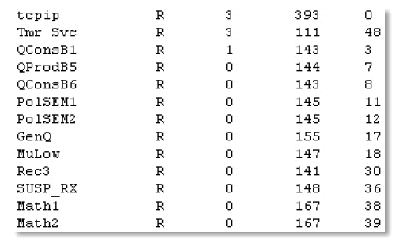
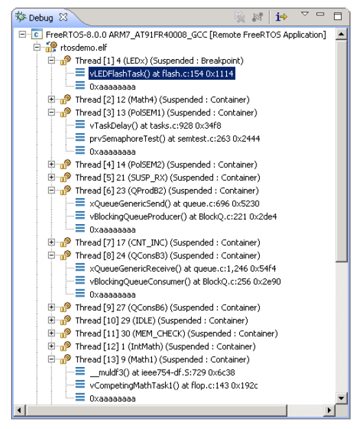

# 12 Developer Support

## 12.1 Introduction 

This chapter highlights a set of features that are included to maximize
productivity by:

- Providing insight into how an application is behaving.
- Highlighting opportunities for optimization.
- Trapping errors at the point at which they occur.


## 12.2 configASSERT()

In C, the macro `assert()` is used to verify an *assertion* (an
assumption) made by the program. The assertion is written as a C
expression, and if the expression evaluates to false (0), then the
assertion has deemed to have failed. For example, Listing 12.1 tests the
assertion that the pointer `pxMyPointer` is not NULL.


<a name="list12.1" title="Listing 12.1 Using the standard C assert() macro to check pxMyPointer is not NULL"></a>

```c
/* Test the assertion that pxMyPointer is not NULL */
assert( pxMyPointer != NULL );
```
***Listing 12.1*** *Using the standard C assert() macro to check pxMyPointer is not NULL*

The application writer specifies the action to take if an assertion
fails by providing an implementation of the `assert()` macro.

The FreeRTOS source code does not call `assert()`, because `assert()` is not
available with all the compilers with which FreeRTOS is compiled.
Instead, the FreeRTOS source code contains lots of calls to a macro
called `configASSERT()`, which can be defined by the application writer in
`FreeRTOSConfig.h`, and behaves exactly like the standard C `assert()`.

A failed assertion must be treated as a fatal error. Do not attempt to
execute past a line that has failed an assertion.

> *Using `configASSERT()` improves productivity by immediately trapping and
> identifying many of the most common sources of error. It is strongly
> advised to have `configASSERT()` defined while developing or debugging a
> FreeRTOS application.*

Defining `configASSERT()` will greatly assist in run-time debugging, but
will also increase the application code size, and therefore slow down
its execution. If a definition of `configASSERT()` is not provided, then
the default empty definition will be used, and all the calls to
`configASSERT()` will be completely removed by the C pre-processor.


### 12.2.1 Example configASSERT() definitions

The definition of `configASSERT()` shown in Listing 12.2 is useful when an
application is being executed under the control of a debugger. It will
halt execution on any line that fails an assertion, so the line that
failed the assertion will be the line displayed by the debugger when the
debug session is paused.


<a name="list12.2" title="Listing 12.2 A simple configASSERT() definition useful when executing under the control of a debugger"></a>

```c
/* Disable interrupts so the tick interrupt stops executing, then sit
   in a loop so execution does not move past the line that failed the
   assertion. If the hardware supports a debug break instruction, then the
   debug break instruction can be used in place of the for() loop. */

#define configASSERT( x ) if( ( x ) == 0 ) { taskDISABLE_INTERRUPTS(); for(;;); }
```
***Listing 12.2*** *A simple configASSERT() definition useful when executing under the control of a debugger*

The definition of `configASSERT()` shown in Listing 12.3 is useful when an
application is not being executed under the control of a debugger. It
prints out, or otherwise records, the source code line that failed an
assertion. The line that failed the assertion is identified using the
standard C `__FILE__` macro to obtain the name of the source file, and
the standard C `__LINE__` macro to obtain the line number within the
source file.


<a name="list12.3" title="Listing 12.3 A configASSERT() definition that records the source code line that failed an assertion"></a>

```c
/* This function must be defined in a C source file, not the FreeRTOSConfig.h 
   header file. */
void vAssertCalled( const char *pcFile, uint32_t ulLine )
{
    /* Inside this function, pcFile holds the name of the source file that 
       contains the line that detected the error, and ulLine holds the line 
       number in the source file. The pcFile and ulLine values can be printed 
       out, or otherwise recorded, before the following infinite loop is 
       entered. */
    RecordErrorInformationHere( pcFile, ulLine );

    /* Disable interrupts so the tick interrupt stops executing, then sit in a 
       loop so execution does not move past the line that failed the assertion. */
    taskDISABLE_INTERRUPTS();
    for( ;; );
}
/*-----------------------------------------------------------*/

/* These following two lines must be placed in FreeRTOSConfig.h. */
extern void vAssertCalled( const char *pcFile, unsigned long ulLine );
#define configASSERT( x ) if( ( x ) == 0 ) vAssertCalled( __FILE__, __LINE__ )
```
***Listing 12.3*** *A configASSERT() definition that records the source code line that failed an assertion*


## 12.3 Tracealyzer for FreeRTOS

Tracealyzer for FreeRTOS is a run-time diagnostic and optimization tool provided
by our partner company, Percepio.

Tracealyzer for FreeRTOS captures valuable dynamic behavior information, then
presents the captured information in interconnected graphical views. The
tool is also capable of displaying multiple synchronized views.

The captured information is invaluable when analyzing, troubleshooting,
or simply optimizing a FreeRTOS application.

Tracealyzer for FreeRTOS can be used side-by-side with a traditional debugger, and
complements the debugger's view with a higher level, time-based
perspective.


<a name="fig12.1" title="Figure 12.1 FreeRTOS+Trace includes more than 20 interconnected views"></a>
<a name="fig12.2" title="Figure 12.2 FreeRTOS+Trace main trace view - one of more than 20 interconnected trace views"></a>
<a name="fig12.3" title="Figure 12.3 FreeRTOS+Trace CPU load view - one of more than 20 interconnected trace views"></a>
<a name="fig12.4" title="Figure 12.4 FreeRTOS+Trace response time view - one of more than 20 interconnected trace views"></a>
<a name="fig12.5" title="Figure 12.5 FreeRTOS+Trace user event plot view - one of more than 20 interconnected trace views"></a>
<a name="fig12.6" title="Figure 12.6 FreeRTOS+Trace kernel object history view - one of more than 20 interconnected trace views"></a>

* * *
   
***Figure 12.1*** *FreeRTOS+Trace includes more than 20 interconnected views*

   
***Figure 12.2*** *FreeRTOS+Trace main trace view - one of more than 20 interconnected trace views*

   
***Figure 12.3*** *FreeRTOS+Trace CPU load view - one of more than 20 interconnected trace views*

   
***Figure 12.4*** *FreeRTOS+Trace response time view - one of more than 20 interconnected trace views*

   
***Figure 12.5*** *FreeRTOS+Trace user event plot view - one of more than 20 interconnected trace views*

   
***Figure 12.6*** *FreeRTOS+Trace kernel object history view - one of more than 20 interconnected trace views*
* * *


## 12.4 Debug Related Hook (Callback) Functions

### 12.4.1 Malloc failed hook

The malloc failed hook (or callback) was described in Chapter 3, Heap
Memory Management.

Defining a malloc failed hook ensures the application developer is
notified immediately if an attempt to create a task, queue, semaphore or
event group fails.

### 12.4.2 Stack overflow hook

Details of the stack overflow hook are provided in section 13.3, Stack
Overflow.

Defining a stack overflow hook ensures the application developer is
notified if the amount of stack used by a task exceeds the stack space
allocated to the task.


## 12.5 Viewing Run-time and Task State Information

### 12.5.1 Task Run-Time Statistics

Task run-time statistics provide information on the amount of processing
time each task has received. A task's *run time* is the total time the
task has been in the Running state since the application booted.

Run-time statistics are intended to be used as a profiling and debugging
aid during the development phase of a project. The information they
provide is only valid until the counter used as the run-time statistics
clock overflows. Collecting run-time statistics will increase the task
context switch time.

To obtain binary run-time statistics information, call the
`uxTaskGetSystemState()` API function. To obtain run-time statistics
information as a human readable ASCII table, call the
`vTaskGetRunTimeStatistics()` helper function.


### 12.5.2 The Run-Time Statistics Clock

Run-time statistics need to measure fractions of a tick period.
Therefore, the RTOS tick count is not used as the run-time statistics
clock, and the clock is instead provided by the application code. It is
recommended to make the frequency of the run-time statistics clock
between 10 and 100 times faster than the frequency of the tick
interrupt. The faster the run-time statistics clock, the more accurate
the statistics will be, but also the sooner the time value will
overflow.

Ideally, the time value will be generated by a free-running 32-bit
peripheral timer/counter, the value of which can be read with no other
processing overhead. If the available peripherals and clock speeds do
not make that technique possible, then alternative, but less efficient,
techniques include:

- Configure a peripheral to generate a periodic interrupt at the
  desired run-time statistics clock frequency, and then use a count
  of the number of interrupts generated as the run-time statistics clock.

  This method is very inefficient if the periodic interrupt is only
  used for the purpose of providing a run-time statistics clock.
  However, if the application already uses a periodic interrupt with a
  suitable frequency, then it is simple and efficient to add a count
  of the number of interrupts generated into the existing interrupt
  service routine.

- Generate a 32-bit value by using the current value of a free running
  16-bit peripheral timer as the 32-bit value's least significant
  16-bits, and the number of times the timer has overflowed as the
  32-bit value's most significant 16-bits.

It is possible, with appropriate and somewhat complex manipulation, to
generate a run-time statistics clock by combining the RTOS tick count
with the current value of an ARM Cortex-M SysTick timer. Some of the
demo projects in the FreeRTOS download demonstrate how this is achieved.


### 12.5.3 Configuring an Application to Collect Run-Time Statistics

Below are details on the macros necessary to collect task run-time
statistics. Originally, the macros were intended to be included in
the RTOS port layer, which is why the macros are prefixed 'port', but it
has proven more practical to define them in `FreeRTOSConfig.h`.

**Macros used in the collection of run-time statistics**

- `configGENERATE_RUN_TIME_STATS`

  This macro must be set to 1 in FreeRTOSConfig.h. When this macro is
  set to 1 the scheduler will call the other macros detailed in this section
  at the appropriate times.

- `portCONFIGURE_TIMER_FOR_RUN_TIME_STATS()`

  This macro must be provided to initialize whichever peripheral is
  used to provide the run-time statistics clock.

- `portGET_RUN_TIME_COUNTER_VALUE()`, or `portALT_GET_RUN_TIME_COUNTER_VALUE(Time)`

  One of these two macros must be provided to return the current
  run-time statistics clock value. This is the total time the application
  has been running, in run-time statistics clock units, since the
  application first booted.

  If the first macro is used, it must be defined to evaluate to the
  current clock value. If the second macro is used, it must be defined to
  set its 'Time' parameter to the current clock value.


### 12.5.4 The uxTaskGetSystemState() API Function

`uxTaskGetSystemState()` provides a snapshot of status information for
each task under the control of the FreeRTOS scheduler. The information
is provided as an array of `TaskStatus_t` structures, with one index in
the array for each task. `TaskStatus_t` is described by Listing 12.5 and
below.


<a name="list12.4" title="Listing 12.4 The uxTaskGetSystemState() API function prototype"></a>

```c
UBaseType_t uxTaskGetSystemState( TaskStatus_t * const pxTaskStatusArray,
                                  const UBaseType_t uxArraySize,
                                  configRUN_TIME_COUNTER_TYPE * const pulTotalRunTime );
```
***Listing 12.4*** *The uxTaskGetSystemState() API function prototype*

> Note: `configRUN_TIME_COUNTER_TYPE` defaults to `uint32_t` for backward compatibility, but can be 
> overridden in FreeRTOSConfig.h if `uint32_t` is too restrictive.


**uxTaskGetSystemState() parameters and return value**

- `pxTaskStatusArray`

  A pointer to an array of `TaskStatus_t` structures.

  The array must contain at least one `TaskStatus_t` structure for each
  task. The number of tasks can be determined using the
  `uxTaskGetNumberOfTasks()` API function.

  The `TaskStatus_t` structure is shown in Listing 12.5, and the
  TaskStatus\_t structure members are described in the next list.

- `uxArraySize`

  The size of the array pointed to by the `pxTaskStatusArray` parameter.
  The size is specified as the number of indexes in the array (the number
  of `TaskStatus_t` structures contained in the array), not by the number of
  bytes in the array.

- `pulTotalRunTime`

  If `configGENERATE_RUN_TIME_STATS` is set to 1 in `FreeRTOSConfig.h`,
  then `*pulTotalRunTime` is set by `uxTaskGetSystemState()` to the total run
  time (as defined by the run-time statistics clock provided by the
  application) since the target booted.

  `pulTotalRunTime` is optional, and can be set to NULL if the total run
  time is not required.

- Return value

  The number of `TaskStatus_t` structures that were populated by
  `uxTaskGetSystemState()` is returned.

  The returned value should equal the number returned by the
  `uxTaskGetNumberOfTasks()` API function, but will be zero if the value
  passed in the `uxArraySize` parameter was too small.


<a name="list12.5" title="Listing 12.5 The TaskStatus\_t structure"></a>

```c
typedef struct xTASK_STATUS
{
    TaskHandle_t xHandle;
    const char *pcTaskName;
    UBaseType_t xTaskNumber;
    eTaskState eCurrentState;
    UBaseType_t uxCurrentPriority;
    UBaseType_t uxBasePriority;
    configRUN_TIME_COUNTER_TYPE ulRunTimeCounter;
    StackType_t * pxStackBase;
    #if ( ( portSTACK_GROWTH > 0 ) || ( configRECORD_STACK_HIGH_ADDRESS == 1 ) )
        StackType_t * pxTopOfStack;
        StackType_t * pxEndOfStack;
    #endif
    uint16_t usStackHighWaterMark;
    #if ( ( configUSE_CORE_AFFINITY == 1 ) && ( configNUMBER_OF_CORES > 1 ) )
        UBaseType_t uxCoreAffinityMask;
    #endif
} TaskStatus_t;
```
***Listing 12.5*** *The TaskStatus\_t structure*

**TaskStatus_t structure members**

- `xHandle`

  The handle of the task to which the information in the structure relates.

- `pcTaskName`

  The human readable text name of the task.

- `xTaskNumber`

  Each task has a unique `xTaskNumber` value.

  If an application creates and deletes tasks at run time then it is
  possible that a task will have the same handle as a task that was
  previously deleted. `xTaskNumber` is provided to allow application code,
  and kernel aware debuggers, to distinguish between a task that is still
  valid, and a deleted task that had the same handle as the valid
  task.

- `eCurrentState`

  An enumerated type that holds the state of the task.
  `eCurrentState` can be one of the following values: 
  
  - `eRunning`
  - `eReady`
  - `eBlocked`
  - `eSuspended`
  - `eDeleted`

  A task will only be reported as being in the `eDeleted` state for the
  short period between the time the task was deleted by a call to
  `vTaskDelete()`, and the time the Idle task frees the memory that was
  allocated to the deleted task's internal data structures and stack.
  After that time, the task will no longer exist in any way, and it is
  invalid to attempt to use its handle.

- `uxCurrentPriority`

  The priority at which the task was running at the time
  `uxTaskGetSystemState()` was called. `uxCurrentPriority` will only be higher
  than the priority assigned to the task by the application writer if the
  task has temporarily been assigned a higher priority in accordance with
  the priority inheritance mechanism described in section
  [8.3 Mutexes (and Binary Semaphores)](ch08.md#83-mutexes-and-binary-semaphores).

- `uxBasePriority`

  The priority assigned to the task by the application writer.
  `uxBasePriority` is only valid if `configUSE_MUTEXES` is set to 1 in
  FreeRTOSConfig.h.

- `ulRunTimeCounter`

  The total run time used by the task since the task was created. The
  total run time is provided as an absolute time that uses the clock
  provided by the application writer for the collection of run-time
  statistics. `ulRunTimeCounter` is only valid if
  `configGENERATE_RUN_TIME_STATS` is set to 1 in FreeRTOSConfig.h.
  
- `pxStackBase`

   Points to the base address of the stack region allotted to this task.

- `pxTopOfStack`

   Points to the current top address of the stack region allotted to this task.
   The field `pxTopOfStack` is only valid if either the stack grows upwards (i.e.
   `portSTACK_GROWTH` is greater than zero) or `configRECORD_STACK_HIGH_ADDRESS`
   is set to 1 in FreeRTOSConfig.h.

- `pxEndOfStack`

   Points to the end address of the of the stack region allotted to this task.
   The field `pxEndOfStack` is only valid if either the stack grows upwards (i.e.
   `portSTACK_GROWTH` is greater than zero) or `configRECORD_STACK_HIGH_ADDRESS`
   is set to 1 in FreeRTOSConfig.h.

- `usStackHighWaterMark`

  The task's stack high water mark. This is the minimum amount of
  stack space that has remained for the task since the task was created.
  It is an indication of how close the task has come to overflowing its
  stack; the closer this value is to zero, the closer the task has come to
  overflowing its stack. `usStackHighWaterMark` is specified in bytes.
  
- `uxCoreAffinityMask`

   A bitwise value that indicates the cores on which the task can run. 
   Cores are numbered from 0 to `configNUMBER_OF_CORES` - 1. For example, a
   task that can run on core 0 and core 1 will have its `uxCoreAffinityMask`
   set to 0x03. The field `uxCoreAffinityMask` is only available if both
   `configUSE_CORE_AFFINITY` is set to 1 and `configNUMBER_OF_CORES`
   is set to greater than 1 in FreeRTOSConfig.h.


### 12.5.5 The vTaskListTasks() Helper Function

`vTaskListTasks()` provides similar task status information to that provided by
`uxTaskGetSystemState()`, but it presents the information as a human
readable ASCII table, rather than an array of binary values.

`vTaskListTasks()` is a very processor intensive function, and leaves the
scheduler suspended for an extended period. Therefore, it is recommended
to use the function for debug purposes only, and not in a production
real-time system.

`vTaskListTasks()` is available if `configUSE_TRACE_FACILITY` is set to 1 and
`configUSE_STATS_FORMATTING_FUNCTIONS` is set to greater than 0 in
FreeRTOSConfig.h.


<a name="list12.6" title="Listing 12.6 The vTaskListTasks() API function prototype"></a>

```c
void vTaskListTasks( char * pcWriteBuffer, size_t uxBufferLength );
```
***Listing 12.6*** *The vTaskListTasks() API function prototype*

**vTaskListTasks() parameters**

- `pcWriteBuffer`

  A pointer to a character buffer into which the formatted and human readable table is written. 
  This buffer is assumed to be large enough to contain the generated report.  
  Approximately 40 bytes per task should be sufficient.

- `uxBufferLength`

  Length of the `pcWriteBuffer`.

An example of the output generated by `vTaskListTasks()` is shown in Figure 12.7.
In the output:

- Each row provides information on a single task.

- The first column is the task's name.

- The second column is the task's state, where 'X' means Running, 'R' means Ready, 'B'
  means Blocked, 'S' means Suspended, and 'D' means the task has been
  deleted. A task will only be reported as being in the deleted state
  for the short period between the time the task was deleted by a call
  to `vTaskDelete()`, and the time the Idle task frees the memory that
  was allocated to the deleted task's internal data structures and
  stack. After that time, the task will no longer exist in any way,
  and it is invalid to attempt to use its handle.

- The third column is the task's priority.

- The fourth column is the task's stack high water mark. See the
  description of `usStackHighWaterMark`.

- The fifth column is the unique number allocated to the task. See the
  description of `xTaskNumber`.


<a name="fig12.7" title="Figure 12.7 Example output generated by vTaskListTasks()"></a>

* * *
   
***Figure 12.7*** *Example output generated by vTaskListTasks()*
* * *

> Note:   
> The older version of `vTaskListTasks` is `vTaskList`. `vTaskList` assumes that the 
> `pcWriteBuffer` is of length `configSTATS_BUFFER_MAX_LENGTH`. This function is there only for 
> backward compatibility. New applications are recommended to use `vTaskListTasks` and 
> supply the length of the `pcWriteBuffer` explicitly.


<a name="list12.7" title="Listing 12.7 The vTaskList() API function prototype"></a>

```c
void vTaskList( signed char *pcWriteBuffer );
```
***Listing 12.7*** *The vTaskList() API function prototype*

  **vTaskList() parameters**

  - `pcWriteBuffer`
    
    A pointer to a character buffer into which the formatted and human readable table is written. 
    The buffer must be large enough to hold the entire table, as no boundary checking is performed.


### 12.5.6 The vTaskGetRunTimeStatistics() Helper Function

`vTaskGetRunTimeStatistics()` formats collected run-time statistics into a
human readable ASCII table.

`vTaskGetRunTimeStatistics()` is a very processor intensive function and leaves
the scheduler suspended for an extended period. Therefore, it is
recommended to use the function for debug purposes only, and not in a
production real-time system.

`vTaskGetRunTimeStatistics()` is available when `configGENERATE_RUN_TIME_STATS` is set to
1, `configUSE_STATS_FORMATTING_FUNCTIONS` is set greater than 0, and 
`configUSE_TRACE_FACILITY` is set to 1 in FreeRTOSConfig.h.


<a name="list12.8" title="Listing 12.8 The vTaskGetRunTimeStatistics() API function prototype"></a>

```c
void vTaskGetRunTimeStatistics( char * pcWriteBuffer, size_t uxBufferLength );
```
***Listing 12.8*** *The vTaskGetRunTimeStatistics() API function prototype*

**vTaskGetRunTimeStatistics() parameters**

- `pcWriteBuffer`

  A pointer to a character buffer into which the formatted and human readable table is written.
  This buffer is assumed to be large enough to contain the generated report.  
  Approximately 40 bytes per task should be sufficient.

- `uxBufferLength` 

  Length of the `pcWriteBuffer`.

An example of the output generated by `vTaskGetRunTimeStatistics()` is shown in
Figure 12.8. In the output:

- Each row provides information on a single task.

- The first column is the task name.

- The second column is the amount of time the task has spent in the
  Running state as an absolute value. See the description of
  `ulRunTimeCounter`.

- The third column is the amount of time the task has spent in the
  Running state as a percentage of the total time since the target was
  booted. The total of the displayed percentage times will normally be
  less than the expected 100% because statistics are collected and
  calculated using integer calculations that round down to the nearest
  integer value.


<a name="fig12.8" title="Figure 12.8 Example output generated by vTaskGetRunTimeStatistics()"></a>

* * *
   
***Figure 12.8*** *Example output generated by vTaskGetRunTimeStatistics()*
* * *

> Note:   
> The older version of `vTaskGetRunTimeStatistics` is `vTaskGetRunTimeStats`. 
> `vTaskGetRunTimeStats` assumes that the pcWriteBuffer is of length
> `configSTATS_BUFFER_MAX_LENGTH`. This function is there only for backward compatiblity. 
> New applications are recommended to use `vTaskGetRunTimeStatistics` and supply the length 
> of the pcWriteBuffer explicitly.


 <a name="list12.9" title="Listing 12.9 The vTaskGetRunTimeStats() API function prototype"></a>

 ```c
 void vTaskGetRunTimeStats( signed char *pcWriteBuffer );
 ```
 ***Listing 12.9*** *The vTaskGetRunTimeStats() API function prototype*
 
  **vTaskGetRunTimeStats() parameters**

  - `pcWriteBuffer`

    A pointer to a character buffer into which the formatted and human readable table is written. The 
    buffer must be large enough to hold the entire table, as no boundary checking is performed.


### 12.5.7 Generating and Displaying Run-Time Statistics, a Worked Example

This example uses a hypothetical 16-bit timer to generate a 32-bit
run-time statistics clock. The counter is configured to generate an
interrupt each time the 16-bit value reaches its maximum
value—effectively creating an overflow interrupt. The interrupt service
routine counts the number of overflow occurrences.

The 32-bit value is created by using the count of overflow occurrences
as the two most significant bytes of the 32-bit value, and the current
16-bit counter value as the two least significant bytes of the 32-bit
value. Pseudo code for the interrupt service routine is shown in Listing
12.10.


<a name="list12.10" title="Listing 12.10 16-bit timer overflow interrupt handler used to count timer overflows"></a>

```c
void TimerOverflowInterruptHandler( void )
{
    /* Just count the number of interrupts. */
    ulOverflowCount++;

    /* Clear the interrupt. */
    ClearTimerInterrupt();
}
```
***Listing 12.10*** *16-bit timer overflow interrupt handler used to count timer overflows*

Listing 12.11 shows the lines added to FreeRTOSConfig.h to enable the
collection of run-time statistics.


<a name="list12.11" title="Listing 12.11 Macros added to FreeRTOSConfig.h to enable the collection of run-time statistics"></a>

```c
/* Set configGENERATE_RUN_TIME_STATS to 1 to enable collection of run-time 
   statistics. When this is done, both portCONFIGURE_TIMER_FOR_RUN_TIME_STATS()
   and portGET_RUN_TIME_COUNTER_VALUE() or 
   portALT_GET_RUN_TIME_COUNTER_VALUE(x) must also be defined. */
#define configGENERATE_RUN_TIME_STATS 1

/* portCONFIGURE_TIMER_FOR_RUN_TIME_STATS() is defined to call the function 
   that sets up the hypothetical 16-bit timer (the function's implementation 
   is not shown). */
void vSetupTimerForRunTimeStats( void );
#define portCONFIGURE_TIMER_FOR_RUN_TIME_STATS()  vSetupTimerForRunTimeStats()

/* portALT_GET_RUN_TIME_COUNTER_VALUE() is defined to set its parameter to the
   current run-time counter/time value. The returned time value is 32-bits 
   long, and is formed by shifting the count of 16-bit timer overflows into 
   the top two bytes of a 32-bit number, then bitwise ORing the result with 
   the current 16-bit counter value. */
#define portALT_GET_RUN_TIME_COUNTER_VALUE( ulCountValue )                  \
{                                                                           \
    extern volatile unsigned long ulOverflowCount;                          \
                                                                            \
    /* Disconnect the clock from the counter so it does not change          \
       while its value is being used. */                                    \
    PauseTimer();                                                           \
                                                                            \
    /* The number of overflows is shifted into the most significant         \
       two bytes of the returned 32-bit value. */                           \
    ulCountValue = ( ulOverflowCount << 16UL );                             \
                                                                            \
    /* The current counter value is used as the two least significant       \
       bytes of the returned 32-bit value. */                               \
    ulCountValue |= ( unsigned long ) ReadTimerCount();                     \
                                                                            \
    /* Reconnect the clock to the counter. */                               \
    ResumeTimer();                                                          \
}
```
***Listing 12.11*** *Macros added to FreeRTOSConfig.h to enable the collection of run-time statistics*

The task shown in Listing 12.12 prints out the collected run-time statistics every 5 seconds.


<a name="list12.12" title="Listing 12.12 The task that prints out the collected run-time statistics"></a>

```c
#define RUN_TIME_STATS_STRING_BUFFER_LENGTH       512

/* For clarity, calls to fflush() have been omitted from this code listing. */
static void prvStatsTask( void *pvParameters )
{
    TickType_t xLastExecutionTime;

    /* The buffer used to hold the formatted run-time statistics text needs to
       be quite large. It is therefore declared static to ensure it is not
       allocated on the task stack. This makes this function non re-entrant. */
    static signed char cStringBuffer[ RUN_TIME_STATS_STRING_BUFFER_LENGTH ];

    /* The task will run every 5 seconds. */
    const TickType_t xBlockPeriod = pdMS_TO_TICKS( 5000 );

    /* Initialize xLastExecutionTime to the current time. This is the only
       time this variable needs to be written to explicitly. Afterwards it is 
       updated internally within the vTaskDelayUntil() API function. */
    xLastExecutionTime = xTaskGetTickCount();

    /* As per most tasks, this task is implemented in an infinite loop. */
    for( ;; )
    {
        /* Wait until it is time to run this task again. */
        xTaskDelayUntil( &xLastExecutionTime, xBlockPeriod );

        /* Generate a text table from the run-time stats. This must fit into
           the cStringBuffer array. */
        vTaskGetRunTimeStatistics( cStringBuffer, RUN_TIME_STATS_STRING_BUFFER_LENGTH );

        /* Print out column headings for the run-time stats table. */
        printf( "\nTask\t\tAbs\t\t\t%%\n" );
        printf( "-------------------------------------------------------------\n" );

        /* Print out the run-time stats themselves. The table of data contains
           multiple lines, so the vPrintMultipleLines() function is called 
           instead of calling printf() directly. vPrintMultipleLines() simply 
           calls printf() on each line individually, to ensure the line 
           buffering works as expected. */ 
        vPrintMultipleLines( cStringBuffer );
    }
}
```
***Listing 12.12*** *The task that prints out the collected run-time statistics*


## 12.6 Trace Hook Macros

Trace macros are macros that have been placed at key points within the
FreeRTOS source code. By default, the macros are empty, and so do not
generate any code, and have no run time overhead. By overriding the
default empty implementations, an application writer can:

- Insert code into FreeRTOS without modifying the FreeRTOS source
  files.

- Output detailed execution sequencing information by any means
  available on the target hardware. Trace macros appear in enough
  places in the FreeRTOS source code to allow them to be used to
  create a full and detailed scheduler activity trace and profiling
  log.


### 12.6.1 Available Trace Hook Macros

It would take too much space to detail every macro here. The list below
details the subset of macros deemed to be most useful to an application
writer.

Many of the descriptions in the list below refer to a variable called
`pxCurrentTCB`. `pxCurrentTCB` is a FreeRTOS private variable that holds the
handle of the task in the Running state, and is available to any macro
that is called from the FreeRTOS/Source/tasks.c source file.

**A selection of the most commonly used trace hook macros**

- `traceTASK_INCREMENT_TICK(xTickCount)`

  Called during the tick interrupt, before the tick count is incremented. The `xTickCount` parameter 
  passes the new tick count value into the macro.

- `traceTASK_SWITCHED_OUT()`

  Called before a new task is selected to run. At this point, `pxCurrentTCB` contains the handle of 
  the task about to leave the Running state.

- `traceTASK_SWITCHED_IN()`

  Called after a task is selected to run. At this point, `pxCurrentTCB` contains the handle of the 
  task about to enter the Running state.

- `traceBLOCKING_ON_QUEUE_RECEIVE(pxQueue)`
  
  Called immediately before the currently executing task enters the Blocked state following an attempt 
  to read from an empty queue, or an attempt to 'take' an empty semaphore or mutex. The `pxQueue` parameter 
  passes the handle of the target queue or semaphore into the macro.

- `traceBLOCKING_ON_QUEUE_SEND(pxQueue)`
  
  Called immediately before the currently executing task enters the Blocked state following an attempt 
  to write to a queue that is full. The `pxQueue` parameter passes the handle of the target queue into 
  the macro.

- `traceQUEUE_SEND(pxQueue)`
  
  Called from within `xQueueSend()`, `xQueueSendToFront()`, `xQueueSendToBack()`, or any of the semaphore 
  'give' functions, when the queue send or semaphore 'give' is successful. The `pxQueue` parameter passes 
  the handle of the target queue or semaphore into the macro.

- `traceQUEUE_SEND_FAILED(pxQueue)`

  Called from within `xQueueSend()`, `xQueueSendToFront()`, `xQueueSendToBack()`, or any of the semaphore 
  'give' functions, when the queue send or semaphore 'give' operation fails. A queue send or semaphore 
  'give' will fail if the queue is full and remains full for the duration of any block time specified. 
  The `pxQueue` parameter passes the handle of the target queue or semaphore into the macro.

- `traceQUEUE_RECEIVE(pxQueue)`

  Called from within `xQueueReceive()` or any of the semaphore 'take' functions when the queue receive or 
  semaphore 'take' is successful. The `pxQueue` parameter passes the handle of the target queue or semaphore 
  into the macro.

- `traceQUEUE_RECEIVE_FAILED(pxQueue)`

  Called from within `xQueueReceive()` or any of the semaphore 'take' functions when the queue or semaphore 
  receive operation fails. A queue receive or semaphore 'take' operation will fail if the queue or semaphore 
  is empty and remains empty for the duration of any block time specified. The `pxQueue` parameter passes the 
  handle of the target queue or semaphore into the macro.

- `traceQUEUE_SEND_FROM_ISR(pxQueue)`

  Called from within `xQueueSendFromISR()` when the send operation is successful. The `pxQueue` parameter 
  passes the handle of the target queue into the macro.

- `traceQUEUE_SEND_FROM_ISR_FAILED(pxQueue)`

  Called from within `xQueueSendFromISR()` when the send operation fails. A send operation will fail 
  if the queue is already full. The `pxQueue` parameter passes the handle of the target queue into the 
  macro.

- `traceQUEUE_RECEIVE_FROM_ISR(pxQueue)`

  Called from within `xQueueReceiveFromISR()` when the receive operation is successful. The `pxQueue` 
  parameter passes the handle of the target queue into the macro.

- `traceQUEUE_RECEIVE_FROM_ISR_FAILED(pxQueue)`

  Called from within `xQueueReceiveFromISR()` when the receive operation fails due to the queue already 
  being empty. The `pxQueue` parameter passes the handle of the target queue into the macro.

- `traceTASK_DELAY_UNTIL( xTimeToWake )`

  Called from within `xTaskDelayUntil()` immediately before the calling task enters the Blocked state.

- `traceTASK_DELAY()`

  Called from within `vTaskDelay()` immediately before the calling task enters the Blocked state.


### 12.6.2 Defining Trace Hook Macros

Each trace macro has a default empty definition. The default definition
can be overridden by providing a new macro definition in
FreeRTOSConfig.h. If trace macro definitions become long or complex,
then they can be implemented in a new header file that is then itself
included from FreeRTOSConfig.h.

In accordance with software engineering best practice, FreeRTOS
maintains a strict data hiding policy. Trace macros allow user code to
be added to the FreeRTOS source files, so the data types visible to the
trace macros will be different to those visible to application code:

- Inside the FreeRTOS/Source/tasks.c source file, a task handle is a
  pointer to the data structure that describes a task (the task's
  *Task Control Block*, or *TCB*). Outside of the
  FreeRTOS/Source/tasks.c source file a task handle is a pointer to
  void.

- Inside the FreeRTOS/Source/queue.c source file, a queue handle is a
  pointer to the data structure that describes a queue. Outside of the
  FreeRTOS/Source/queue.c source file a queue handle is a pointer to
  void.

> *Extreme caution is required if a normally private FreeRTOS data
> structure is accessed directly by a trace macro, as private data
> structures might change between FreeRTOS versions.*


### 12.6.3 FreeRTOS Aware Debugger Plug-ins

Plug-ins that provide some FreeRTOS awareness are available for the
following IDEs. This list may not be an exhaustive:



- Eclipse (StateViewer)

- Eclipse (ThreadSpy)

- IAR

- ARM DS-5

- Atollic TrueStudio

- Microchip MPLAB

- iSYSTEM WinIDEA

- STM32CubeIDE
