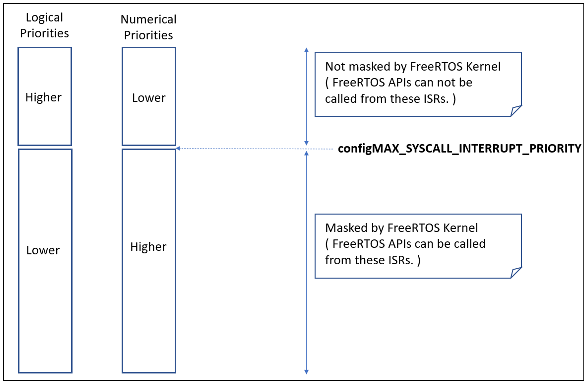

# 13 Troubleshooting

## 13.1 Chapter Introduction and Scope

This chapter highlights the most common issues encountered by users who
are new to FreeRTOS. First, it focuses on three issues that have proven
to be the most frequent source of support requests over the years:
incorrect interrupt priority assignment, stack overflow, and
inappropriate use of printf(). It then briefly, and in an FAQ style,
touches on other common errors, their possible causes, and their
solutions.

> *Using `configASSERT()` improves productivity by immediately trapping and
> identifying many of the most common sources of error. It is strongly
> advised to have `configASSERT()` defined while developing or debugging a
> FreeRTOS application. `configASSERT()` is described in section 12.2.*


## 13.2 Interrupt Priorities

> *Note: This is the number one cause of support requests, and in most
> ports defining `configASSERT()` will trap the error immediately!*

If the FreeRTOS port in use supports interrupt nesting, and the service
routine for an interrupt makes use of the FreeRTOS API, then it is
*essential* the interrupt's priority is set at or below
`configMAX_SYSCALL_INTERRUPT_PRIORITY`, as described in section 7.8,
Interrupt Nesting. Failure to do this will result in ineffective
critical sections, which in turn will result in intermittent failures.

Take particular care if running FreeRTOS on a processor where:

- Interrupt priorities default to having the highest possible
  priority, which is the case on some ARM Cortex processors, and
  possibly others. On such processors, the priority of an interrupt
  that uses the FreeRTOS API cannot be left uninitialized.

- Numerically high priority numbers represent logically low interrupt
  priorities, which may seem counterintuitive, and therefore cause
  confusion. Again this is the case on ARM Cortex processors, and
  possibly others.

- For example, on such a processor an interrupt that is executing at
  priority 5 can itself be interrupted by an interrupt that has a
  priority of 4. Therefore, if `configMAX_SYSCALL_INTERRUPT_PRIORITY` is
  set to 5, any interrupt that uses the FreeRTOS API can only be
  assigned a priority numerically higher than or equal to 5. In that
  case, interrupt priorities of 5 or 6 would be valid, but an
  interrupt priority of 3 is definitely invalid.

  

- Different library implementations expect the priority of an
  interrupt to be specified in a different way. Again, this is particularly
  relevant to libraries that target ARM Cortex processors, where
  interrupt priorities are bit shifted before being written to the
  hardware registers. Some libraries will perform the bit shift
  themselves, whereas others expect the bit shift to be performed
  before the priority is passed into the library function.

- Different implementations of the same architecture implement a
  different number of interrupt priority bits. For example, a Cortex-M
  processor from one manufacturer may implement 3 priority bits, while
  a Cortex-M processor from another manufacturer may implement 4
  priority bits.

- The bits that define the priority of an interrupt can be split
  between bits that define a pre-emption priority, and bits that
  define a sub-priority. Ensure all the bits are assigned to
  specifying a pre-emption priority, so that sub-priorities are not used.

In some FreeRTOS ports, `configMAX_SYSCALL_INTERRUPT_PRIORITY` has the
alternative name `configMAX_API_CALL_INTERRUPT_PRIORITY`.


## 13.3 Stack Overflow

Stack overflow is the second most common source of support requests.
FreeRTOS provides several features to assist trapping and debugging
stack related issues[^28].

[^28]: These features are not available in the FreeRTOS Windows port.


### 13.3.1 The uxTaskGetStackHighWaterMark() API Function

Each task maintains its own stack, the total size of which is specified
when the task is created. `uxTaskGetStackHighWaterMark()` is used to query
how close a task has come to overflowing the stack space allocated to
it. This value is called the stack 'high water mark'.


<a name="list13.1" title="Listing 13.1 The uxTaskGetStackHighWaterMark() API function prototype"></a>

```c
UBaseType_t uxTaskGetStackHighWaterMark( TaskHandle_t xTask );
```
***Listing 13.1*** *The uxTaskGetStackHighWaterMark() API function prototype*

**uxTaskGetStackHighWaterMark() parameters and return value**

- `xTask`

  The handle of the task whose stack high water mark is being
  queried (the subject task)—see the pxCreatedTask parameter of the
  `xTaskCreate()` API function for information on obtaining handles to
  tasks.

  A task can query its own stack high water mark by passing NULL in
  place of a valid task handle.

- Return value

  The amount of stack used by the task grows and shrinks as the task
  executes and interrupts are processed. `uxTaskGetStackHighWaterMark()`
  returns the minimum amount of remaining stack space that has been
  available since the task started executing. This is the amount of stack
  that remains unused when stack usage is at its greatest (or deepest)
  value. The closer the high water mark is to zero, the closer the task
  has come to overflowing its stack.

`uxTaskGetStackHighWaterMark2()` API can be used instead of
`uxTaskGetStackHighWaterMark()` which only differs in the return type.


<a name="list13.2" title="Listing 13.2 The uxTaskGetStackHighWaterMark2() API function prototype"></a>

```c
configSTACK_DEPTH_TYPE uxTaskGetStackHighWaterMark2( TaskHandle_t xTask );
```
***Listing 13.2*** *The uxTaskGetStackHighWaterMark2() API function prototype*

Using `configSTACK_DEPTH_TYPE` allows the application writer to control the type
used for stack depth.

### 13.3.2 Run Time Stack Checking—Overview

FreeRTOS includes three optional run time stack checking mechanisms. These
are controlled by the `configCHECK_FOR_STACK_OVERFLOW` compile time
configuration constant within FreeRTOSConfig.h. Both methods increase
the time it takes to perform a context switch.

The stack overflow hook (or stack overflow callback) is a function that
is called by the kernel when it detects a stack overflow. To use a stack
overflow hook function:

1. Set `configCHECK_FOR_STACK_OVERFLOW` to either 1 , 2 or 3 in
   FreeRTOSConfig.h, as described in the following sub-sections.

1. Provide the implementation of the hook function, using the exact
   function name and prototype shown in Listing 13.3.


<a name="list13.3" title="Listing 13.3 The stack overflow hook function prototype"></a>

```c
void vApplicationStackOverflowHook( TaskHandle_t *pxTask, signed char *pcTaskName );
```
***Listing 13.3*** *The stack overflow hook function prototype*

The stack overflow hook is provided to make trapping and debugging stack
errors easier, but there is no real way to recover from a stack overflow
when it occurs. The function's parameters pass the handle and name of
the task that has overflowed its stack into the hook function.

The stack overflow hook gets called from the context of an interrupt.

Some microcontrollers generate a fault exception when they detect an
incorrect memory access, and it is possible for a fault to be triggered
before the kernel has a chance to call the stack overflow hook function.


### 13.3.3 Run Time Stack Checking—Method 1

Method 1 is selected when `configCHECK_FOR_STACK_OVERFLOW` is set to 1.

A task's entire execution context is saved onto its stack each time it
gets swapped out. It is likely that this will be the time at which stack
usage reaches its peak. When `configCHECK_FOR_STACK_OVERFLOW` is set to 1,
the kernel checks that the stack pointer remains within the valid stack
space after the context has been saved. The stack overflow hook is
called if the stack pointer is found to be outside its valid range.

Method 1 is quick to execute, but can miss stack overflows that occur
between context switches.


### 13.3.4 Run Time Stack Checking—Method 2

Method 2 performs additional checks to those already described for
method 1. It is selected when `configCHECK_FOR_STACK_OVERFLOW` is set to 2.

When a task is created, its stack is filled with a known pattern. Method
2 tests the last valid 20 bytes of the task stack space to verify that
this pattern has not been overwritten. The stack overflow hook function
is called if any of the 20 bytes have changed from their expected
values.

Method 2 is not as quick to execute as method 1, but is still relatively
fast, as only 20 bytes are tested. Most likely, it will catch all stack
overflows; however, it is possible (but highly improbable) that some
overflows will be missed.

### 13.3.4 Run Time Stack Checking—Method 3

Method 3 is selected when `configCHECK_FOR_STACK_OVERFLOW` is set to 3.

This method is available only for selected ports. When available, this method
enables ISR stack checking. When an ISR stack overflow is detected, an
assert is triggered. Note that the stack overflow hook function is not called in
this case because it is specific to a task stack and not the ISR stack.

## 13.4 Use of printf() and sprintf()

Logging via `printf()` is a common source of error, and,
unaware of this, it is common for application developers to then add
further calls to `printf()` to aid debugging, and in-so-doing, exacerbate
the problem.

Many cross compiler vendors will provide a `printf()` implementation that
is suitable for use in small embedded systems. Even when that is the
case, the implementation may not be thread safe, probably won't be
suitable for use inside an interrupt service routine, and depending on
where the output is directed, take a relatively long time to execute.

Particular care must be taken if a `printf()` implementation that is
specifically designed for small embedded systems is not available, and a
generic `printf()` implementation is used instead, as:

- Just including a call to `printf()` or `sprintf()` can massively
  increase the size of the application's executable.

- `printf()` and `sprintf()` may call `malloc()`, which might be invalid if
  a memory allocation scheme other than heap\_3 is in use. See section
  3.2, Example Memory Allocation Schemes, for more information.

- `printf()` and `sprintf()` may require a stack that is many times bigger
  than would otherwise be required.


### 13.4.1 Printf-stdarg.c

Many of the FreeRTOS demonstration projects use a file called
printf-stdarg.c, which provides a minimal and stack-efficient
implementation of `sprintf()` that can be used in place of the standard
library version. In most cases, this will permit a much smaller stack to
be allocated to each task that calls `sprintf()` and related functions.

printf-stdarg.c also provides a mechanism for directing the `printf()`
output to a port character by character which, while slow, allows stack
usage to be decreased even further.

Note that not all copies of `printf-stdarg.c` included in the FreeRTOS
download implement `snprintf()`. Copies that do not implement `snprintf()`
simply ignore the buffer size parameter, as they map directly to
`sprintf()`.

printf-stdarg.c is open source, but is owned by a third party, and
therefore licensed separately from FreeRTOS. The license terms are
contained at the top of the source file.


## 13.5 Other Common Sources of Error

### 13.5.1 Symptom: Adding a simple task to a demo causes the demo to crash

Creating a task requires memory to be obtained from the heap. Many of
the demo application projects dimension the heap to be exactly big
enough to create the demo tasks—so, after the tasks are created, there
will be insufficient heap remaining for any further tasks, queues, event
groups, or semaphores to be added.

The idle task, and possibly also the RTOS daemon task, are created
automatically when `vTaskStartScheduler()` is called.
`vTaskStartScheduler()` will return only if there is not enough heap
memory remaining for these tasks to be created. Including a null loop `[ for(;;); ]`
after the call to `vTaskStartScheduler()` can make this error easier to debug.

To be able to add more tasks, you must either increase the heap size, or remove
some of the existing demo tasks. The increase in heap size will always be
limited by the amount of RAM available. See section 3.2, Example Memory
Allocation Schemes, for more information.


### 13.5.2 Symptom: Using an API function within an interrupt causes the application to crash

Do not use API functions within interrupt service routines, unless the
name of the API function ends with '...FromISR()'. In particular, do not
create a critical section within an interrupt unless using the interrupt
safe macros. See section 7.2, Using the FreeRTOS API from an ISR, for
more information.

In FreeRTOS ports that support interrupt nesting, do not use any API
functions in an interrupt that has been assigned an interrupt priority
above `configMAX_SYSCALL_INTERRUPT_PRIORITY`. See section 7.8, Interrupt
Nesting, for more information.


### 13.5.3 Symptom: Sometimes the application crashes within an interrupt service routine

The first thing to check is that the interrupt is not causing a stack
overflow. Some ports only check for stack overflow within tasks, and not
within interrupts.

The way interrupts are defined and used differs between ports and
between compilers. Therefore, the second thing to check is that the
syntax, macros, and calling conventions used in the interrupt service
routine are exactly as described on the documentation page provided for
the port being used, and exactly as demonstrated in the demo application
provided with the port.

If the application is running on a processor that uses numerically low
priority numbers to represent logically high priorities, then ensure the
priority assigned to each interrupt takes that into account, as it can
seem counter-intuitive. If the application is running on a processor
that defaults the priority of each interrupt to the maximum possible
priority, then ensure the priority of each interrupt is not left at its
default value. See section 7.8, Interrupt Nesting, and section 13.2,
Interrupt Priorities, for more information.


### 13.5.4 Symptom: The scheduler crashes when attempting to start the first task

Ensure the FreeRTOS interrupt handlers have been installed. Refer to the
documentation page for the FreeRTOS port in use for information, and the
demo application provided for the port for an example.

Some processors must be in a privileged mode before the scheduler can be
started. The easiest way to achieve this is to place the processor into
a privileged mode within the C startup code, before main() is called.


### 13.5.5 Symptom: Interrupts are unexpectedly left disabled, or critical sections do not nest correctly

If a FreeRTOS API function is called before the scheduler has been
started then interrupts will deliberately be left disabled, and not
re-enabled again until the first task starts to execute. This is done to
protect the system from crashes caused by interrupts that attempt to use
FreeRTOS API functions during system initialization, before the
scheduler has been started, and while the scheduler may be in an
inconsistent state.

Do not alter the microcontroller interrupt enable bits or priority flags
using any method other than calls to `taskENTER_CRITICAL()` and
`taskEXIT_CRITICAL()`. These macros keep a count of their call nesting
depth to ensure interrupts become enabled again only when the call
nesting has unwound completely to zero. Be aware that some library
functions may themselves enable and disable interrupts.


### 13.5.6 Symptom: The application crashes even before the scheduler is started

An interrupt service routine that could potentially cause a context
switch must not be permitted to execute before the scheduler has been
started. The same applies to any interrupt service routine that attempts
to send to or receive from a FreeRTOS object, such as a queue or
semaphore. A context switch cannot occur until after the scheduler has
started.

Many API functions cannot be called until after the scheduler has been
started. It is best to restrict API usage to the creation of objects
such as tasks, queues, and semaphores, rather than the use of these
objects, until after `vTaskStartScheduler()` has been called.


### 13.5.7 Symptom: Calling API functions while the scheduler is suspended, or from inside a critical section, causes the application to crash

The scheduler is suspended by calling `vTaskSuspendAll()` and resumed
(unsuspended) by calling `xTaskResumeAll()`. A critical section is entered
by calling `taskENTER_CRITICAL()`, and exited by calling
`taskEXIT_CRITICAL()`.

Do not call API functions while the scheduler is suspended, or from
inside a critical section.

 ## 13.6 Additional Debugging Steps

If you encounter an issue not covered in the common causes described above,
you can try to use some of the following debugging steps.

- Define `configASSERT()`, enable malloc failed checking and stack overflow
  checking in the application's FreeRTOSConfig file.
- Check the return values of the FreeRTOS APIs to make sure those were
  successful.
- Check that the secheduler related configuration, like `configUSE_TIME_SLICING`, and
  `configUSE_PREEMPTION` are set correctly as per the application requirements.
- [This page](https://www.freertos.org/Debugging-Hard-Faults-On-Cortex-M-Microcontrollers.html)
  provides details about debugging hard faults on Cortex-M microcontrollers.
